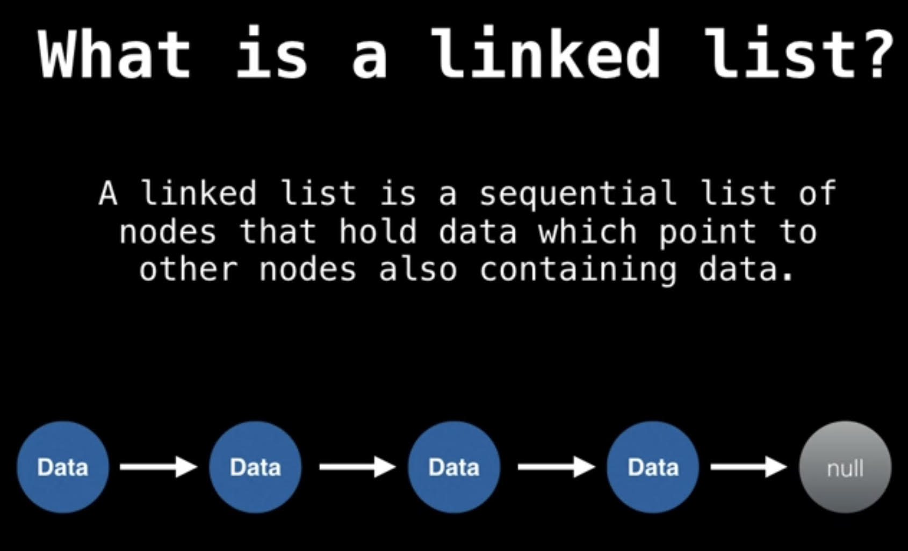

# Linked List

A linked list is a data structure,  like a chain of objects, each points to the next except the last one. 


* Successive elements a re connected by pointers
* The last element points to <span class="coding">\__None__</span> (NULL)
* Can grow or shrink in size during execution of a program
* Can be made just as long as required (until systems memory exhausts)
* Does not waste memory space (but takes some extra memory for pointers)


* Linked lists are linear data structures that hold data in individual objects called nodes. These nodes hold both the data and a reference to the next node in the list.
* Each node contains a value, and a reference (also known as a pointer) to the next node. The last node, points to a null node. This means the list is at its end.
* Linked lists offer some important advantages over other linear data structures. Unlike arrays, they are a dynamic data structure, resizable at run-time. Also, the insertion and deletion operations are efficient and easily implemented.
* However, linked lists do have some drawbacks. Unlike arrays, linked lists aren't fast at finding the __n__th item.To find a node at position __n__, you have to start the search at the first node in the linked list, following the path of references  times. Also, because linked lists are inherently sequential in the forward direction, operations like backwards traversal--visiting every node starting from the end and ending in the front--is especially cumbersome. (__Only sequential search possible__)
* Additionally, linked lists use more storage than the array due to their property of referencing the next node in the linked list.
* Finally, unlike an array whose values are all stored in contiguous memory, a linked list's nodes are at arbitrary, possibly far apart locations in memory.


## Common Operations:
* Insert           
* Insert at end
* Insert at beginning
* Insert between
* Delete                
* Search                
* Indexing
  
# Linked List and Node can be accomodated in separate classes for convenience

<div class="code-head"><span>code</span>linkedList.py</div>

```py
class Node(object):
    # Each node has its data and a pointer that points to next node in the Linked List
    def __init__(self, data, next = None):
        self.data = data;
        self.next = next;
        
    # function to set data
    def setData(self, data):
        self.data = data;
        
    # function to get data of a particular node
    def getData(self):
        return self.data
    
    # function to set next node
    def setNext(self, next):
        self.next = next
        
    # function to get the next node
    def getNext(self):
        return self.next
    
class LinkedList(object):
    # Defining the head of the linked list
    def __init__(self):
        self.head = None
        
    # printing the data in the linked list
    def printLinkedList(self):
        temp = self.head
        while(temp):
            print(temp.data, end=' ')
            temp = temp.next
            
    # inserting the node at the beginning
    def insertAtStart(self, data):
        newNode = Node(data)
        newNode.next = self.head
        self.head = newNode
        
    # inserting the node in between the linked list (after a specific node)
    def insertBetween(self, previousNode, data):
        if (previousNode.next is None):
            print('Previous node should have next node!')
        else:
            newNode = Node(data)
            newNode.next = previousNode.next
            previousNode.next = newNode
            
    # inserting at the end of linked list
    def insertAtEnd(self, data):
        newNode = Node(data)
        temp = self.head
        while(temp.next != None):         # get last node
            temp = temp.next
        temp.next = newNode
        
    # deleting an item based on data(or key)
    def delete(self, data):
        temp = self.head
        # if data/key is found in head node itself
        if (temp.next is not None):
            if(temp.data == data):
                self.head = temp.next
                temp = None
                return
            else:
                #  else search all the nodes
                while(temp.next != None):
                    if(temp.data == data):
                        break
                    prev = temp          #save current node as previous so that we can go on to next node
                    temp = temp.next
                
                # node not found
                if temp == None:
                    return
                
                prev.next = temp.next
                return
            
    # iterative search
    def search(self, node, data):
        if node == None:
            return False
        if node.data == data:
            return True
        return self.search(node.getNext(), data)
            
if __name__ == '__main__':
    List = LinkedList()
    List.head = Node(1)                   # create the head node
    node2 = Node(2)
    List.head.setNext(node2)           # head node's next --> node2
    node3 = Node(3)
    node2.setNext(node3)                # node2's next --> node3
    List.insertAtStart(4)                   # node4's next --> head-node --> node2 --> node3
    List.insertBetween(node2, 5)     # node2's next --> node5
    List.insertAtEnd(6)
    List.printLinkedList()
    print()
    List.delete(3)
    List.printLinkedList()
    print()
    print(List.search(List.head, 1))

```

* In general, __array__ is considered a data structure for which size is fixed at the compile time and array memory is allocated either from __Data section__ (e.g. global array) or __Stack section__ (e.g. local array). 
* Similarly, linked list is considered a data structure for which size is not fixed and memory is allocated from __Heap section__ (e.g. using malloc() etc.) as and when needed. In this sense, array is taken as a static data structure (residing in Data or Stack section) while linked list is taken as a dynamic data structure (residing in Heap section).
* The array elements are allocated memory in sequence i.e. __contiguous memory__ while nodes of a linked list are non-contiguous in memory. Though it sounds trivial yet this is the most important difference between array and linked list. It should be noted that due to this contiguous versus non-contiguous memory, array and linked list are different.

<div class="code-head"><span>code</span>doublyLlinkedList.py</div>

```py
class Node(object):
    # Each node has its data and a pointer that points to next node in the Linked List
    def __init__(self, data, next = None, previous = None):
        self.data = data;
        self.next = next;
        self.previous = previous
        
class DoublyLinkedList(object):
    def __init__(self):
        self.head = None
    
    # for inserting at beginning of linked list
    def insertAtStart(self, data):
        if self.head == None:
            newNode = Node(data)
            self.head = newNode
        else:
            newNode = Node(data)
            self.head.previous = newNode
            newNode.next = self.head
            self.head = newNode
            
    # for inserting at end of linked list
    def insertAtEnd(self, data):
        newNode = Node(data)
        temp = self.head
        while(temp.next != None):
            temp = temp.next
        temp.next = newNode
        newNode.previous = temp
        
    # deleting a node from linked list
    def delete(self, data):
        temp = self.head
        if(temp.next != None):
            # if head node is to be deleted
            if(temp.data == data):
                temp.next.previous = None
                self.head = temp.next
                temp.next = None
                return
            else:
                while(temp.next != None):
                    if(temp.data == data):
                        break
                    temp = temp.next
                if(temp.next):
                    # if element to be deleted is in between
                    temp.previous.next = temp.next
                    temp.next.previous = temp.previous
                    temp.next = None
                    temp.previous = None
                else:
                    # if element to be deleted is the last element
                    temp.previous.next = None
                    temp.previous = None
                return
        
        if (temp == None):
            return
        
    # for printing the contents of linked lists
    def printdll(self):
        temp = self.head
        while(temp != None):
            print(temp.data, end=' ')
            temp = temp.next
            
dll = DoublyLinkedList()
dll.insertAtStart(1)
dll.insertAtStart(2)
dll.insertAtEnd(3)
dll.insertAtStart(4)
dll.printdll()
dll.delete(2)
print()
dll.printdll()

```

## Linked list examples

### Find linkedlist length


<div class="code-head"><span>code</span>a1_findLlinkedListLength.py</div>

```py

import SinglyLinkedList

def checkLength(linkedList):
    count = 0
    temp = linkedList.head
    while(temp != None):
        count += 1
        temp = temp.next

    return count

if __name__ == '__main__':
    myLinkedList = SinglyLinkedList.LinkedList()
    for i in range(10):
        myLinkedList.insertAtStart(i)
    myLinkedList.printLinkedList()
    print()
    print('Length:', checkLength(myLinkedList))

    # OUTPUT:
    # 9 8 7 6 5 4 3 2 1 0
    # Length: 10
    
```

<div class="code-head"><span>code</span>a2_reverseLlinkedListLength.py</div>

```py
import SinglyLinkedList

def reverseLinkedList(myLinkedList):
    previous = None
    current = myLinkedList.head
    while(current != None):
        temp = current.next
        current.next = previous
        previous = current
        current = temp
    myLinkedList.head = previous


if __name__ == '__main__':
    myLinkedList = SinglyLinkedList.LinkedList()
    for i in range(10, 0, -1):
        myLinkedList.insertAtStart(i)

    print('Original:', end = ' ')
    myLinkedList.printLinkedList()
    print()
    print('Reversed:', end = ' ')
    reverseLinkedList(myLinkedList)
    myLinkedList.printLinkedList()

    # OUTPUT:
    # Original: 1 2 3 4 5 6 7 8 9 10
    # Reversed: 10 9 8 7 6 5 4 3 2 1

```

<div class="code-head"><span>code</span>a2_reverseLlinkedListLength.py</div>

```py

# Linked List and Node can be accomodated in separate classes for convenience

class Node(object):
    # Each node has its data and a pointer that points to next node in the Linked List
    def __init__(self, data, next = None):
        self.data = data;
        self.next = next;

    # function to set data
    def setData(self, data):
        self.data = data;

    # function to get data of a particular node
    def getData(self):
        return self.data

    # function to set next node
    def setNext(self, next):
        self.next = next

    # function to get the next node
    def getNext(self):
        return self.next

class LinkedList(object):
    # Defining the head of the linked list
    def __init__(self):
        self.head = None

    # printing the data in the linked list
    def printLinkedList(self):
        temp = self.head
        while(temp):
            print(temp.data, end=' ')
            temp = temp.next

    # inserting the node at the beginning
    def insertAtStart(self, data):
        if self.head == None:
            newNode = Node(data)
            self.head = newNode
        else:
            newNode = Node(data)
            newNode.next = self.head
            self.head = newNode

    # inserting the node in between the linked list (after a specific node)
    def insertBetween(self, previousNode, data):
        if (previousNode.next is None):
            print('Previous node should have next node!')
        else:
            newNode = Node(data)
            newNode.next = previousNode.next
            previousNode.next = newNode

    # inserting at the end of linked list
    def insertAtEnd(self, data):
        newNode = Node(data)
        temp = self.head
        while(temp.next != None):         # get last node
            temp = temp.next
        temp.next = newNode

    # deleting an item based on data(or key)
    def delete(self, data):
        temp = self.head
        # if data/key is found in head node itself
        if (temp.next is not None):
            if(temp.data == data):
                self.head = temp.next
                temp = None
                return
            else:
                #  else search all the nodes
                while(temp.next != None):
                    if(temp.data == data):
                        break
                    prev = temp          #save current node as previous so that we can go on to next node
                    temp = temp.next

                # node not found
                if temp == None:
                    return

                prev.next = temp.next
                return

    # iterative search
    def search(self, node, data):
        if node == None:
            return False
        if node.data == data:
            return True
        return self.search(node.getNext(), data)

if __name__ == '__main__':
    List = LinkedList()
    List.head = Node(1)                # create the head node
    node2 = Node(2)
    List.head.setNext(node2)           # head node's next --> node2
    node3 = Node(3)
    node2.setNext(node3)               # node2's next --> node3
    List.insertAtStart(4)              # node4's next --> head-node --> node2 --> node3
    List.insertBetween(node2, 5)       # node2's next --> node5
    List.insertAtEnd(6)
    List.printLinkedList()
    print()
    List.delete(3)
    List.printLinkedList()
    print()
    print(List.search(List.head, 1))

```