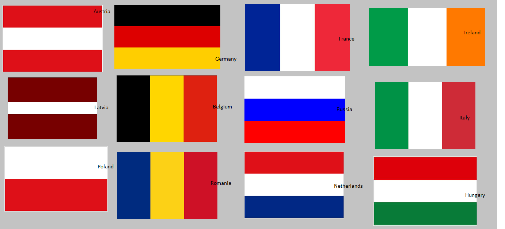

# double-band flags
 
We have an array of integers.  We want to sort it such that all even numbers are before the odd numbers. 

<div class="code-head"><span>code</span>two_part_partition.py</div>

```py
def two_part_partition(A):
    l, r = 0, len(A) - 1
    while l < r:
        if A[r] % 2 == 0:
            A[l], A[r] = A[r], A[l]
            l += 1
        else:
            r -= 1
    return A

lt = [0, 1,2,0,2,1,1]
print(two_part_partition(lt))
# [2, 0, 0, 2, 1, 1, 1]
lt = [0, 1,3,5,7,8,2]
print(two_part_partition(lt))
# [2, 0, 8, 5, 7, 3, 1]
```

## Variation of the double-band flag
Let's take the problem one step further.  All even numbers should go before odd numbers.  And the relative ordering of odd numbers should not change. 

<div class="code-head"><span>code</span>two_part_partition.py</div>

```py
def two_part_partition(A):
    l, r = 0, len(A) - 1
    while l < r:
        if A[r] % 2 == 0:
            A[l], A[r] = A[r], A[l]
            l += 1
        else:
            r -= 1
    return A

lt = [0, 1,2,0,2,1,1]
print(two_part_partition(lt))
# [2, 0, 0, 2, 1, 1, 1]
lt = [0, 1,3,5,7,8,2]
print(two_part_partition(lt))
# [2, 0, 8, 5, 7, 3, 1]
```

## tri-band flags
 

We want to partition an array in the following fashion:
Given an element called "pivot" (or the index of it) of the array of integers,  the ones smaller than this number should be placed before this number, and the ones bigger than this number after. This way of sorting is the foundation of quicksort.
## $$O(n)$$ space solution
$$O(n)$$ space solution is very easy: create 3 arrays, for those smaller to the pivot, we put in the first array.  For those equal to the pivot, we put them in the second array.  For those larger than the pivot, we put then in the last array. 

## $$O(1)$$ space solution

The following solution has time complexity $$O(n)$$ and space complexity $$O(1)$$.  I did this problem a few times.  There are 4 places I found myself making mistakes:
1. indent of the return (or forgot to return)
2. compare with the pivot, not anything else
3. the direction of the range
4. forgot to increment/decrement the pointer indices

<div class="code-head"><span>code</span>flag_partition.py</div>

```py
def flag_partition(pivot_idx, A):
    pivot = A[pivot_idx]
    N = len(A)
    small_idx = 0
    big_idx = N - 1
    print("Pivot is ",A[pivot_idx])
    # move smaller ones to the front
    for i in range(N):
        if A[i] < pivot:
            A[i], A[small_idx] = A[small_idx], A[i]
            small_idx += 1

    # move bigger ones to the front
    for i in reversed(range(N)):
        if A[i] < pivot:
            break
        if A[i] > pivot:
            A[i], A[big_idx] = A[big_idx], A[i]
            big_idx -= 1

    return A
lt = [0, 1,2,0,2,1,1]
print(flag_partition(3,lt))
```

