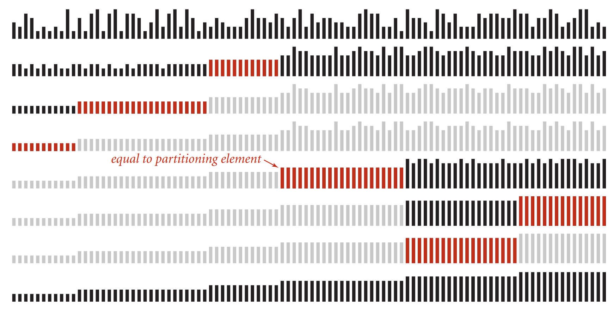

The famous [Dutch National Flag problem](https://en.wikipedia.org/wiki/Dutch_national_flag_problem#:~:text=The%20Dutch%20national%20flag%20problem,red%2C%20white%2C%20and%20blue.) was proposed as a colored ball problem by Edsger Dijkstra as follows:

Given N balls of colour red, white or blue arranged in a line in random order. You have to arrange all the balls such that the balls with the same colours are adjacent with the order of the balls, with the order of the colours being red, white and blue (i.e., all red coloured balls come first then the white coloured balls and then the blue coloured balls). 

Why is this problem interesting? 
The solution to this problem is of interest for designing sorting algorithms; in particular, variants of the quicksort algorithm that must be robust to repeated elements may use a three-way partitioning function that groups items less than a given key (red), equal to the key (white) and greater than the key (blue). Several solutions exist that have varying performance characteristics, tailored to sorting arrays with either small or large numbers of repeated elements.


# Ukrainian national flag problem
Before solving the Dutch flag problem, we look at the easier double-band flag problem, which we shall call the "Ukrainian national flag problem". 
 

The solution here is from a webpage of the [School of Computer Sci & Software Eng., Monash U., Australia](https://users.monash.edu/~lloyd/tildeAlgDS/Sort/Flag/).  Consider just two "colours", {zero,one}, first. The algorithm maintains three sections (possibly empty) in the array A[ ]:
* A[0..Lo-1] zeroes
* A[Lo..Hi] unknown
* A[Hi+1..N-1] ones

The unknown section is shrunk while maintaining these conditions:
1. Lo := 0; Hi := N-1;
2. while Lo <= Hi do
   1. Invariant: A[0..Lo-1] are all zero and A[Hi+1..N-1] are all one; A[Lo..Hi] are unknown.
   2. if A[Lo] = 0 then Lo++
   3. else swap A[Lo] and A[Hi]; Hi--

We implment the above psudocode in Python. 
<div class="code-head"><span>code</span>the-ukrainian-flag-problem.py</div>

```py
def ukrainianFlagPartition(A):
    l, r = 0, len(A) - 1
    while l < r:
        if A[l] == 0:
            l += 1
        else:
            A[l], A[r] = A[r], A[l]
            r -= 1
    return A

lt = [0, 1, 1, 0, 1, 1, 0]
print(ukrainianFlagPartition(lt))
# [0, 0, 0, 1, 1, 1, 1]

```

# The Dutch national flag problem

There are quite a number of countries that have flags of three bands of colors.
 

We are back to the DNF problem. 
 

We can solve the DNF problem in a similar way of the Ukrianian Flag problem.  First, we agree to maintain the four sections on the array A. 

* A[0..Lo-1] zeroes
* A[Lo..M-1] ones
* A[M..Hi] unknown
* A[Hi+1..N-1] twos

The unknown section is shrunk while maintaining these conditions:
1. Lo := 0; M := 0; Hi := N-1;
2. while M <= H do
   1. if A[M] == 0 then swap A[M] with A[Lo]; Lo++; M++ 
   2. else if A[M] == 1 then M++
   3. else swap A[M] and A[Hi]; Hi--

We implment the above psudocode in Python.  I added extra code to print out that's happening in the sorting. 
<div class="code-head"><span>code</span>the-dutch-flag-problem.py</div>

```py
def dutchFlagPartition(A):
    l, m, r = 0, 0, len(A) - 1
    while m <= r:
        # print("************\n")
        # print("m :", m)
        # print("l :", l)
        # print("r :", r)
        if A[m] == 0:
            # print("A[m] is ", A[m], "so swapping ", A[l], " and ", A[m])
            A[l], A[m] = A[m], A[l]
            l += 1
            m += 1
            # print(A)
        elif A[m] == 2:
            # print("A[m] is ", A[m], "so swapping ", A[r], " and ", A[m])
            A[m], A[r] = A[r], A[m]
            r -= 1
            # print(A)
        else:
            m += 1
            # print("m increments", A)
    return A
lt = [1, 1,  0, 2]
print(dutchFlagPartition(lt))
# ************

# m : 0
# l : 0
# r : 3
# m increments [1, 1, 0, 2]
# ************

# m : 1
# l : 0
# r : 3
# m increments [1, 1, 0, 2]
# ************

# m : 2
# l : 0
# r : 3
# A[m] is  0 so swapping  1  and  0
# [0, 1, 1, 2]
# ************

# m : 3
# l : 1
# r : 3
# A[m] is  2 so swapping  2  and  2
# [0, 1, 1, 2]
# [0, 1, 1, 2]
```


The DNF algorithm can be extended to four, or even more colours but it grows more and more complex to write.

The DNF algorithm can be used to partition an array into sections that are (i) <x (red), (ii) =x (white), and (iii) >x (blue), where x is an estimate of the median, for example. Sections (i) and (iii) can be sorted recursively as in Quick Sort.

Like quicksort, the DNF algorithm is **not stable**. The relative order of similar elements always change.  

The DNF is incorporated into C library qsort() and Java 6 system sort.

# The counting approach
Naturally, a child would have thought of a less contrived approach: just count how many of each color (category) and put the same color ones together. 

<div class="code-head"><span>code</span>flag_partition.py</div>

```py
# Function to sort the array of 0s, 1s and 2s
def countingSort(A, n):
	cnt0 = 0
	cnt1 = 0
	cnt2 = 0

	# Count the number of 0s, 1s and 2s in the array
	for i in range(n):
		if A[i] == 0:
			cnt0 += 1

		elif A[i] == 1:
			cnt1 += 1

		elif A[i] == 2:
			cnt2 += 1
	# Update the array
	i = 0
	# Store all the 0s in the beginning
	while (cnt0 > 0):
		A[i] = 0
		i += 1
		cnt0 -= 1
	# Then all the 1s
	while (cnt1 > 0):
		A[i] = 1
		i += 1
		cnt1 -= 1
	# Finally all the 2s
	while (cnt2 > 0):
		A[i] = 2
		i += 1
		cnt2 -= 1

lt = [0, 1, 1, 0, 1, 2, 1, 2, 0, 0, 0, 1]
n = len(lt)
countingSort(lt, n)
# [0, 0, 0, 0, 0, 1, 1, 1, 1, 1, 2, 2]
```

# DNF 3-way sort
DNF-based 3-way sort can be used for quicksort.  

We are not limited to 3 colors anymore, and we want to partition an array in the following fashion:
Given an element called "pivot" (or the index of it) of the array of integers,  the ones smaller than this number should be placed before this number, and the ones bigger than this number after. This looks like quicksort. But what we are doing is a little different from quicksort as we want to take into account those that are *equal to the pivot*. 

If we don't care about space, $$O(n)$$ space solution is very easy: create 3 arrays, for those smaller to the pivot, we put in the first array.  For those equal to the pivot, we put them in the second array.  For those larger than the pivot, we put then in the last array. 

## Two-way sort

We make two passes on the array.  
1. **From left to right**: if A[i] < pivot,, swap A[i] and A[L], L++, i++ (L and iterator i moves in tandem); when A[i] > pivot, i++
2. **From right to left**: if A[i] > pivot,, swap A[i] and A[H], H--, i-- (H and iterator i moves in tandem); when A[i] < pivot, i--

In the left to right scan <span class="coding">for i in range(N)</span>, you can imagine the pointer L stays firm guarding the border of those smaller than the pivot.  It moves a step to the right only when the iterator i founds a new member smaller than the pivot.

In the right to left scan, the direction of the range is <span class="coding">for i in reversed(range(N))</span>. 

It has time complexity $$O(n)$$ and space complexity $$O(1)$$.  

<div class="code-head"><span>code</span>pre_dnf_partition.py</div>

```py
def pre_dnf_partition(pivot_idx, A):
    pivot = A[pivot_idx]
    N = len(A)
    l = 0
    r = N - 1
    print("Pivot is ",A[pivot_idx])
    # move smaller ones to the left
    for i in range(N):
        if A[i] < pivot:
            A[i], A[l] = A[l], A[i]
            l += 1

    # move bigger ones to the right
    for i in reversed(range(N)):
        if A[i] < pivot:
            break
        if A[i] > pivot:
            A[i], A[r] = A[r], A[i]
            r -= 1

    return A
lt = [0, 1,2,0,2,1,1]
print(pre_dnf_partition(3,lt))
# Pivot is  0
# [0, 0, 1, 2, 2, 1, 1]
lt = [0, 1,2,0,2,1,1]
print(pre_dnf_partition(1,lt))
# Pivot is  1
# [0, 0, 1, 1, 1, 2, 2]
```
**Note:**
In the first example, the input array is [0, 1,2,0,2,1,1], and the pivot is 0. The output is [0, 0, 1, 2, 2, 1, 1] as all 0's are together, and the rest of the numbers are not sorted.   

In the second example, the pivot is 1.  The output is [0, 0, 1, 1, 1, 2, 2].  So, unless the pivot is the median, we cannot get the three blocks of colors. 

## One single pass
The one single pass approach is just like the 3-color problem. We first agree to keep the four sections. 
* A[0..Lo-1]  < pivot
* A[Lo..M-1] == pivot
* A[M..Hi] unknown
* A[Hi+1..N-1] > pivot

The unknown section is shrunk while maintaining these conditions:
1. Lo := 0; M := 0; Hi := N-1;
2. while M <= H do
   1. if A[M] < pivot then swap A[M] with A[Lo]; Lo++; M++ 
   2. else if A[M] == pivot then M++
   3. else swap A[M] and A[Hi]; Hi--


<div class="code-head"><span>code</span>dnf_partition.py</div>

```py
def dnf_partition(pivot_idx, A):
    l, m, r = 0, 0, len(A) - 1
    while m <= r:
        if A[m] < A[pivot_idx]:
            A[l], A[m] = A[m], A[l]
            l += 1
            m += 1
        elif A[m] > A[pivot_idx]:
            A[m], A[r] = A[r], A[m]
            r -= 1
        else:
            m += 1
    return A
lt = [1, 1,  0, 2]
print(dnf_partition(0, lt))
# [0, 1, 1, 2]

lt = [2, 4, 1, 0, 2, 2]
print(dnf_partition(0, lt))

# [1, 0, 2, 2, 2, 4]
```

Three-way quicksort improves quicksort when there are many duplicate keys.
The visual trace of the three-way quicksort is from [Princeton Unversity Computer Science course slide](https://www.cs.princeton.edu/courses/archive/spring15/cos226/lectures/23Quicksort.pdf)
 

# Variations of the UNF and the DNF
We have an array of integers.  We want to sort it such that all even numbers are before the odd numbers.  

<div class="code-head"><span>code</span>two_part_partition.py</div>

```py
def ukrainianFlagPartition(A):
    l, r = 0, len(A) - 1
    while l < r:
        if A[r] % 2 == 0:
            A[l], A[r] = A[r], A[l]
            l += 1
        else:
            r -= 1
    return A

# [2, 0, 0, 2, 1, 1, 1]
lt = [0, 1,3,5,7,8,2]
print(two_part_partition(lt))
# [2, 0, 8, 5, 7, 3, 1]
```

Let's take the problem one step further.  All even numbers should go before odd numbers.  And the relative ordering of odd numbers should not change. This is a kind of stable sort requirement.  How shall we solve it?


# Reference
[Dutch National Flag, Lloyd Allison, School of Computer Sci & Software Eng., Monash U., Australia 1999](https://users.monash.edu/~lloyd/tildeAlgDS/Sort/Flag/)

[Princeton University Computer Science Spring 15 lecture slide](https://www.cs.princeton.edu/courses/archive/spring15/cos226/lectures/23Quicksort.pdf)