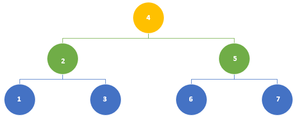

# Binary search tree

A Binary search tree is a kind of abstract data structure.  It is very intuitive from the mathematical perspective: *divide and conquer*.  For a sorted array/list, if we know that x is bigger than the median, then we don't need to spend time on the left half.  On the right half, we divide and conquer again.

Of course, it is made for doing something better than other data structures :)

<!-- # Compare with (abstract) array
* **Advantages**:
*Fast search*: Unlike arrays (abstract data structure), Binary search trees are resizable at run-time as Binary search tree nodes are stored at *arbitrary locations in memory*.  Fast Insertion and deletion operations because do not need to change the indices of other elements or storage location. 
  
* **Disadvantages**:
* *Slower search*: We cannot access elements in constant time as we do in arrays.  To find a node at position n, we have to start the search at the first (head) node and iterate through via next. 
* Binary search trees takes more space than the array.  -->

* **Search time**:  Search time is proportional to $$O(h)$$, where $$h$$ is height of tree.

**Height of tree** is the length of the longest path between the *root* and *leaf*.  Or, the number of nodes from root to leaf, not including the leaf itself.  Or the number of edges connecting from root to leaf. 

In a balanced tree, $$height = log(n)$$

In the extreme case, as shown below, $$height = n$$.  To correct unbalance, 
  

**height of node** is the length of the longest path between the *node* and *leaf*.
  
**Local rule**  

$$\text{height of node} = max{ \text{height of left child}, \text{height of right child} } + 1$$

Whenever we have local rules that depend on the children only, we get constant overhead: store node height for free. 

Our goal is to keep the tree's height small (we want short/bushy trees), quivalently, the heights of the children equal.  Cascading down, it means to keep heights of left and right children of every node to differ by at most $$+-1$$. 

# Keeping tree balanced
There are many ways to keep trees balanced, AVL is the original method discovered in the 1960s.  AVL trees use node heights (i.e. heights of left and right children).

An AVL tree (named after inventors Adelson-Velsky and Landis in 1962) is a *self-balancing* binary search tree (BST).  

In table Below we compare the abstract data structure of array and Binary search tree:

Compare | array | Binary search tree
---------|----------|---------
 size | fixed at birth | can change from insertion/deletion
 storage | static in continuous block of memory allocated during compile time | dynamic, nodes are located at run time
 ordering/sorting | fast direct access via index  | sequential, transverse from the head node via link (next)
 search | binary and linear search | linear search
 
# Binary search trees uses

They are useful when we need fast insertion and deletion, and when we do not know in advance the size of data, or do not need random access when searching for items.   

# Tree traversing/walking

* **In-order traversal**: 
Inorder DFS LNR: Left -> node -> right
When data is stored sorted in the binary tree, in-order traversal retrieves the data in ascending sorted order.  Hence the name "in order".

* **pre-order traversal**:
* **post-order traversal**: