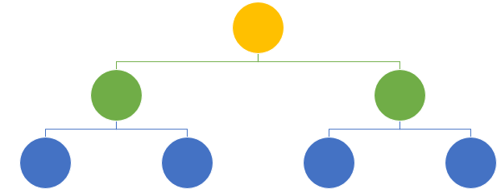
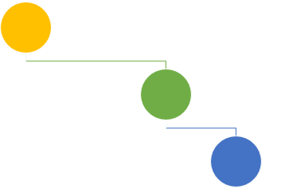
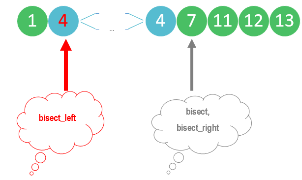

# Binary search tree

A Binary search tree is a kind of abstract data structure.  It is very intuitive from the mathematical perspective: *divide and conquer*.  For a sorted array/list, if we know that x is bigger than the median, then we don't need to spend time on the left half.  On the right half, we divide and conquer again.

Of course, it is made for doing something better than other data structures :)

<!-- # Compare with (abstract) array
* **Advantages**:
*Fast search*: Unlike arrays (abstract data structure), Binary search trees are resizable at run-time as Binary search tree nodes are stored at *arbitrary locations in memory*.  Fast Insertion and deletion operations because do not need to change the indices of other elements or storage location. 
  
* **Disadvantages**:
* *Slower search*: We cannot access elements in constant time as we do in arrays.  To find a node at position n, we have to start the search at the first (head) node and iterate through via <span class="coding">next</span>. 
* Binary search trees takes more space than the array.  -->


* **Properties**
- Search time is proportional to $$O(h)$$, where $$h$$ is height of tree.

- **height of tree** is the length of the longest path between the *root* and *leaf*. In a balanced tree, $$height = log(n)$$


In the extreme case, as shown below, $$height = n$$.  To correct unbalance, 
  


**height of node** is the length of the longest path between the *node* and *leaf*.
  
**Local rule**  

$$\text{height of node} = max{ \text{height of left child}, \text{height of right child} } + 1$$

Whenever we have local rules that depend on the children only, we get constant overhead: store node height for free. 

Our goal is to keep the tree's height small (we want short/bushy trees), quivalently, the heights of the children equal.  Cascading down, it means to keep heights of left and right children of every node to differ by at most $$+-1$$. 

<!-- # Maintein structure of subtree
Data structure augmentation. -->

# Keeping tree balanced
There are many ways to keep trees balanced, AVL is the original method discovered in the 1960s.  AVL trees use node heights (i.e. heights of left and right children).

An AVL tree (named after inventors Adelson-Velsky and Landis in 1962) is a *self-balancing* binary search tree (BST).  

In table Below we compare the abstract data structure of array and Binary search tree:

Compare | array | Binary search tree
---------|----------|---------
 size | fixed at birth | can change from insertion/deletion
 storage | static in continuous block of memory allocated during compile time | dynamic, nodes are located at run time
 ordering/sorting | fast direct access via index  | sequential, transverse from the head node via link (next)
 search | binary and linear search | linear search
 
# Binary search trees uses

They are useful when we need fast insertion and deletion, and when we do not know in advance the size of data, or do not need random access when searching for items.   


# Binary search problems

## Problem 1: the basic search

Given a sorted array of integers, we want to find a number, which we call "target".  The code should return the index of target, and return -1 if not found. 

The devide and conquer method is implemented as follows:
1. We begin searching the entire array of numbers, defined by the index for the smallest number and the index of the biggest number.         
2. We find the mid point.  Although it seems <span class="coding">l + (r - l) // 2</span> and <span class="coding">(r + l) // 2</span> are equivalent, in computation, they have a subtle difference: the latter may cause overflow (even though it may never happen) in some languages (not in Python because Python integers are unbounded).
3. We compare the target with the mid point:
   1. if the target is bigger than the mid point, then we can disregard the left half $$->$$ <span class="coding">l</span> moves to <span class="coding">m + 1</span>, $$\text{mid point} + 1$$
   2. Else if the target is smaller than the mid point, then we drop the right half $$->$$ <span class="coding">r</span> moves to <span class="coding">m - 1</span>, $$\text{mid point} - 1$$
   3. else it means the target is equal to the mid point, we return it and get out of the loop
4. After the search area is updated, we continue the search from step 1. 

> The condition for the while loop is <span class="coding">while l <= r</span>.  Missing the $$=$$ sign the algorithm will be wrong.  For example, if you search for the boundary values, it would return $$-1$$ erroneously. 

For an one-element array, [1], or [100], the <span class="coding">while</span> loop would not have even run if we did not have the $$=$$ sign because the boundary indices would be the same. 

So, when we check our code, we can test these extreme cases:
* one-element array
* target is one of the boundary values

> Note that if the target is found, it will be returned and the function call will stop immediately. 

<div class="code-head"><span>code</span>binary search.py</div>

```py
def bSearch(A, target):
    N = len(A)
    l = 0
    r = N - 1
    while l <= r:
        m = l + (r - l) // 2 # not writing it as (r + l) // 2 to prevent overflow
        if target > A[m]:
            l = m + 1
        elif target < A[m]:
            r = m - 1
        else:
            return m # return and stop the function
    return - 1

lt = [1, 2, 5, 7, 8, 10, 20]
print(bSearch(lt, 7))

```

## Problem 2: first and last position in sorted array

Now, instead of finding the index of the target (assuming no duplicates), we want to find the first and the last position of the target.  

<div class="code-head"><span>code</span>binary search variation.py</div>

```py
def searchRange(A, target):
    small = bSearch(A, target, True)
    big = bSearch(A, target, False)
    return [small, big]
    
def bSearch(A, target, smallBias):
    ```
    smallbias: True means we are searching for the first & False means searching for the last
    ```
    N = len(A)
    l = 0
    r = N - 1
    idx = -1
    while l <= r:
        m = l + (r - l )//2
        if target > A[m]:
            l = m + 1
        elif target < A[m]:
            r = m - 1
        else:
            idx = m
            # return idx for regular binary bSearch
            if smallBias:
                r = m - 1
            else:
                l = m + 1

    return idx

lt = [1]
lt2 = [1,1,1, 2,2, 5, 7, 8, 10, 20, 30, 100]
print(searchRange(lt, 1))
print(searchRange(lt2, 2))
```    

# The bisect library

The [bisect library](https://docs.python.org/3/library/bisect.html) has some functions that perform variations of binary search. 
> The source code may be most useful as a working example of the algorithm (the boundary conditions are already right!).

The <span class="coding">bisect_left</span> function returns the leftist index of the value we search, if it exist in the input array. If value we search does not exist in the array, then the function gives the index position the insertion point where it would be:


The results show that:
1. when x is not in the input array, bisect_left, bisect, and bisect_right all produce the same result: the insertion point
2. when x is in the input array, biset_left gives the index of the leftmost one, while bisect and bisect_right give the index of the number adjacent to the rightmost x. 

<div class="code-head"><span>code</span>bisect.py</div>

```py
from bisect import bisect, bisect_left, bisect_right
In [61]: list1 = [1, 4, 4, 5, 6]
    ...: x = 3
    ...: print(bSearch(list1, x))
    ...: print(bisect_left(list1, x))
    ...: print(bisect(list1, x))
    ...: print(bisect_right(list1, x))
    ...:
-1
1
1
1

In [62]: list1 = [1, 4, 4, 5, 6]
    ...: x = 4
    ...: print(bSearch(list1, x))
    ...: print(bisect_left(list1, x))
    ...: print(bisect(list1, x))
    ...: print(bisect_right(list1, x))
    ...:
2
1
3
3

In [63]: list1 = [1, 4, 4, 5, 6, 6, 6]
    ...: x = 6
    ...: print(bSearch(list1, x))
    ...: print(bisect_left(list1, x))
    ...: print(bisect(list1, x))
    ...: print(bisect_right(list1, x))
    ...:
5
4
7
7

```