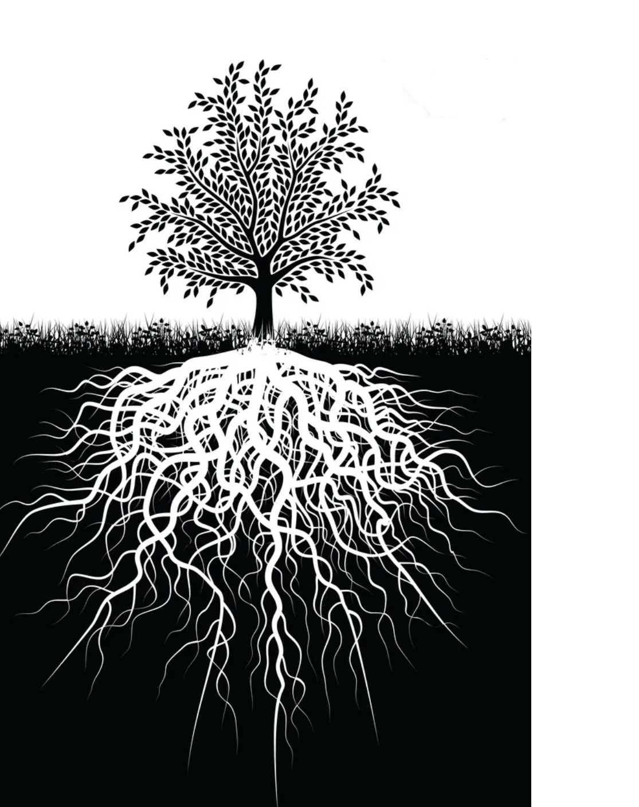

  
- [Applications of trees](#applications-of-trees)
- [Tree storage](#tree-storage)
- [Binary Trees](#binary-trees)
  - [Types of binary trees:](#types-of-binary-trees)
- [Binary Search Trees (BST)](#binary-search-trees-bst)
- [Rooted tress](#rooted-tress)
- [Reference](#reference)


A tree is a data structure similar to a linked list but instead of each node pointing simply to the next node in a linear fashion, each node points to a number of nodes. Tree is an example of **non-linear data structures**. A tree structure is a way of representing the **hierarchical** nature of a structure in a graphical form.   

A tree is an undirected graph without any cycles.  Each tree has exactly $$n$$ nodes and $$n-1$$ edges. 

A tree is also an array.  The diagrams are just visual representations.  

* The _edge_ refers to the link from parent to child.
* A node with NO children is called _leaf_ node.
* Children of same parent are called _siblings_.
# Applications of trees
There are many applications of trees.  Some examples are:
* Used to represent and manage hierarchical data such as computer file system, social hierarchy. 
* Every webpage is a tree due to HTML structure. 
* Make information easy to search (see tree traversal).
* Manipulate sorted lists of data (binary search trees)
* As a workflow for compositing digital images for visual effects.
* Router algorithms
* Form of a multi-stage decision-making (see business chess).
# Tree storage
Since trees are a type of graph, the common ways to store graphs apply to trees as well. 

First of all, we index each node of a tree from 0 to n. 
*Edge list* is a list of undirected edges that looks like a list of tuples in Python.  The advantage of edge list is that it is fast to iterate over and cheap to store.  The lacks of structure and information of neighbors.  That's why *adjacency list* is a more popular way to store trees.  An adjacency list is a mapping from nodes to their respective neighbors.  An adjacency matrix expands list into a symmetric table, but it is a very costly way to store trees and should be avoided.  

# Binary Trees
A rooted tree is called _binary tree_ if each node has at most children.  An empty tree is also a valid binary tree.  Binary trees are abstract data structures created for easy insertion and removals of data. 
## Types of binary trees:
**Full binary tree**:
A Binary Tree is full if every node has 0 or 2 children. Following are examples of full binary tree.
**Complete binary tree**:
A Binary Tree is complete Binary Tree if all levels are completely filled except possibly the last level and the last level has all keys as left as possible.
**Perfect Binary Tree**:
A Binary tree is Perfect Binary Tree in which all internal nodes have two children and all leaves are at same level.
**Balanced Binary Tree**:
A binary tree is balanced if height of the tree is O(Log n) where n is number of nodes. For Example, AVL tree maintain O(Log n) height by making sure that the difference between heights of left and right subtrees is 1. Red-Black trees maintain O(Log n) height by making sure that the number of Black nodes on every root to leaf paths are same and there are no adjacent red nodes. Balanced Binary Search trees are performance wise good as they provide O(log n) time for search, insert and delete.
**A degenerate (or pathological) tree**:
A Tree where every internal node has one child. Such trees are performance-wise same as linked list.

# Binary Search Trees (BST)
BSTs are binary trees with the BST property: the $$left <= node <= right$$.  It is often useful to enforce uniqueness on the node values so that $$left < node < right$$. 
# Rooted tress
The **root** of the tree is the node with no parents. There can be at most one root node in a tree.  A rooted tree is not necessarily binary. 

A rooted tree is a tree that has a designated root node and have its edges either pointing away or towards the root node.  Genearally speaking, rooted trees are easier to work with than undirected trees because they are more structured and allow easy recursive implementations. 

Rooted trees are most naturally defined recursively in a top-down manner. The connections between root node, its children, and children of children are defined in a linked list manner. For example,
```python
class Node(object):
    def __init__(self, val = None):
        self.left = None
        self.right = None
        self.val = val
```
**Rooted trees can be stored in arrays** because of the 1-1 mapping between node location and array index.  At some array indices there may be nulls in cases when the tree is not a perfect tree that all leaves are at the same level. 

Let i be the index of the current node. 
Left: $$2*i + 1$$
Right: $$2*i + 2$$

Reciprocally, the parent of node i is: $$(i-1)//2$$
# Reference

[Geeks for Geeks 3-types-of-binary-tree](http://www.geeksforgeeks.org/binary-tree-set-3-types-of-binary-tree/)

For visualizations, see [Geeks for Geeks](http://www.geeksforgeeks.org/binary-tree-set-3-types-of-binary-tree/), and [more details on binary tree properties](http://www.geeksforgeeks.org/binary-tree-set-2-properties/)

[Youtube video, Introduction to tree algorithms | Graph Theory](https://www.youtube.com/watch?v=1XC3p2zBK34&t=26)