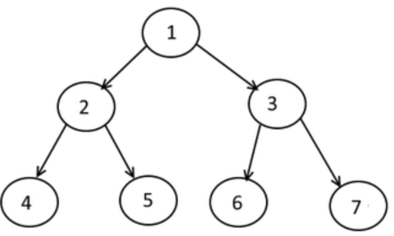

  
- [Tree Traversal](#tree-traversal)
- [Implementing tree traversals:](#implementing-tree-traversals)
  - [breadth First Traversal](#breadth-first-traversal)
- [Reference](#reference)


# Tree Traversal
Unlike linear data structures (Array, Linked List, Queues, Stacks, etc) which have only one logical way to traverse them, trees can be traversed in different ways. The following are the generally used ways for traversing trees.

* Inorder  中序   (left, data, right)
* Preorder  前序 (data, left, right)
* Postorder 後序 (left, right, data)


Inorder: 4, 2, 5, 1, 6, 3, 7
Postorder: 4, 5, 2, 6, 7, 3, 1
BFS:    1, 2, 3, 4, 5, 6, 7
Preorder: 1, 2, 4, 5, 3, 6, 7
DFS:    same as preorder


中序運算式」「後序運算式」

「中序運算式」，即是我們一般會看見的運算式形式。例如：２＋７ * ８，每個運算子都會被運算元所包圍（除非是一元運算子，或是括號）。

「後序運算式」，則是電腦方便運算的運算式形式。例如，上面的２＋７ * ８的後序運算式為２７８ * ＋。而在生成後序運算式時，各個運算子的運算順序已經被考慮進去（包含括號），因此在裡面不會再看到括號的存在。

可是為何有中序、後序之差？這是因為，每個運算式都可化為一個樹，以上面的２＋７ * ８為例，可化為：


如上圖，是一個二元樹（每個節點最多兩個子樹）。

我們常見的「中序運算式」便是這棵樹經由「中序探訪」的「路徑」。先走左子樹，接下來是自己，最後再走右子樹。

相似地，「後序運算式」為這棵樹的「後序探訪」。先走左子樹、再右子樹，最後才走根節點。


而中序轉後序不需要真的建一棵二元樹，再用後序探訪找路徑。只需要堆疊，在輸入的時候即可轉變成後序運算式。

以５＋７－８ /（６＋２）* ２為例：
先讀入５，一讀入數字即可把它放進後序運算式的結果之中。現結果為５，堆疊為空。

讀入＋，放進堆疊裡。現結果為５，堆疊裡有＋。

讀入７，結果為５７，堆疊裡有＋。

讀入－，判斷堆疊的頂端元素的優先順序，是否大於等於現在讀入的運算子之優先度。如果是，就一直把堆疊的頂端元素拿出，直到堆疊為空或是不符合為止。最後再放入現有的運算子。現結果為５７＋，堆疊裡有－。

讀入８，結果為５７＋８，堆疊裡有－。

讀入 / ，結果為５７＋８，堆疊裡有－ / 。

讀入（，左括號很特別，要與右括號配對。結果為５７＋８，堆疊裡有－ / （。

讀入６，結果為５７＋８６，堆疊裡有－ / （。

讀入＋，結果為５７＋８６，堆疊裡有－ / （＋。

讀入２，結果為５７＋８６２，堆疊裡有－ / （＋。

讀入），把堆疊的頂端元素拿出，直到遇見（。現結果為５７＋８６２＋，堆疊裡有－ / 。

讀入 * ，結果為５７＋８６２＋ / ，堆疊裡有－ * 。

讀入２，結果為５７＋８６２＋ / ２，堆疊裡有－ * 。

最後把堆疊清空，最終結果即為５７＋８６２＋ / ２ * －，即是題目所求。


# Implementing tree traversals:

## breadth First Traversal
<div class="code-head"><span>code</span> breadthFirstTraversal.py</div>

```py
def breadthFirstTraversal(root):
    if root == None:
        return 0
    else:
        h = height(root)
        for i in range(1, h + 1):
            printBFT(root, i)
def printBFT(root, level):
    if root is None:
        return
    else:
        if level == 1:
            print(root.val, end = ' ')
        elif level > 1:
            printBFT(root.left, level - 1)
            printBFT(root.right, level - 1)

breadthFirstTraversal(root)
# 1 2 3 4 5 6 7

```

<div class="code-head"><span>code</span> Binary tree implementation.py</div>

```py
# in this we traverse first to the leftmost node, then print its data and then traverse for rightmost node
def inorder(Tree):
    if Tree:
        inorder(Tree.getLeft())
        print(Tree.getData(), end = ' ')
        inorder(Tree.getRight())
    return

# in this we first print the root node and then traverse towards leftmost node and then to the rightmost node
def preorder(Tree):
    if Tree:
        print(Tree.getData(), end = ' ')
        preorder(Tree.getLeft())
        preorder(Tree.getRight())
    return 

# in this we first traverse to the leftmost node and then to the rightmost node and then print the data
def postorder(Tree):
    if Tree:
        postorder(Tree.getLeft())
        postorder(Tree.getRight())
        print(Tree.getData(), end = ' ')
    return

print('Inorder  Traversal:')
inorder(root)
print('\nPreorder Traversal:')
preorder(root)
print('\nPostorder Traversal:')
postorder(root)      

```

# Reference

