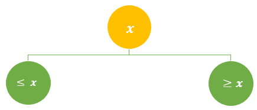

- [Binary search tree basics](#binary-search-tree-basics)
- [Keeping tree balanced](#keeping-tree-balanced)
- [Binary search trees uses](#binary-search-trees-uses)
- [Tree traversing/walking](#tree-traversingwalking)
  - [Depth first search (DFS)](#depth-first-search-dfs)
- [Binary search tree implementation in Python](#binary-search-tree-implementation-in-python)
  - [Libraries](#libraries)
  - [Write it](#write-it)

# Binary search tree basics

A Binary search tree (often abbreviated as "BST") is an abstract data structure. It is also called an [**ordered/sorted binary tree**](https://en.wikipedia.org/wiki/Binary_search_tree).   


The general property of the BST is: at each node, it is greater or equal to its left child but is less or equal to its right child.  It can be summarized in graph below:



Its setup is very intuitive from the mathematical perspective: *divide and conquer*, or recursion, or induction, you name it. 

For a sorted array/list, if we know that x is bigger than the median, then we don't need to spend time on the left half.  On the right half, we divide and conquer again.


Of course, it is made for doing something better than other data structures :)

<!-- # Compare with (abstract) array
* **Advantages**:
*Fast search*: Unlike arrays (abstract data structure), Binary search trees are resizable at run-time as Binary search tree nodes are stored at *arbitrary locations in memory*.  Fast Insertion and deletion operations because do not need to change the indices of other elements or storage location. 
  
* **Disadvantages**:
* *Slower search*: We cannot access elements in constant time as we do in arrays.  To find a node at position n, we have to start the search at the first (head) node and iterate through via <span class="coding">next</span>. 
* Binary search trees takes more space than the array.  -->

**Height of tree** is the length of the longest path between the *root* and *leaf*.  Or, the number of nodes from root to leaf, not including the leaf itself.  Or the number of edges connecting from root to leaf. 

In a balanced tree, $$height = log(n)$$


In the extreme case it becomes a single linked list, as shown below, $$height = n$$.  
  


**height of node** is the length of the longest path between the *node* and *leaf*.
  
**Local rule**  

$$\text{height of node}=max{\text{height of left child},\text{height of right child}}+1$$

Whenever we have local rules that depend on the children only, we get constant overhead: store node height for free. 

Our goal is to keep the tree's height small (we want short/bushy trees), quivalently, the heights of the children equal.  Cascading down, it means to keep heights of left and right children of every node to differ by at most $$+-1$$. 

# Keeping tree balanced
There are many ways to keep trees balanced, AVL is the original method discovered in the 1960s.  AVL trees use node heights (i.e. heights of left and right children).

An AVL tree (named after inventors Adelson-Velsky and Landis in 1962) is a *self-balancing* BST.  

In table Below we compare the abstract data structure of array and Binary search tree:

Compare | array | Binary search tree
---------|----------|---------
 size | fixed at birth | can change from insertion/deletion
 storage | static in continuous block of memory allocated during compile time | dynamic, nodes are located at run time
 ordering/sorting | fast direct access via index  | sequential, transverse from the head node via link (next)
 search | binary and linear search | linear search
 
# Binary search trees uses

The primary use of BST is searching: find the min and max elements, and find the next largest or smallest element. 

They are useful when we need fast insertion and deletion, and when we do not know in advance the size of data, or do not need random access when searching for items.   
* **Time complexity**:  
* Search time is proportional to $$O(h)$$, where $$h$$ is height of tree. 
* The insert, delete and search take $$O(log(n))$$. 
  
# Tree traversing/walking

<!-- If tree traversals are implemented using recursion, the time complexity is $$O(n)$$, and space complexity is $$O(h)$$, where $$h$$ is height of tree.  -->

## Depth first search (DFS)

Depth first as much as possible before going to the next sibling.   

Let N represent "node", "L" represent "left", and "R" represent "right".

There are $$3!$$ different DFS because of permutation of NLR. 

* **In-order traversal**: 

When data is stored sorted a BST, in-order [traversal](https://en.wikipedia.org/wiki/Tree_traversal) retrieves the data in ascending sorted order.  Hence the name "in order".

**Inorder DFS LNR**: Left -> node -> right

1. Recursively traverse the current node's left subtree.
2. Visit the current node (in the figure: position green).
3. Recursively traverse the current node's right subtree.


Conversey, Reverse in-order, **RNL** retrieves data in descending order:

1. Recursively traverse the current node's right subtree.
2. Visit the current node.
3. Recursively traverse the current node's left subtree.

Order | Vertical direction 
---------|----------
 **In-order LNR** | Up
 **Pre-order NLR** | Down
 **Post_order LRN** | Up 


# Binary search tree implementation in Python

[Python does not have a built-in binary search tree](https://stackoverflow.com/questions/17857496/built-in-binary-search-tree-in-python).  

## Libraries

* [sortedcontainers](https://grantjenks.com/docs/sortedcontainers/) module.
* Underlying data structure: **sorted list of sorted list**
* Time complexity: $$O(\sqrt{n})$$ (as compared with $$O(log(n))$$ for balanced binary search tree)

## Write it 
There can be many different ways to implement this.  All of them have 2 parts: Node and Tree.  

The most complicated is for the delete function because we need to account for different situations.  

<div class="code-head"><span>code</span>binary_search_tree_node.py</div>

```py
class Node(object):
    def __init__(self, data = None):
        self.data = data
        self.leftChild = None
        self.rightChild = None

    def minValueNode(self, node):
        current = node
        # loop down to find the leftmost leaf
        while(current.leftChild is not None):
            current = current.leftChild
        return current

    def maxValueNode(self, node):
        current = node
        # loop down to find the rightmost leaf
        while(current.rightChild is not None):
            current = current.rightChild
        return current

    def insert(self, data):
        ''' For inserting the data in the Tree '''
        if self.data == data: # check if already has this data, if so, reject insert
            return False        
        elif data < self.data:
            if self.leftChild: # check if already has left child
                return self.leftChild.insert(data)
            else:
                self.leftChild = Node(data)
                return True
        else:
            if self.rightChild: # check if already has right child
                return self.rightChild.insert(data)
            else:
                self.rightChild = Node(data)
                return True
                
    def delete(self, data,root):
        ''' For deleting the node '''
        if self is None:
            return None
        # if current node's data is less than that of root node, then only search in left subtree else right subtree
        if data < self.data:
            self.leftChild = self.leftChild.delete(data,root) # recursive
        elif data > self.data:
            self.rightChild = self.rightChild.delete(data,root) # recursive
        else:
            # deleting node with one child
            if self.leftChild is None:
                if self == root: # if no left child, then find the min from right side
                    temp = self.minValueNode(self.rightChild)
                    self.data = temp.data
                    self.rightChild = self.rightChild.delete(temp.data,root) 

                temp = self.rightChild
                self = None
                return temp
            elif self.rightChild is None:
                if self == root:
                    temp = self.maxValueNode(self.leftChild)
                    self.data = temp.data
                    self.leftChild = self.leftChild.delete(temp.data,root) 

                temp = self.leftChild
                self = None
                return temp
            # deleting node with two children
            # first get the inorder successor
            temp = self.minValueNode(self.rightChild)
            self.data = temp.data
            self.rightChild = self.rightChild.delete(temp.data,root)

        return self
```


<div class="code-head"><span>code</span>binary_search_tree.py</div>

```py
class Tree(object):
    def __init__(self):
        self.root = None

    def insert(self, data):
        if self.root:
            return self.root.insert(data)
        else:
            self.root = Node(data)
            return True

    def delete(self, data):
        if self.root is not None:
            return self.root.delete(data,self.root)

    def find(self, data):
        if self.root:
            return self.root.find(data)
        else:
            return False

    def preorder(self):
        if self.root is not None:
            print()
            print('Preorder: ')
            self.root.preorder()

    def inorder(self):
        print()
        if self.root is not None:
            print('Inorder: ')
            self.root.inorder()

    def postorder(self):
        print()
        if self.root is not None:
            print('Postorder: ')
            self.root.postorder()
```

<div class="code-head"><span>code</span>binary_search_use.py</div>

```py
tree = Tree()
tree.insert(3)
tree.insert(1)
tree.insert(7)
tree.insert(2)
tree.insert(4)
tree.insert(5)
tree.insert(9)
tree.insert(6)
tree.insert(8)
print(tree.find(1))
# True
print(tree.find(20))
# False
tree.preorder()
# Out:
# Preorder:
# 3 1 2 7 4 5 6 9 8
tree.inorder()
# Out:
# Inorder:
# 1 2 3 4 5 6 7 8 9

''' Following tree is getting created:
                3
             /      \
           1         9
          / \           \
        2     2          20
                       /
                     15
                     /
                   13
    '''

tree.preorder()
tree.inorder()
tree.postorder()
trint('\n\nAfter deleting 20')
tree.delete(20)
tree.inorder()
tree.preorder()
trint('\n\nAfter deleting 10')
tree.delete(10)
tree.inorder()
tree.preorder()
```