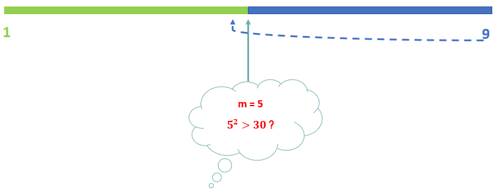

- [Binary search the basics](#binary-search-the-basics)
- [The bisect library](#the-bisect-library)
- [Variations of binary search](#variations-of-binary-search)
- [Binary search trivial problems](#binary-search-trivial-problems)
  - [First and last position in sorted array](#first-and-last-position-in-sorted-array)
  - [Check if perfect square](#check-if-perfect-square)

# Binary search the basics

Given a sorted array of integers $$A$$, we want to find a number, which we call "target", or $$x$$  The code should return the index of target, and return $$-1$$ if not found. 

The devide and conquer method is implemented as follows:
1. We begin searching the entire array of numbers, defined by the index for the smallest number and the index of the biggest number.         
2. Compute the mid point index. 
>  <span class="coding">l + (r - l) // 2</span> and <span class="coding">(r + l) // 2</span> are equivalent, in computation, they have a subtle difference: the latter may cause overflow (even though it may never happen) in some languages (not in Python because Python integers are unbounded).
3. We compare the target with the $$A[m]$$:
   1. if the target $$>A[m]$$, then we can disregard the left half $$->$$ <span class="coding">l</span> moves to <span class="coding">m + 1</span>, $$\text{mid point index} + 1$$
   2. else if the target $$<A[m]$$, then we drop the right half $$->$$ <span class="coding">r</span> moves to <span class="coding">m - 1</span>, $$\text{mid point index} - 1$$
   3. else it means the target is equal to $$A[m]$$, we return it and get out of the loop
4. Continue the search from step 1 until loop is exhausted 

> The condition for the <span class="coding">while</span> loop is <span class="coding">while l <= r</span>.  Missing the $$=$$ sign the algorithm will be wrong in this particular set up.  For example, if you search for the boundary values, it would return $$-1$$ erroneously. 

For an one-element array, [1], or [100], the <span class="coding">while</span> loop would not have even run if we did not have the $$=$$ sign because the boundary indices would be the same. 

So, when we check our code, we can test these extreme cases:
* one-element array
* target is one of the boundary values

> Note that if the target is found, it will be returned and the function call will stop immediately. 

<div class="code-head"><span>code</span>binary search.py</div>

```py
def bSearch(A, target):
    N = len(A)
    l = 0
    r = N - 1
    while l <= r:
        m = l + (r - l) // 2 # not writing it as (r + l) // 2 to prevent overflow
        if target > A[m]:
            l = m + 1
        elif target < A[m]:
            r = m - 1
        else:
            return m # return and stop the function
    return - 1

lt = [1, 2, 5, 7, 8, 10, 20]
print(bSearch(lt, 7))

```


# The bisect library

The [bisect library](https://docs.python.org/3/library/bisect.html) has some functions that perform variations of binary search.  For example, the <span class="coding">bisect_left</span> function returns the leftist index of the value we search, if it exist in the input array. If value we search does not exist in the array, then it gives the index position the insertion point.
> The source code may be most useful as a working example of the algorithm (the boundary conditions are already right!).

I simplified the bisect_left source code as below.  
Note many of the small differences from <span class="coding">bSearch</span> function above.
* while loop condition
* two conditions in if-else rather than there
* r is updated as r = m rather than r = m -1
* return left pointer <span class="coding">l</span> 

<div class="code-head"><span>code</span>bisectLeft.py</div>

```py
def bisectLeft(A, target):
    l = 0
    r = len(A)
    while l < r:
        m = l + (r - l) // 2
        if A[m] < target:
            l = m + 1
        else:
            r = m
    return l
```


1. **when x is *missing* from the input array**: <span class="coding">bisect_left</span>, <span class="coding">bisect</span>, and <span class="coding">bisect_right</span> all produce the same result: **the insertion point**
2. **when x is in the input array**:  <span class="coding">bisect_left</span> gives the index of the leftmost one, while <span class="coding">bisect</span> and <span class="coding">bisect_right</span> returns the insertion point immediately after the rightmost x, i.e., the leftmost insertion point after the target, 

<div class="code-head"><span>code</span>bisect.py</div>

```py
from bisect import bisect, bisect_left, bisect_right
In [61]: list1 = [1, 4, 4, 5, 6]
    ...: x = 3
    ...: print(bSearch(list1, x))
    ...: print(bisect_left(list1, x))
    ...: print(bisect(list1, x))
    ...: print(bisect_right(list1, x))
    ...:
-1
1
1
1

In [62]: list1 = [1, 4, 4, 5, 6]
    ...: x = 4
    ...: print(bSearch(list1, x))
    ...: print(bisect_left(list1, x))
    ...: print(bisect(list1, x))
    ...: print(bisect_right(list1, x))
    ...:
2
1
3
3

In [63]: list1 = [1, 4, 4, 5, 6, 6, 6]
    ...: x = 6
    ...: print(bSearch(list1, x))
    ...: print(bisect_left(list1, x))
    ...: print(bisect(list1, x))
    ...: print(bisect_right(list1, x))
    ...:
5
4
7
7

```

# Variations of binary search

I have summarized some variations of binary search in the table below. 
For "Find leftmost value less than or equal to x", we use <span class="coding">bisect_left</span> since bisect_left gives the leftmost index when found and the insertion index if not found, 

Action | Math expression | Function
---------|----------|---------
 **locate leftmost value exactly equal to x**  | $$min\{i\| A[i] = x\}$$| <span class="coding">bisect_left(A,x)</span>
 **rightmost value less than x** | $$max\{y\|y<x \cap y\in A\}$$  | <span class="coding">A[bisect_left(A,x) - 1]</span>                                   
 **rightmost value less than or equal to x** | $$max\{y\|y<=x \cap y\in A\}$$  | <span class="coding">A[bisect_right(A,x) - 1]</span>
 **leftmost value less than or equal to x** | $$min\{y\|y<=x \cap y\in A\}$$  | <span class="coding">A[bisect_left(A,x) - 1] </span>

The following snippets are modified from the bisect page.

<div class="code-head"><span>code</span>bisect_derived_functions.py</div>

```py

def find_lt(A, x):
    'Find rightmost value less than x'
    i = bisect_left(A, x)
    if i:
        return A[i-1]
    raise ValueError

def find_le(A, x):
    'Find rightmost value less than or equal to x'
    i = bisect_right(A, x)
    if i:
        return A[i-1]
    raise ValueError

def find_gt(A, x):
    'Find leftmost value greater than x'
    i = bisect_right(A, x)
    if i != len(A):
        return A[i]
    raise ValueError

def find_ge(A, x):
    'Find leftmost item greater than or equal to x'
    i = bisect_left(A, x)
    if i != len(A):
        return A[i]
    raise ValueError

```

The [example](https://docs.python.org/3/library/bisect.html) on numeric table lookups is interesting and clever.  Since the <span class="coding">bisect()</span> function gives the leftmost insertion point after the target, *all numbers **from** break point 60 (**inclusive**) up to next break point 70 (**exclusive**) will be given the insertion point after break point*.  

This code would not have worked had we used <span class="coding">bisect_left()</span>

We have $$n$$ breakPoints, which corresponds to a 5-part partition on the range [0, 100].  The 5-part partition corresponds to the 5 grades, in sorted order. 
<div class="code-head"><span>code</span>ratings.py</div>

```py
from bisect import bisect, bisect_left, bisect_right
def grade_location(score, breakpoints, grades='FDCBA'):
    i = bisect(breakpoints, score)
    return i
def grade(score, breakpoints, grades='FDCBA'):
    i = bisect(breakpoints, score)
    return grades[i]

A = [33, 59, 60, 61,  70, 77, 79, 89, 90, 100]
breakPoints = [60, 70, 80, 90]
grades='FDCBA'
print([grade_location(score,breakPoints, grades) for score in A])
print([grade(score,breakPoints, grades) for score in A])
# [0, 0, 1, 1, 2, 2, 2, 3, 4, 4]
# ['F', 'F', 'D', 'D', 'C', 'C', 'C', 'B', 'A', 'A']
```

|  in range  |   score |   index/insertion point | grade   |
|---:|--------:|--------:|:--------|
|  below 60 |      33 |       0 | F       |
|  [0,60) |      59 |       0 | F       |
|  [60,70) |      60 |       1 | D       |
|  [60,70) |      61 |       1 | D       |
|  [70,80) |      70 |       2 | C       |
|  [70,80)  |      77 |       2 | C       |
|  [70,80) |      79 |       2 | C       |
|  [80,90)  |      89 |       3 | B       |
|  90 and above |      90 |       4 | A       |
|  90 and above |     100 |       4 | A       |

# Binary search trivial problems

A few trivial problems are documented here. 

## First and last position in sorted array

Now, instead of finding the index of the target (assuming no duplicates), we want to find the first and the last position of the target.  

<div class="code-head"><span>code</span>binary search variation.py</div>

```py
def searchRange(A, target):
    small = bSearch(A, target, True)
    big = bSearch(A, target, False)
    return [small, big]
    
def bSearch(A, target, smallBias):
    ```
    smallbias: True means we are searching for the first & False means searching for the last
    ```
    N = len(A)
    l = 0
    r = N - 1
    idx = -1
    while l <= r:
        m = l + (r - l )//2
        if target > A[m]:
            l = m + 1
        elif target < A[m]:
            r = m - 1
        else:
            idx = m
            # return idx for regular binary bSearch
            if smallBias:
                r = m - 1
            else:
                l = m + 1

    return idx

lt = [1]
lt2 = [1,1,1, 2,2, 5, 7, 8, 10, 20, 30, 100]
print(searchRange(lt, 1))
print(searchRange(lt2, 2))
```    
## Check if perfect square

Problem: Given a positive interger, we want to check if it is a perfect square.  

My instinct would have been just use the square root function and check if the root is an integer.  I am sure there are many different ways to solve this.   The two solutions here are to square numbers almost by brute force and check if the result matches the number:

1. Linear time: a small trick used to reduce computation is loop through up to input number//2.  Because all numbers squared are larger than doubled, except 2.  
2. Log(n) time: use binary search.  
   


Below program compare the two methods by recording the time they each take to check a list of integers.  Aparently, linear time becomes large quickly whereas log(n) time increases very slowly. 
<div class="code-head"><span>code</span>checkSquares.py</div>

```py
def checkSquare(num):
    for i in range(1, num//2 + 1, 1):
        if i**2 == num:
            return True
    return False

def checkSquare2(num):
    l = 1
    r = 1+ num // 2
    while l <= r:
        m = l + (r - l)//2
        if m*m > num:
            r = m -1
        elif m*m < num:
            l = m + 1
        else:
            return True
    return False
# print(checkSquare2(3))

from datetime import datetime
import pandas as pd
def compareTime(A):
    bs, bs_time, linear, linear_time = [], [], [], []
    for i in A:
        t0 = datetime.now()
        bs.append(checkSquare2(i))
        bs_time.append((datetime.now() - t0).microseconds)

        t1 = datetime.now()
        linear.append(checkSquare(i))
        linear_time.append((datetime.now() - t1).microseconds)
    df = pd.DataFrame({
        'num': A,
        'bs': bs,
        'bs_time': bs_time,
        'linear': linear,
        'linear_time': linear_time
    })
    return df

A = [1, 3, 30, 300, 3000, 30000, 300000, 3000000]
result = compareTime(A)
print(result)

```

|     num | bs    |   bs_time | linear   |   linear_time |
|--------:|:------|----------:|:---------|--------------:|
|       0 | True  |         0 | True     |             0 |
|       3 | False |         0 | False    |             0 |
|       3 | False |         0 | False    |             0 |
|      30 | False |         0 | False    |             0 |
|     300 | False |         0 | False    |             0 |
|    3000 | False |         0 | False    |         15622 |
|   30000 | False |         0 | False    |         39016 |
|  300000 | False |         0 | False    |        519450 |
| 3000000 | False |         0 | False    |        314920 |