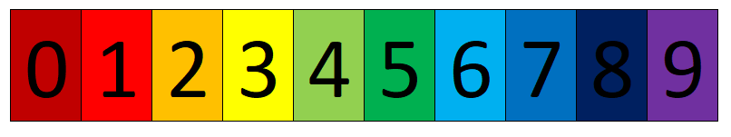

- [Introduction](#introduction)
- [Quicksort](#quicksort)
  - [Worst case time complexity](#worst-case-time-complexity)
  - [Quicksort implementations](#quicksort-implementations)
    - [1. First shot](#1-first-shot)
    - [2. quicksort using list comprehension](#2-quicksort-using-list-comprehension)
  - [Preventing worst case](#preventing-worst-case)
- [Merge sort](#merge-sort)
- [Heapsort 堆排序](#heapsort-堆排序)
  - [Max heap data structrue](#max-heap-data-structrue)
  - [Implement max heap in Python](#implement-max-heap-in-python)
  - [The heapq  module](#the-heapq--module)
- [Bucket sort (Radix sort)](#bucket-sort-radix-sort)
- [Reference](#reference)
  - [QuickSort](#quicksort-1)
# Introduction

This is a second post on sorting algorithms.  In this post we talk about four common algorithms that have average time complexity $$O(n*log(n))$$, which is a lot better than $$O(n^2)$$. 

Most of the sorting methods in this post are by comparion, except bucket sort. 


Volume 3 of Don Knuth's book series “The Art of Computer Programming” compares sorting speed for an *“artificial typical”* computer invented by the author. Some of the average case results are in the following plot:


# Quicksort

The quicksort algorithm reminds me of binary search.  

In binary search on a sorted array, we half the search range by comparing target with the median of the search range.  

Quicksort works by sorting as if we only care about sorting into two parts: larger than (something) and smaller than (something).  The element that is used to split the original array into two parts is commonly called the "pivot".  


Then we apply the same method to each of the two parts, and continue until each of the parts has only 1 element (cannot be splited anymore). 

Because we are divide-sorting in half every iteration, time complexity is $$n*log(n)$$ on average.  

## Worst case time complexity

In the unfortunate case that the pivot is the largest or the smallest, then our intent to half the array fails: 

• Then one subarray is always empty.

• The second subarray contains n − 1 elements, i.e. all the elements other than the pivot.

• Quicksort is recursively called only on this second group.

To do the first partitioning, there are $$n − 1$$$$ comparisons.

• At each subsequent step, the number of comparisons is one less, so that 

$$T(n) = T(n − 1) + (n − 1)$$; 

$$T(1) = 0$$.

• “Telescoping” $$T(n) − T(n − 1) = n − 1$$:

$$T(n)+T(n − 1)+T(n − 2)+. . .+T(3)+T(2)
−T(n − 1)−T(n − 2)−. . .−T(3)−T(2)− T(1)
= (n − 1) + (n − 2) +. . .+ 2 + 1 − 0$$

$$T(n)= (n − 1) + (n − 2) +. . .+ 2 + 1 =(n−1)n/2$$

This yields that $$T(n) ∈ Ω(n^2)$$.

> **Quicksort is slow on sorted or nearly sorted data**. 

> **It is fast on the “randomly scattered” pivots**, excpet with no guarantees. 


## Quicksort implementations

Below quicksort implementation is simple but not optimized.  We use recursion.  The "initial" condition is that if input has only 1 element, then stop.  Otherwise, we split input in half according to whether elements are bigger or smaller than pivot. 


### 1. First shot
An error I made before was to use <span class="coding">A[-1]</span> as the pivot instead of <span class="coding">A.pop()</span>.   

<span class="coding">A[-1]</span> does not remove the last element (used as pivot) from the comparison.

<span class="coding">A.pop()</span> removes the last element. 

To make sure we fully understand what's going on, we print out each step.

In the second iteration of the sorting, the right array has only 1 element, 100.  So recursion stops for the right array. 

The new left array L is now  [3, 9, 1, 0, -10].  Because nothing is smaller than the pivot -10, L is empty.  The new right array has to carry on and do all the work.

Each time we see A is an empty array, we know it was recursed from an empty left or right array. 

<div class="code-head"><span>code</span>basic quicksort.py</div>

```python
def quickSort(A):
    print("\nA:", A)
    if len(A) < 2:  # base case
        return A
    else:
        L, R = [], []
        print("pivot is ", A[-1])
        pivot = A.pop()
        for num in A: # pivot is not in A anymore
            if num < pivot:
                L.append(num)
            else:
                R.append(num)
        print("L:", L)
        print("R:", R)
    return quickSort(L) + [pivot] + quickSort(R)

nums = [100, 3, 9, 1, 0, -10, 87]
print(quickSort(nums))

# A: [100, 3, 9, 1, 0, -10, 87]
# pivot is  87
# L: [3, 9, 1, 0, -10]
# R: [100]

# A: [3, 9, 1, 0, -10]
# pivot is  -10
# L: []
# R: [3, 9, 1, 0]

# A: []

# A: [3, 9, 1, 0]
# pivot is  0
# L: []
# R: [3, 9, 1]

# A: []

# A: [3, 9, 1]
# pivot is  1
# L: []
# R: [3, 9]

# A: []

# A: [3, 9]
# pivot is  9
# L: [3]
# R: []

# A: [3]

# A: []

# A: [100]
# [-10, 0, 1, 3, 9, 87, 100]

```

### 2. quicksort using list comprehension 

One problem with the above code is that at the end, our input array is altered: it is missing the last element because of <span class="coding">pop()</span>.   

It is easy to fix that, we use slicing instead of pop().   

Below snippet is adapted from the book ["Python Cookbook"](https://www.oreilly.com/library/view/python-cookbook/0596001673/ch02s12.html).  

It uses only 2 lines of code.  Simple!

<div class="code-head"><span>code</span>quicksort using list comprehension.py</div>

```python
# use the rightmost as pivot
def qsort(A):
    if len(A) <= 1: return A
    return qsort([lt for lt in A[:-1] if lt < A[-1]]) + A[-1:] + \
           qsort([ge for ge in A[:-1] if ge >= A[-1]])
print(qsort(nums))

# use the leftmost as pivot
def qsort(A):
    if len(A) <= 1: return A
    return qsort([lt for lt in A[1:] if lt < A[0]]) + A[0:1] + \
           qsort([ge for ge in A[1:] if ge >= A[0]])
print(qsort(nums))
```

Below quicksort implementation has improvement in space complexity.  It uses the rightmost of range as pivot, which is not the best method because the rightmost can be the largest or smallest, and has higher likelihood to be the extreme values than if we use some methods to prevent it. 

<div class="code-head"><span>code</span>basic quicksort in place.py</div>

```python
def partition(A, l, r):
    i = l - 1
    pivot = A[r] # use the rightmost of range as pivot (not the best method)
    for j in range(l, r):
        if A[j] <= pivot:
            i += 1 # if a number is smaller than pivot, then pointer increments by 1
            A[i], A[j] = A[j], A[i] # swap with that smaller number with the one pointer is at
    A[i+1], A[r] = A[r], A[i+1] 
    return i+1
def quicksort(A, l=0, r = None):
    if r==None:
        r = len(A) - 1
    if l < r:
        pivot = partition(A, l,r)
        quicksort(A, l, pivot-1)
        quicksort(A, pivot+1, r)
    return A
nums = [100, 3, 9, 1, 0]
quicksort(nums,l=0)
```

Given the importance of pivot, below code takes a random element as pivot instead of what happens to be at the leftmost or rightmost position. 
This code is adapted from this [stackoverflow](https://stackoverflow.com/questions/17773516/in-place-quicksort-in-python) post.

It has two parts: 

 **1. quicksort body**.  It takes input array, left, right position, randomly pick an element as the pivot.  
It gives the function <span class="coding">partitionSort</span> input array, left, right and pivot indices, to do its partition-sort.   The <span class="coding">partitionSort</span> function sorts input array into two subarrays: smaller than pivot, and greater than pivot, and returns the position of the pivot where it ended up.

It then recurse on the two subarrays. 

  **2. partitionSort**:  It takes input array, left, right and pivot indices, to do its partition-sort.  

*     Station the pivot at the leftmost place by swapping <span class="coding">A[l]</span> with pivot. 
*     Then it does its partition-sort by keeping track of two things: <span class="coding">i</span> and <span class="coding">j</span> both begin as <span class="coding">l + 1</span> because they need to leave the pivot alone. 
*     <span class="coding">i</span> keeps track of the less-than-pivot elements, and moves by 1 to the right each time a less-than-pivot element is moved to the left subarray.  
* <span class="coding">j</span> does the looping from <span class="coding">l + 1</span> all the way to <span class="coding">r</span> (inclusive), and checks one by one if less than pivot.  If less than pivot, <span class="coding">A[j]</span> swaps with <span class="coding">A[i]</span>, and <span class="coding">i</span> increments by $$1$$. 

> **Note**: Do not omit the $$=$$ in  <span class="coding">while j <= r:</span>.  Because we may have duplicates in the array.  And because everyone in the subarray needs to compare with the pivot, including the one in the rightest. 

On the other hand, result is correct whether we put $$=$$ in <span class="coding">if A[j] < pivot:</span>. 

<div class="code-head"><span>code</span>quicksort in place with random pivot.py</div>

```python
import random
def partitionSort(A, l, r, pivotIdx):
    '''
    sort into two parts, smaller than pivot, 
    '''
    if not (l <= pivotIdx <= r):
        raise ValueError("pivot index must be within l and r")
    # move pivot out of the way
    pivot = A[pivotIdx]
    # now in A, pivot is moved to the leftmost place
    A[pivotIdx], A[l] = A[l], A[pivotIdx]
    # adding 1 because we don't touch the pivot. 
    i = l + 1
    j = l + 1
    while j <= r:
        if A[j] < pivot:
            A[i], A[j] = A[j], A[i]
            i += 1 # i represent small item count, but we would need to decrement it by 1 for pivot in the end of the function
        j += 1
    # put pivot where it belongs because we have i-1 items small or equal to pivot
    A[l], A[i -1] = A[i -1], A[l]
    return i - 1

def quickSort(A, l=0, r = None):
    if r == None:
        r = len(A) - 1
    if r - 1 < l:
        return 
    pivotIdx = random.randint(l, r) # starting pivot index
    p = partitionSort(A, l, r, pivotIdx) # ending pivot index after sorting
    quickSort(A, l, p - 1)
    quickSort(A, p + 1, r)
    return A


nums = [100, 3, 9, 1, 0, -10, 87]
print(quickSort(nums))
print(nums)

```

The error catching code <span class="coding">if not (l <= pivotIdx <= r):</span> was never used, but it is nevertheless good to put into place in case of any misuse. 

## Preventing worst case


# Merge sort

Like quicksort, merge sort is a divide-and-conquer recursive method. 

The quicksort algorithm tries to sort an array in two **"halves"** (or more accurately,two parts), and then **"halves of halves"**, by *comparing* with members of arrays (or more precisely "sub-arrays") that are commonly called "pivot".  The sorting efficiency depends on how close the "pivots" are close to the medians of the arrays.  The pivots are not the medians in reality because we don't know what the medians are. 

Whereas the merge sort method splits input array in exact halves, and then halves, recursively, into one-unit subarrays, compare elements of the subarrays with each other in a binary fashion, and **merge** them back recursively into one sorted array.  

The merge sort method feels like some kind of **depth-first** search even though it is a sorting method. 

Time complexity: $$O(n*log(n))$$, which is optimal for comparison based algorithm. 

In code below, **the recursion calls are placed immediately after halfing the input array into left and right halves**.   

Since the <span class="coding">mergeSort(L)</span> is placed before <span class="coding">mergeSort(R)</span>, it means that the left half will be recursively partitioned and merged before the right half. 


<div class="code-head"><span>code</span>merge sort.py</div>

```python

# merge sort
def mergeSort(A):
    N = len(A)
    if N > 1:
        L = A[:N//2]
        R = A[N//2:]
    
        # recursion
        mergeSort(L)
        mergeSort(R)

        # merge
        i = 0 # left array idx initiated at 0, whenever an element is copied to A i < len(L) means 
        j = 0 # right array idx
        k = 0 # merged array idx
        while i < len(L) and j < len(R): 
            if L[i] < R[j]:
                A[k] = L[i]
                i += 1
            else: 
                A[k] = R[j]
                j += 1
            k += 1

        while i < len(L):
            A[k] = L[i]
            k += 1
            i += 1
            
        while j < len(R):
            A[k] = R[j]
            k += 1
            j += 1
    return A
A = [9, 4, 100, 1, 598, 0, 8]
print(mergeSort(A))
# [0, 1, 4, 8, 9, 100, 598]
```

To see how the recursion works, I printed out every single parameter as shown in code and output below. 

<div class="code-head"><span>code</span>merge sort.py</div>

```python

# merge sort
def mergeSort(A):
    print("\nEntering function call, A is ", A)
    N = len(A)
    print("N, the length of A is, ", N)
    if N > 1:
        L = A[:N//2]
        R = A[N//2:]
        print("L is ", L)
        print("R is ", R)
    
        # recursion
        mergeSort(L)
        mergeSort(R)

        # merge
        print("\nMERGING STEP")
        i = 0 # left array idx initiated at 0, whenever an element is copied to A i < len(L) means 
        j = 0 # right array idx
        k = 0 # merged array idx
        while i < len(L) and j < len(R): 
            if L[i] < R[j]:
                print("if both L & R have something left, and left is smaller than right")
                print("L[i] is ", L[i])      
                A[k] = L[i]
                i += 1
            else: 
                print("if both L & R have something left, and left is bigger than right")
                A[k] = R[j]
                print("R[j] is ", R[j])
                j += 1
            k += 1

        while i < len(L):
            print("if only L has something left, then copy them to A")
            A[k] = L[i]
            k += 1
            i += 1
            
        while j < len(R):
            print("if only R has something left, then copy them to A")
            A[k] = R[j]
            k += 1
            j += 1
    print("\nExiting function call, A is ", A)
    return A
A = [9, 4, 100, 1, 598, 0, 8]
# A = [9, 4, 100, 1]
print(mergeSort(A))

# Entering function call, A is  [9, 4, 100, 1, 598, 0, 8]
# N, the length of A is,  7
# L is  [9, 4, 100]
# R is  [1, 598, 0, 8]

# Entering function call, A is  [9, 4, 100]
# N, the length of A is,  3
# L is  [9]
# R is  [4, 100]

# Entering function call, A is  [9]
# N, the length of A is,  1

# Exiting function call, A is  [9]

# Entering function call, A is  [4, 100]
# N, the length of A is,  2
# L is  [4]
# R is  [100]

# Entering function call, A is  [4]
# N, the length of A is,  1

# Exiting function call, A is  [4]

# Entering function call, A is  [100]
# N, the length of A is,  1

# Exiting function call, A is  [100]

# MERGING STEP
# if both L & R have something left, and left is smaller than right
# L[i] is  4
# if only R has something left, then copy them to A

# Exiting function call, A is  [4, 100]

# MERGING STEP
# if both L & R have something left, and left is bigger than right
# R[j] is  4
# if both L & R have something left, and left is smaller than right
# L[i] is  9
# if only R has something left, then copy them to A

# Exiting function call, A is  [4, 9, 100]

# Entering function call, A is  [1, 598, 0, 8]
# N, the length of A is,  4
# L is  [1, 598]
# R is  [0, 8]

# Entering function call, A is  [1, 598]
# N, the length of A is,  2
# L is  [1]
# R is  [598]

# Entering function call, A is  [1]
# N, the length of A is,  1

# Exiting function call, A is  [1]

# Entering function call, A is  [598]
# N, the length of A is,  1

# Exiting function call, A is  [598]

# MERGING STEP
# if both L & R have something left, and left is smaller than right
# L[i] is  1
# if only R has something left, then copy them to A

# Exiting function call, A is  [1, 598]

# Entering function call, A is  [0, 8]
# N, the length of A is,  2
# L is  [0]
# R is  [8]

# Entering function call, A is  [0]
# N, the length of A is,  1

# Exiting function call, A is  [0]

# Entering function call, A is  [8]
# N, the length of A is,  1

# Exiting function call, A is  [8]

# MERGING STEP
# if both L & R have something left, and left is smaller than right
# L[i] is  0
# if only R has something left, then copy them to A

# Exiting function call, A is  [0, 8]

# MERGING STEP
# if both L & R have something left, and left is bigger than right
# R[j] is  0
# if both L & R have something left, and left is smaller than right
# L[i] is  1
# if both L & R have something left, and left is bigger than right
# R[j] is  8
# if only L has something left, then copy them to A

# Exiting function call, A is  [0, 1, 8, 598]

# MERGING STEP
# if both L & R have something left, and left is bigger than right
# R[j] is  0
# if both L & R have something left, and left is bigger than right
# R[j] is  1
# if both L & R have something left, and left is smaller than right
# L[i] is  4
# if both L & R have something left, and left is bigger than right
# R[j] is  8
# if both L & R have something left, and left is smaller than right
# L[i] is  9
# if both L & R have something left, and left is smaller than right
# L[i] is  100
# if only R has something left, then copy them to A

# Exiting function call, A is  [0, 1, 4, 8, 9, 100, 598]
# [0, 1, 4, 8, 9, 100, 598]
```

# Heapsort 堆排序

> [Heapsort can be thought of as an improved Selection sort](https://en.wikipedia.org/wiki/Heapsort).

> Like Selection sort, heapsort partitions its input into a sorted and an unsorted region, and it iteratively shrinks the unsorted region by selecting the largest element from it and inserting it into the sorted region in order. 

> Unlike selection sort, heapsort does not waste time with a linear-time scan (**no pointers**) of the unsorted region; rather, heap sort maintains the unsorted region in a **max heap data structure** to more quickly find the largest element in each step.

In practice on most machines it is **slower than** a well-implemented quicksort ($$O(n^2)$$), it has better worst-case $$O(n*log(n))$$ runtime than quicksort. 

Heapsort is an in-place algorithm, but it is not a stable sort.

## Max heap data structrue

> The heap data structure is a fusion of array and tree. 

The max heap data structure is a **complete binary tree** with the max heap property: **At each node, the parent is larger than its chidren.**

*  Complete means that at all levels of the tree, except possibly the last one (deepest) are fully filled, and, if the last level of the tree is not complete, the nodes of that level are filled from left to right (left-aligned).

* $$ \forall \text{ complete binary tree, }\exists\text{ an unique array, and vice versa.}

* $$Left(i)=2*i+1$$
* $$Right(i)=2*i+2$$
* $$Parent(j)=[(i-2)/2]$$

The "parent-children" relationship are defined by the array indices in the above three functions.  There is no need of any pointers.  There is no need for attributes such as left or right children either. 


## Implement max heap in Python

Below implementation of the maxHeap object has 3 public functions: push, peek, and pop.   

When a <span class="coding">maxHeap</span> object is instantiated, the input is transformed into a max heap using the <span class="coding">__heapifyUp</span> function. 

Both <span class="coding">__heapifyUp</span> and <span class="coding">__heapifyDown</span> functions are recursive functions.  The former compares with "parent" whereas the latter compares with "children".

The <span class="coding">__heapifyUp</span> compares the value at the current index with the value at its parent index, if the value at current index is bigger, then it swaps with "its parent" so that the value at the parent index is bigger. 

The <span class="coding">__heapifyDown</span> compares the value at the current index with the values at its children indices.  If the current value is smaller, then it swaps with "one of its children" so that the value at the child index is smaller, or equivalently the value at the current index is bigger. 

<div class="code-head"><span>code</span>heap.py</div>.

```python
class maxHeap:
    """
    3 private functions: 
    __swap
    __heapifyUp
    __heapifyDown
    """
    def __init__(self, items= []):
    # def __init__(self, items= object):
        self.heap = []
        for i in items:
            self.heap.append(i)
            self.__heapifyUp(len(self.heap) - 1)

    def push(self, data):
        self.heap.append(data)
        self.__heapifyUp(len(self.heap) - 1)

    def peek(self):
        if self.heap[0]:
            return self.heap[0]
        else:
            return False

    def pop(self):
        if len(self.heap) > 1:
            self.__swap(0, len(self.heap) - 1) # swap the max and last element
            max = self.heap.pop()
            self.__heapifyDown(0) # heapify down the last element that got swapped to the max position
        elif len(self.heap) ==1:
            max = self.heap.pop()
        else:
            max = False
        return max
    
    def __swap(self, i, j):
        self.heap[i], self.heap[j] =  self.heap[j], self.heap[i]

    def __heapifyUp(self, idx):
        parent = (idx - 1) //2 #  parent index
        if idx <= 0:
            return # do nothing if already at the top
        elif self.heap[idx] > self.heap[parent]: # if larger than parent, then swap with parent
            self.__swap(idx, parent)
            self.__heapifyUp(parent) # recurse

    def __heapifyDown(self, idx):  # heapify down until it is not smaller than its children
        left = idx *2 +1 # left child index
        right = idx * 2 + 2 # right child index
        largest = idx # assume current idx holds the largest
        if len(self.heap) > left and self.heap[largest] < self.heap[left]:
            largest = left
        if len(self.heap) > right and self.heap[largest] < self.heap[right]:
            largest = right
        if largest != idx:
            self.__swap(idx, largest)
            self.__heapifyDown(largest) # recurse

```
Below code instantiates a maxHeap object we defined above, and repeatedly pops the maximum. 


<div class="code-head"><span>code</span>heapSort.py</div>

```python
A = [5, 7,3,9, 2,8, 1, 4,6,]
maxHeap(A).heap
# [9, 7, 8, 6, 2, 3, 1, 4, 5]

M = maxHeap(A)  
print(M.heap) 
# [9, 7, 8, 6, 2, 3, 1, 4, 5]
M.push(10)
print(M.heap)
# [10, 9, 8, 6, 7, 3, 1, 4, 5, 2]

from collections import deque
A = deque()
for i in range(len(M.heap)):
    A.appendleft(M.pop())
print(A) # sorted
# [10, 9, 8, 6, 7, 3, 1, 4, 5, 2]
# deque([1, 2, 3, 4, 5, 6, 7, 8, 9, 10])

```

## The heapq  module


We can also use the Python <span class="coding">heapq</span> module.  The heapq module is part of Python standard library, with well-documented [Github source code](https://github.com/python/cpython/blob/3.10/Lib/heapq.py). 

Note that it implements min heap, which means that the root node is the smallest. 

The <span class="coding">_heapify_max</span> function converts an input to a max heap in-place, in O(n) time. 

<div class="code-head"><span>code</span>heapq.py</div>

```python
import heapq
A = [5, 7 ,3, 9, 2, 8, 1, 4, 6]
heapq.heapify(A)
print(A)
# [1, 2, 3, 4, 7, 8, 5, 9, 6]

A = [5, 7 ,3, 9, 2, 8, 1, 4, 6]
heapq._heapify_max(A)
print("max heap", A)
# max heap [9, 7, 8, 6, 2, 3, 1, 4, 5]


print(heapq.heappop(A))
print("after poping max")
print(A)

print(heapq.heappop(A))
print("after poping the second number, we see that it is no longer max heap")
print(A)

print("need to heapify again")
heapq._heapify_max(A)
print("max heap", A)
```

# Bucket sort (Radix sort)

Radix sort is a very fast sorting algorithm for integers.  Unlike other sorting methods, it does no comparisons. Digits of integers are slotted into their respective buckets (0, 1, 2, 3, ..., 9).

> There is no comparions and no if-else branching



Bucket sort is very fast for large quantities of small integers. 

Even though the algorithm is for integers only, other objects can be mapped to integers to use this sorting method. 

Note the order of operations in <span class="coding">i//10**(digit)%10</span>:
> The exponential is computed first even if you put a space between like <span class="coding">i//10** (digit)%10</span>!
> To avoid any confusion, it may be better to write <span class="coding">i//(10**digit)%10</span>

Also, pay attention to that $$A$$ is modified with each loop. 

**In the first outer loop, $$A$$ is the input**.
**In all subsequent outer loops, $$A$$ is the flattened buckets $$B$$**. 

```python
def bucketSort(A):
    num_digits = len(str(max(A)))

    for digit in range(0, num_digits):
        B = [[] for i in range(10)] # list of list
        for i in A:
            num = i//10**(digit)%10 
            B[num].append(i)
        # flatten
        A = []
        for i in B:
            A.extend(i)
    return A

A = [4, 9, 100, 1, 598, 0, 8]
print(bucketSort(A))

# [0, 1, 4, 8, 9, 100, 598]
```

# Reference

## QuickSort
* [Georgy Gimel’farb, Algorithm Quicksort: Analysis of Complexity, Lecture slide](https://www.cs.auckland.ac.nz/courses/compsci220s1c/lectures/2016S1C/CS220-Lecture10.pdf)

* [stackexchange "why is quicksort better than other sorting algorithms in practice"](https://cs.stackexchange.com/questions/3/why-is-quicksort-better-than-other-sorting-algorithms-in-practice)

* [stackexchange "inplace quicksort"](https://codereview.stackexchange.com/questions/272639/in-place-quicksort-algorithm-in-python)
  