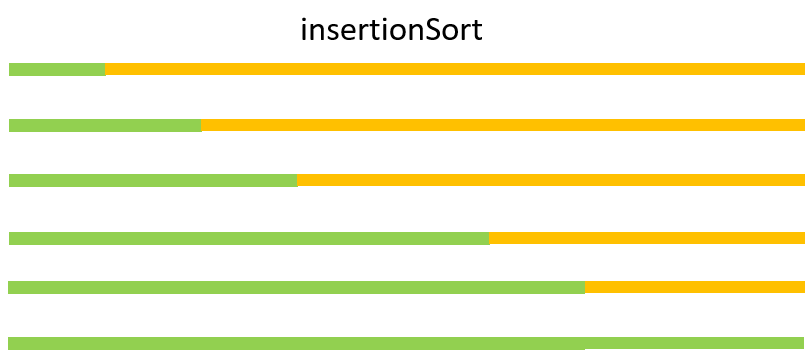
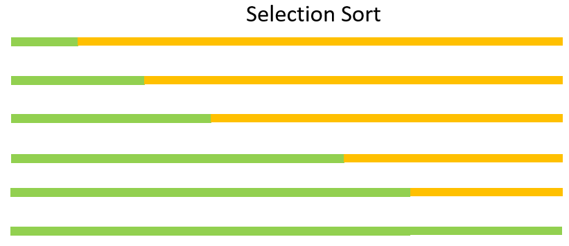
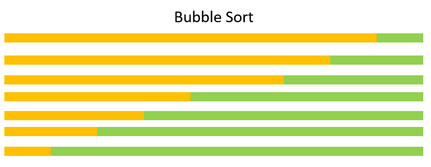

- [Introduction](#introduction)
- [Quick sort](#quick-sort)
- [Insertion sort](#insertion-sort)
- [Select sort](#select-sort)
- [Compare Select sort and Insertion sort](#compare-select-sort-and-insertion-sort)
- [Merge sort](#merge-sort)
- [Bubble sort](#bubble-sort)
- [Heapsort 堆排序](#heapsort-堆排序)
  - [Max heap data structrue](#max-heap-data-structrue)
  - [Implement max heap in Python](#implement-max-heap-in-python)
  - [The heapq  module](#the-heapq--module)
- [Bucket sort (Radix sort)](#bucket-sort-radix-sort)
# Introduction

Sorting algorithms are very important.  In the Women in Mathematics summer program that I participated in Washington DC 2006 during my college junior year, the NSA director of mathematics came and gave us (16 women math college students from around the country) a talk on sorting algorithms.  The fact that he chose to talk about sorting made me realize it is importance.  For examples:

When things are sorted, you can find order much faster, for example, percentiles.  
The [binary search algorithm](2022-06-22-1-binary-search.md) works on a sorted array.  

There are two main types of sorting: by comparison and not by comparion.  Most of the sorting methods in this post are by comparion, except bucket sort. 


# Quick sort

The quick sort algorithm reminds me of binary search.  

In binary search on a sorted array, we half the search range by comparing target with the median of the search range.  

Quick sort works by sorting as if we only care about sorting into two parts: larger and smaller.  The element that is used to split the original array into two parts is commonly called the "pivot".  

Then we apply the same method to each of the two parts, and continue until each of the parts has only 1 element (cannot be splited anymore).  


Below quick sort implementation is simple but not optimized in any way. 

<div class="code-head"><span>code</span>basic quick sort.py</div>

```python
def quickSort(A):
    N = len(A)
    if N < 2:
       return A
    else:
        L = [] # not inplace
        H = []
        pivot = A.pop() # using the last element instead of random or the "median of three" method
        for i in range(0,len(A)):
            if A[i] > pivot:
                H.append(A[i])
            else:
                L.append(A[i])
    return quickSort(L) + [pivot] + quickSort(H)

nums = [100, 3, 9, 1, 0]
print(qs(nums))
# [0, 1, 3, 9, 100]
```
Below quick sort implementation has improvement in space complexity.  

<div class="code-head"><span>code</span>basic quick sort in place.py</div>

```python
def partition(A, l, r):
    i = l - 1
    pivot = A[r] # use the rightmost of range as pivot (not the best method)
    for j in range(l, r):
        if A[j] <= pivot:
            i += 1
            A[i], A[j] = A[j], A[i]
    A[i+1], A[r] = A[r], A[i+1]
    return i+1
def quicksort(A, l=0, r = None):
    if r==None:
        r = len(A) - 1
    if l < r:
        pivot = partition(A, l,r)
        quicksort(A, l, pivot-1)
        quicksort(A, pivot+1, r)
    return A
nums = [100, 3, 9, 1, 0]
quicksort(nums,l=0)
```

# Insertion sort
Insertion sort feels like some kind of depth-first algorithm although it does not have anything to do with trees.

> It starts from left to right.  The leftiest two element chuck gets sorted.  Then three-element chunk gets sorted, and so on. 


> **For each element, compare it with all elements on its left side to find its right insertion point**. As we progress, all elements are in their rightplaces. 

For the element in the 2nd position, compare with its only left neighbor, if it is smaller than its left neighbor, swap.
Now the first two elements are sorted.

Then move on to the next element, the one in the 3rd position, compare it with its immediate left neighbor, swap if needed. 

Because for each element, the first comparison is always with its **immediate left** neighbor, if it is bigger than its immediate left neightbor, then nothing needs to be done because the left side has already been sorted.  Break to get out and move to the next element.

Else then we have to do **all the comparisons** to ensure the new element will be in its proper place so that order is maintained.  **All the comparisons** means it must go 'stepwise' and swap if needed <span class="coding">A[j+1], A[j] = A[j], A[j+1]</span>. 

All we have to do is to translate the above statement to code.  Before typing, we should work out the indices as shown in table below.

Loop pointer | start | end (inclusive) | direction | end + 1 (Python range)
---------|----------|---------|--------|--------
 Outer loop $$i$$ | $$1$$| $$N - 1$$ | L to R| $$N$$
 Inner loop $$j$$ | $$i-1$$ | $$0$$ | R to L | $$-1$$

<div class="code-head"><span>code</span>insertion sort.py</div>

```python
def insertionSort(A):
    N = len(A)
    for i in range(1,N):
        print("\ni is ", i)
        print("A[i] is ", A[i])
        for j in range(i-1, -1, -1): # everyone to the left of i
            print("j is ", j)
            print("A[j] is ", A[j])
            print("A is ", A)
            if A[j+1] >= A[j]:
                break
            else:
                A[j+1], A[j] = A[j], A[j+1]
                print("swapping ", A[j], " and ", A[j+1])
    return A

nums = [100,3,1]
print(insertionSort(nums))

# i is  1
# A[i] is  3
# j is  0
# A[j] is  100
# A is  [100, 3, 1]
# swapping  3  and  100

# i is  2
# A[i] is  1
# j is  1
# A[j] is  100
# A is  [3, 100, 1]
# swapping  1  and  100
# j is  0
# A[j] is  3
# A is  [3, 1, 100]
# swapping  1  and  3
# [1, 3, 100]
```
We can also use a while-loop instead of if-else-loop. 
<div class="code-head"><span>code</span>insertion sort while loop.py</div>

```python
def insertionSort(A):
    N = len(A)
    for i in range(1,N):
        j = i -1
        while A[j] > A[j+1] and j >= 0:
            A[j], A[j+1] = A[j+1], A[j]
            j -= 1
    return A

nums = [100, 3, 9, 1, 0]
print(insertionSort(nums))
```

Insertion sort is not super fast because it uses nested loops. It is useful for only small datasets. 

# Select sort

> Select means to select the smallest from the unsorted (yellow portion)

> The first outer loop returns the "global minimum" from N elements and places it at the first place

> The second outer loop selects the minimum from the remining N - 1 elements, and so on




<div class="code-head"><span>code</span>selection sort.py</div>

```python
def selectSort(A):
    N = len(A)
    for i in range(0, N-1):
        min_index = i
        for j in range(i,N):
            if A[j] < A[min_index]:
                min_index = j
        A[i], A[min_index] = A[min_index], A[i]

    return A
a = [4,9, 100, 1, 0,8,2]
print(selectSort(a))
# [0, 1, 2, 4, 8, 9, 100]
```

In the code below, I print out each step of the double looping to show how it works.

<div class="code-head"><span>code</span>selection sort in detail.py</div>

```python
def selectSort(A):
    N = len(A)
    for i in range(0, N-1):
        min_idx = i
        print("\nmin_idx is ", min_idx)
        for j in range(i, N):
            print("j is ", j)
            print("comparing if A[j] < A[min_idx]:", A[j], "and", A[min_idx])^
            if A[j] < A[min_idx]:
                min_idx = j
                print("min_idx is updated to ", min_idx)
        print("\nswap A[i], A[min_idx]: ", A[i], " and ",  A[min_idx])
        A[i], A[min_idx] = A[min_idx], A[i]
    return A

a = [4, 3, 5, 9, 9, 1, 1, 0]
print(selectSort(a))

# min_idx is  0
# j is  0
# comparing if A[j] < A[min_idx]: 4 and 4
# j is  1
# comparing if A[j] < A[min_idx]: 3 and 4
# min_idx is updated to  1
# j is  2
# comparing if A[j] < A[min_idx]: 5 and 3
# j is  3
# comparing if A[j] < A[min_idx]: 9 and 3
# j is  4
# comparing if A[j] < A[min_idx]: 9 and 3
# j is  5
# comparing if A[j] < A[min_idx]: 1 and 3
# min_idx is updated to  5
# j is  6
# comparing if A[j] < A[min_idx]: 1 and 1
# j is  7
# comparing if A[j] < A[min_idx]: 0 and 1
# min_idx is updated to  7

# swap A[i], A[min_idx]:  4  and  0

# min_idx is  1
# j is  1
# comparing if A[j] < A[min_idx]: 3 and 3
# j is  2
# comparing if A[j] < A[min_idx]: 5 and 3
# j is  3
# comparing if A[j] < A[min_idx]: 9 and 3
# j is  4
# comparing if A[j] < A[min_idx]: 9 and 3
# j is  5
# comparing if A[j] < A[min_idx]: 1 and 3
# min_idx is updated to  5
# j is  6
# comparing if A[j] < A[min_idx]: 1 and 1
# j is  7
# comparing if A[j] < A[min_idx]: 4 and 1

# swap A[i], A[min_idx]:  3  and  1

# min_idx is  2
# j is  2
# comparing if A[j] < A[min_idx]: 5 and 5
# j is  3
# comparing if A[j] < A[min_idx]: 9 and 5
# j is  4
# comparing if A[j] < A[min_idx]: 9 and 5
# j is  5
# comparing if A[j] < A[min_idx]: 3 and 5
# min_idx is updated to  5
# j is  6
# comparing if A[j] < A[min_idx]: 1 and 3
# min_idx is updated to  6
# j is  7
# comparing if A[j] < A[min_idx]: 4 and 1

# swap A[i], A[min_idx]:  5  and  1

# min_idx is  3
# j is  3
# comparing if A[j] < A[min_idx]: 9 and 9
# j is  4
# comparing if A[j] < A[min_idx]: 9 and 9
# j is  5
# comparing if A[j] < A[min_idx]: 3 and 9
# min_idx is updated to  5
# j is  6
# comparing if A[j] < A[min_idx]: 5 and 3
# j is  7
# comparing if A[j] < A[min_idx]: 4 and 3

# swap A[i], A[min_idx]:  9  and  3

# min_idx is  4
# j is  4
# comparing if A[j] < A[min_idx]: 9 and 9
# j is  5
# comparing if A[j] < A[min_idx]: 9 and 9
# j is  6
# comparing if A[j] < A[min_idx]: 5 and 9
# min_idx is updated to  6
# j is  7
# comparing if A[j] < A[min_idx]: 4 and 5
# min_idx is updated to  7

# swap A[i], A[min_idx]:  9  and  4

# min_idx is  5
# j is  5
# comparing if A[j] < A[min_idx]: 9 and 9
# j is  6
# comparing if A[j] < A[min_idx]: 5 and 9
# min_idx is updated to  6
# j is  7
# comparing if A[j] < A[min_idx]: 9 and 5

# swap A[i], A[min_idx]:  9  and  5

# min_idx is  6
# j is  6
# comparing if A[j] < A[min_idx]: 9 and 9
# j is  7
# comparing if A[j] < A[min_idx]: 9 and 9

# swap A[i], A[min_idx]:  9  and  9
# [0, 1, 1, 3, 4, 5, 9, 9]
```


# Compare Select sort and Insertion sort

My graphic summary of the selection sort method looks identical to the one from the insertion sort method.

Both of them grow the sorted from left to right.  

Both of them use double looping.

* Differences:

Select sort **actions in the unsorted (right) side** (yellow).  

Each outer loop ***selects the smallest one from the unsorted side***  and places at the end of the left (sorted) side. 

Insertion sort **actions in the sorted (left)** side (green).  

Each outer loop ***moves the immediate neighbor from the unsorted sorted side*** and uses pair-wise swap (if needed) to find the new *defector* the right insertion point. 

* Insertion sort pointer indexing summary

Loop pointer | start | end (inclusive) | direction | end + 1 (Python range)
---------|----------|---------|--------|--------
 Outer loop $$i$$ | $$1$$| $$N - 1$$ | L to R| $$N$$
 Inner loop $$j$$ | $$i-1$$ | $$0$$ | R to L | $$-1$$

* Select sort pointer indexing summary

Loop pointer | start | end (inclusive) | direction | end + 1 (Python range)
---------|----------|---------|--------|--------
 Outer loop $$i$$ | $$0$$| $$N - 2$$ | L to R| $$N-1$$
 Inner loop $$j$$ | $$i$$ | $$N-1$$ | L to R | $$N$$


# Merge sort

Like quick sort, merge sort is a divide-and-conquer recursive method. 

The quick sort algorithm tries to sort an array in two **"halves"** (or more accurately,two parts), and then **"halves of halves"**, by *comparing* with members of arrays (or more precisely "sub-arrays") that are commonly called "pivot".  The sorting efficiency depends on how close the "pivots" are close to the medians of the arrays.  The pivots are not the medians in reality because we don't know what the medians are. 

Whereas the merge sort method splits input array in exact halves, and then halves, recursively, into one-unit subarrays, compare elements of the subarrays with each other in a binary fashion, and **merge** them back recursively into one sorted array.  

The merge sort method feels like some kind of **depth-first** search even though it is a sorting method. 

Time complexity: $$O(n*log(n))$$, which is optimal for comparison based algorithm. 

In code below, **the recursion calls are placed immediately after halfing the input array into left and right halves**.   

Since the <span class="coding">mergeSort(L)</span> is placed before <span class="coding">mergeSort(R)</span>, it means that the left half will be recursively partitioned and merged before the right half. 


<div class="code-head"><span>code</span>merge sort.py</div>

```python

# merge sort
def mergeSort(A):
    N = len(A)
    if N > 1:
        L = A[:N//2]
        R = A[N//2:]
    
        # recursion
        mergeSort(L)
        mergeSort(R)

        # merge
        i = 0 # left array idx initiated at 0, whenever an element is copied to A i < len(L) means 
        j = 0 # right array idx
        k = 0 # merged array idx
        while i < len(L) and j < len(R): 
            if L[i] < R[j]:
                A[k] = L[i]
                i += 1
            else: 
                A[k] = R[j]
                j += 1
            k += 1

        while i < len(L):
            A[k] = L[i]
            k += 1
            i += 1
            
        while j < len(R):
            A[k] = R[j]
            k += 1
            j += 1
    return A
A = [9, 4, 100, 1, 598, 0, 8]
print(mergeSort(A))
# [0, 1, 4, 8, 9, 100, 598]
```

To see how the recursion works, I printed out every single as shown in code and output below. 

<div class="code-head"><span>code</span>merge sort.py</div>

```python

# merge sort
def mergeSort(A):
    print("\nEntering function call, A is ", A)
    N = len(A)
    print("N, the length of A is, ", N)
    if N > 1:
        L = A[:N//2]
        R = A[N//2:]
        print("L is ", L)
        print("R is ", R)
    
        # recursion
        mergeSort(L)
        mergeSort(R)

        # merge
        print("\nMERGING STEP")
        i = 0 # left array idx initiated at 0, whenever an element is copied to A i < len(L) means 
        j = 0 # right array idx
        k = 0 # merged array idx
        while i < len(L) and j < len(R): 
            if L[i] < R[j]:
                print("if both L & R have something left, and left is smaller than right")
                print("L[i] is ", L[i])      
                A[k] = L[i]
                i += 1
            else: 
                print("if both L & R have something left, and left is bigger than right")
                A[k] = R[j]
                print("R[j] is ", R[j])
                j += 1
            k += 1

        while i < len(L):
            print("if only L has something left, then copy them to A")
            A[k] = L[i]
            k += 1
            i += 1
            
        while j < len(R):
            print("if only R has something left, then copy them to A")
            A[k] = R[j]
            k += 1
            j += 1
    print("\nExiting function call, A is ", A)
    return A
A = [9, 4, 100, 1, 598, 0, 8]
# A = [9, 4, 100, 1]
print(mergeSort(A))

# Entering function call, A is  [9, 4, 100, 1, 598, 0, 8]
# N, the length of A is,  7
# L is  [9, 4, 100]
# R is  [1, 598, 0, 8]

# Entering function call, A is  [9, 4, 100]
# N, the length of A is,  3
# L is  [9]
# R is  [4, 100]

# Entering function call, A is  [9]
# N, the length of A is,  1

# Exiting function call, A is  [9]

# Entering function call, A is  [4, 100]
# N, the length of A is,  2
# L is  [4]
# R is  [100]

# Entering function call, A is  [4]
# N, the length of A is,  1

# Exiting function call, A is  [4]

# Entering function call, A is  [100]
# N, the length of A is,  1

# Exiting function call, A is  [100]

# MERGING STEP
# if both L & R have something left, and left is smaller than right
# L[i] is  4
# if only R has something left, then copy them to A

# Exiting function call, A is  [4, 100]

# MERGING STEP
# if both L & R have something left, and left is bigger than right
# R[j] is  4
# if both L & R have something left, and left is smaller than right
# L[i] is  9
# if only R has something left, then copy them to A

# Exiting function call, A is  [4, 9, 100]

# Entering function call, A is  [1, 598, 0, 8]
# N, the length of A is,  4
# L is  [1, 598]
# R is  [0, 8]

# Entering function call, A is  [1, 598]
# N, the length of A is,  2
# L is  [1]
# R is  [598]

# Entering function call, A is  [1]
# N, the length of A is,  1

# Exiting function call, A is  [1]

# Entering function call, A is  [598]
# N, the length of A is,  1

# Exiting function call, A is  [598]

# MERGING STEP
# if both L & R have something left, and left is smaller than right
# L[i] is  1
# if only R has something left, then copy them to A

# Exiting function call, A is  [1, 598]

# Entering function call, A is  [0, 8]
# N, the length of A is,  2
# L is  [0]
# R is  [8]

# Entering function call, A is  [0]
# N, the length of A is,  1

# Exiting function call, A is  [0]

# Entering function call, A is  [8]
# N, the length of A is,  1

# Exiting function call, A is  [8]

# MERGING STEP
# if both L & R have something left, and left is smaller than right
# L[i] is  0
# if only R has something left, then copy them to A

# Exiting function call, A is  [0, 8]

# MERGING STEP
# if both L & R have something left, and left is bigger than right
# R[j] is  0
# if both L & R have something left, and left is smaller than right
# L[i] is  1
# if both L & R have something left, and left is bigger than right
# R[j] is  8
# if only L has something left, then copy them to A

# Exiting function call, A is  [0, 1, 8, 598]

# MERGING STEP
# if both L & R have something left, and left is bigger than right
# R[j] is  0
# if both L & R have something left, and left is bigger than right
# R[j] is  1
# if both L & R have something left, and left is smaller than right
# L[i] is  4
# if both L & R have something left, and left is bigger than right
# R[j] is  8
# if both L & R have something left, and left is smaller than right
# L[i] is  9
# if both L & R have something left, and left is smaller than right
# L[i] is  100
# if only R has something left, then copy them to A

# Exiting function call, A is  [0, 1, 4, 8, 9, 100, 598]
# [0, 1, 4, 8, 9, 100, 598]
```

# Bubble sort

> With each loop, the largest one from the unsorted (left yellow section) is moved to sorted section (right) while ironing out **local wrinkles**.  



> The buble sort is quite similar to **insertion sort** as both use **adjacent pair-wise comparions**, and swaps them into sorted order in each scanning loop. 

Insertion sort moves the immediate neighbor from unsorted (right) to the sorted (left) and shuffles it to its proper insertion point via pair-wise comparision <span class="coding">A[j], A[j+1] = A[j+1], A[j]</span>, bubble sort bubbles the the largest one from the unsorted to the sorted (left to right).  


<div class="code-head"><span>code</span>bubble sort.py</div>

```python
def bubbleSort(A):
    N = len(A)
    sorted = False

    while not sorted:
        sorted = True # for getting out the while loop
        for i in range(0, N -1):
            if A[i] > A[i+1]:
                sorted = False
                A[i], A[i+1] = A[i+1],A[i]
    return A
a = [4, 9, 100, 1, 0, 8, 2]
print(bubbleSort(a))
# [0, 1, 2, 4, 8, 9, 100]
```

In the buble sort code below, I have printed out how the input array gets sorted in each step and each loop.

<div class="code-head"><span>code</span>bubble sort explanation version.py</div>

```python
def bubbleSort(A):
    N = len(A)
    sorted = False
    print(A)
    while not sorted:
        print("\nStarting the loop:")
        sorted = True # for getting out the while loop
        for i in range(0, N -1):
            if A[i] > A[i+1]:
                sorted = False
                A[i], A[i+1] = A[i+1],A[i]
                print(A)
    return A
a = [4, 9, 100, 1, 200, 0, 8, 2]
print(bubbleSort(a))

# [4, 9, 100, 1, 200, 0, 8, 2]

# Starting the loop:
# [4, 9, 1, 100, 200, 0, 8, 2]
# [4, 9, 1, 100, 0, 200, 8, 2]
# [4, 9, 1, 100, 0, 8, 200, 2]
# [4, 9, 1, 100, 0, 8, 2, 200]

# Starting the loop:
# [4, 1, 9, 100, 0, 8, 2, 200]
# [4, 1, 9, 0, 100, 8, 2, 200]
# [4, 1, 9, 0, 8, 100, 2, 200]
# [4, 1, 9, 0, 8, 2, 100, 200]

# Starting the loop:
# [1, 4, 9, 0, 8, 2, 100, 200]
# [1, 4, 0, 9, 8, 2, 100, 200]
# [1, 4, 0, 8, 9, 2, 100, 200]
# [1, 4, 0, 8, 2, 9, 100, 200]

# Starting the loop:
# [1, 0, 4, 8, 2, 9, 100, 200]
# [1, 0, 4, 2, 8, 9, 100, 200]

# Starting the loop:
# [0, 1, 4, 2, 8, 9, 100, 200]
# [0, 1, 2, 4, 8, 9, 100, 200]

# Starting the loop:
# [0, 1, 2, 4, 8, 9, 100, 200]
```


# Heapsort 堆排序

> [Heapsort can be thought of as an improved Selection sort](https://en.wikipedia.org/wiki/Heapsort).

> Like Selection sort, heapsort partitions its input into a sorted and an unsorted region, and it iteratively shrinks the unsorted region by selecting the largest element from it and inserting it into the sorted region in order. 

> Unlike selection sort, heapsort does not waste time with a linear-time scan (**no pointers**) of the unsorted region; rather, heap sort maintains the unsorted region in a **max heap data structure** to more quickly find the largest element in each step.

In practice on most machines it is **slower than** a well-implemented quicksort ($$O(n^2)$$), it has better worst-case $$O(n*log(n))$$ runtime than quicksort. 

Heapsort is an in-place algorithm, but it is not a stable sort.

## Max heap data structrue

> The heap data structure is a fusion of array and tree. 

The max heap data structure is a **complete binary tree** with the max heap property: **At each node, the parent is larger than its chidren.**

*  Complete means that at all levels of the tree, except possibly the last one (deepest) are fully filled, and, if the last level of the tree is not complete, the nodes of that level are filled from left to right (left-aligned).

* $$ \forall \text{ complete binary tree, }\exists\text{ an unique array, and vice versa.}

* $$Left(i)=2*i+1$$
* $$Right(i)=2*i+2$$
* $$Parent(j)=[(i-2)/2]$$

The "parent-children" relationship are defined by the array indices in the above three functions.  There is no need of any pointers.  There is no need for attributes such as left or right children either. 


## Implement max heap in Python

Below implementation of the maxHeap object has 3 public functions: push, peek, and pop.   

When a <span class="coding">maxHeap</span> object is instantiated, the input is transformed into a max heap using the <span class="coding">__heapifyUp</span> function. 

Both <span class="coding">__heapifyUp</span> and <span class="coding">__heapifyDown</span> functions are recursive functions.  The former compares with "parent" whereas the latter compares with "children".

The <span class="coding">__heapifyUp</span> compares the value at the current index with the value at its parent index, if the value at current index is bigger, then it swaps with "its parent" so that the value at the parent index is bigger. 

The <span class="coding">__heapifyDown</span> compares the value at the current index with the values at its children indices.  If the current value is smaller, then it swaps with "one of its children" so that the value at the child index is smaller, or equivalently the value at the current index is bigger. 

<div class="code-head"><span>code</span>heap.py</div>.

```python
class maxHeap:
    """
    3 private functions: 
    __swap
    __heapifyUp
    __heapifyDown
    """
    def __init__(self, items= []):
    # def __init__(self, items= object):
        self.heap = []
        for i in items:
            self.heap.append(i)
            self.__heapifyUp(len(self.heap) - 1)

    def push(self, data):
        self.heap.append(data)
        self.__heapifyUp(len(self.heap) - 1)

    def peek(self):
        if self.heap[0]:
            return self.heap[0]
        else:
            return False

    def pop(self):
        if len(self.heap) > 1:
            self.__swap(0, len(self.heap) - 1) # swap the max and last element
            max = self.heap.pop()
            self.__heapifyDown(0) # heapify down the last element that got swapped to the max position
        elif len(self.heap) ==1:
            max = self.heap.pop()
        else:
            max = False
        return max
    
    def __swap(self, i, j):
        self.heap[i], self.heap[j] =  self.heap[j], self.heap[i]

    def __heapifyUp(self, idx):
        parent = (idx - 1) //2 #  parent index
        if idx <= 0:
            return # do nothing if already at the top
        elif self.heap[idx] > self.heap[parent]: # if larger than parent, then swap with parent
            self.__swap(idx, parent)
            self.__heapifyUp(parent) # recurse

    def __heapifyDown(self, idx):  # heapify down until it is not smaller than its children
        left = idx *2 +1 # left child index
        right = idx * 2 + 2 # right child index
        largest = idx # assume current idx holds the largest
        if len(self.heap) > left and self.heap[largest] < self.heap[left]:
            largest = left
        if len(self.heap) > right and self.heap[largest] < self.heap[right]:
            largest = right
        if largest != idx:
            self.__swap(idx, largest)
            self.__heapifyDown(largest) # recurse

```
Below code instantiates a maxHeap object we defined above, and repeatedly pops the maximum. 


<div class="code-head"><span>code</span>heapSort.py</div>

```python
A = [5, 7,3,9, 2,8, 1, 4,6,]
maxHeap(A).heap
# [9, 7, 8, 6, 2, 3, 1, 4, 5]

M = maxHeap(A)  
print(M.heap) 
# [9, 7, 8, 6, 2, 3, 1, 4, 5]
M.push(10)
print(M.heap)
# [10, 9, 8, 6, 7, 3, 1, 4, 5, 2]

from collections import deque
A = deque()
for i in range(len(M.heap)):
    A.appendleft(M.pop())
print(A) # sorted
# [10, 9, 8, 6, 7, 3, 1, 4, 5, 2]
# deque([1, 2, 3, 4, 5, 6, 7, 8, 9, 10])

```

## The heapq  module


We can also use the Python <span class="coding">heapq</span> module.  The heapq module is part of Python standard library, with well-documented [Github source code](https://github.com/python/cpython/blob/3.10/Lib/heapq.py). 

Note that it implements min heap, which means that the root node is the smallest. 

The <span class="coding">_heapify_max</span> function converts an input to a max heap in-place, in O(n) time. 

<div class="code-head"><span>code</span>heapq.py</div>

```python
import heapq
A = [5, 7 ,3, 9, 2, 8, 1, 4, 6]
heapq.heapify(A)
print(A)
# [1, 2, 3, 4, 7, 8, 5, 9, 6]

A = [5, 7 ,3, 9, 2, 8, 1, 4, 6]
heapq._heapify_max(A)
print("max heap", A)
# max heap [9, 7, 8, 6, 2, 3, 1, 4, 5]


print(heapq.heappop(A))
print("after poping max")
print(A)

print(heapq.heappop(A))
print("after poping the second number, we see that it is no longer max heap")
print(A)

print("need to heapify again")
heapq._heapify_max(A)
print("max heap", A)
```

# Bucket sort (Radix sort)

Radix sort is a very fast sorting algorithm for integers.  Unlike other sorting methods, it does no comparisons. Digits of integers are slotted into their respective buckets (0, 1, 2, 3, ..., 9).

> There is no comparions and no if-else branching


Bucket sort is very fast for large quantities of small integers. 

Even though the algorithm is for integers only, other objects can be mapped to integers to use this sorting method. 

Note the order of operations in <span class="coding">i//10**(digit)%10</span>:
> The exponential is computed first even if you put a space between like <span class="coding">i//10** (digit)%10</span>!
> To avoid any confusion, it may be better to write <span class="coding">i//(10**digit)%10</span>

Also, pay attention to that $$A$$ is modified with each loop. 

**In the first outer loop, $$A$$ is the input**.
**In all subsequent outer loops, $$A$$ is the flattened buckets $$B$$**. 

```python
def bucketSort(A):
    num_digits = len(str(max(A)))

    for digit in range(0, num_digits):
        B = [[] for i in range(10)] # list of list
        for i in A:
            num = i//10**(digit)%10 
            B[num].append(i)
        # flatten
        A = []
        for i in B:
            A.extend(i)
    return A

A = [4, 9, 100, 1, 598, 0, 8]
print(bucketSort(A))

# [0, 1, 4, 8, 9, 100, 598]
```


