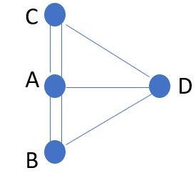

- [Introduction](#introduction)
  - [Types of graphs](#types-of-graphs)
- [Representations](#representations)
  - [Mathematical set representation](#mathematical-set-representation)
  - [adjacency list representation](#adjacency-list-representation)
- [Adjacency matrix representation](#adjacency-matrix-representation)
  - [Convert set representation to adjacency matrix](#convert-set-representation-to-adjacency-matrix)
  - [Convert matrix to adjacency list](#convert-matrix-to-adjacency-list)
  - [Directed graphs](#directed-graphs)
  - [Comparisons of representations](#comparisons-of-representations)
- [Implementation](#implementation)
  - [undirected graph](#undirected-graph)
- [Appendix](#appendix)
  - [tuples](#tuples)
  - [namedtuple](#namedtuple)

# Introduction
Graphs, or networks, are useful for representing relationships from social network,maps, the internet, and the universe.  In this post, we start with the humble beginning of graph theory from the problem of proving it is not possible to cross each of the 7 bridges of Konigsberg once and only once, and go over its three presentations, and implementating a graph object. 

In this post, we will go over three representations of network: mathematical set, adjacency list, and adjacency matrix. 

## Types of graphs
1. Undirected graphs. E.g.,two-way streets
2. Directed graphs (Digraph). E.g., Instagram followers and influencers
3. Weighted graphs, where edges have varied weights, such as credit risk transition matrix
4. Special graphs: trees, rooted tree, directed acyclic graphs (DGA)
   
**tree** is undirected connected graph with no cycles.   One other definition relating tree to graph is: a graph is a free tree iff there exists a unique path between every pair of nodes. 
A tree with $$N$$ nodes has $$N-1$$ edges. 

A **rooted tree** (often simplily referred to as "tree") is a tree with a root node where either all edges point towards the root node ("out-tree") or away from it ("in-tree").  For example, max and min heaps. 

**DGA**s are directed graphs with no cycles. DAGs are used to represent structures with dependencies.   All out-trees are DAGs but all DAGs are out-trees. 

**Bipartite graph**: a graph that can be split into two groups such that every edges is a link between the two groups (male and female among the heterosexual, job seekers and jobs)

**Complete graph** is fully connected where every node is connected to every other node. 

# Representations
## Mathematical set representation

The mathematical set representation is also called "edge list". Tt is conceptually simple, although it is not often used in computer implementation because of the lack of structure.  
In mathematics, graph is a pair of two sets:

$$G=(V,E)$$ 

where $$V$$ is the set of nodes, and $$E$$ is the set of edges.

For example, 

$$V=\{0, 1, 2, 3\}$$

$$E=\{(0, 1),(0, 2), (0, 3),(2, 3)\}$$

[Image and quote below from MAA "Leonard Euler's Solution to the Konigsberg Bridge Problem"](https://www.maa.org/press/periodicals/convergence/leonard-eulers-solution-to-the-konigsberg-bridge-problem#:~:text=Euler%20states%20that%20if%20bridge,the%20starting%20or%20ending%20place.)

;

"According to lore, the citizens of Königsberg used to spend Sunday afternoons walking around their beautiful city.  While walking, the people of the city decided to create a game for themselves, their goal being to devise a way in which they could walk around the city, crossing each of the seven bridges only once.  Even though none of the citizens of Königsberg could invent a route that would allow them to cross each of the bridges only once, still they could not prove that it was impossible."

Euler was not only famous for being a mathematician, but also for his notations, how he represented the problems using symbols to simplify problem (to help mental process) as shown in his own scketch.  


We will use graph representation on Euler's 7 bridge problem.  A, B, C, D are the names of regions. 

$$V=\{A, B, C, D\}$$

$$E=\{(A,B),(A,B), (A,C), (A,C), (B,D), (A,D), (C,D)\}$$

A set is a collection of unique elements.  The set of $$E$$ is called a multi-set because it contains "duplicates". 



Use <span class="coding">namedtuple</span> is a natural choice for coding graph objects in Python.  
<div class="code-head"><span>code</span>graph representation 1.py</div>

```python
from collections import namedtuple

Graph = namedtuple("Graph", ["vertice", "edge"])

V = ['A','B', 'C', 'D']
E =[
    ('A','B'),
    ('A','B'),
    ('A','C'),
    ('A','C'),
    ('A','D'),
    ('B','D'),
    ('C','D'),
]
# W= [0.1, 0.1, 0.1, 0.1,0.1, 0.1,0.4]
G = Graph(V ,E)
# G = Graph(V ,E, W)
print(G)
# Graph(vertice=['A', 'B', 'C', 'D'], edge=[('A', 'B'), ('A', 'B'), ('A', 'C'), ('A', 'C'), ('A', 'D'), ('B', 'D'), ('C', 'D')], weights=[0.1, 0.1, 0.1, 0.1, 0.1, 0.1, 0.4])

```

## adjacency list representation

Adjacency list groupbys the nodes and lists out their immediate neighbors.  In other words, it maps from nodes to lists of edges.  

$$A: B, B, C, C, D$$

$$B: A, A, D$$

$$C: A, A, D$$

$$D: A, B, C$$

Below code uses Python dictionary to store the adjacency list representation of the graph.  

Note that using dictionary (a hash table) has limitation:
Because dictionary keys have to be hashable, this means that list, and user-defined classes cannot be used as keys.  Therefore, this limits our nodes cannot be list or user-defined classes. 

<div class="code-head"><span>code</span>graph representation using adjacency list.py</div>

```python
adjacency_dict = {'A': ['B', 'B', 'C', 'C', 'D'],
 'B': ['A', 'A', 'D'],
 'C': ['A', 'A', 'D'],
 'D': ['A', 'B', 'C']}
# Graph(vertice=['A', 'B', 'C', 'D'], edge=[('A', 'B'), ('A', 'B'), ('A', 'C'), ('A', 'C'), ('A', 'D'), ('B', 'D'), ('C', 'D')])
def adjacency_dict(graph):
    """
    Returns the adjacency list representation of graph
    """
    adj = {vertice:[] for vertice in graph.vertice}
    print(adj)
    for edge in graph.edge:
        V1, V2 = edge[0], edge[1]
        adj[V1].append(V2)
        adj[V2].append(V1)
    return adj
aG = adjacency_dict(G)
print(aG)
```
If our source data for the nodes and edges is a pandas DataFrame using mathematical set representation, we can use <span class="coding">df.groupby('vertice')['edge'].apply(list)</span> to quickly convert it to adjacency list representation. 

# Adjacency matrix representation

Adjacency matrix representation looks very much like a square transition matrix.  

$$\|V\|\times\|V\|$$ Boolean-valued matrix indexed by nodes, with $$1$$ indicating edge or connection. 

The time and space complexity of a graph
We put a 1 (or weight, or the number of times they are connected) in the (i,j) cell for edges , and 0 for no connection. 

In the code below, we use pandas to handle the indexing. 
1. Read in list of edge tuples to a DataFrame
2. Copy the DataFrame from step 1 with columns flipped.  However, the names should follow the first DataFrame's order.
3. Concatenate the 2 DataFrames, and crosstab to get the count
4. (Optional) Re-index both columns and row index in order to get rid of the old names
   
<div class="code-head"><span>code</span>convert set representation to adjacency matrix using pandas.py</div>

```python
import pandas as pd
df1 = pd.DataFrame(E, columns = ['V1','V2'])
df2 = df1[['V2','V1']].copy() # copy but with columns flipped because of undirected graph has symmetry
df2.columns = ['V1','V2']
df = pd.concat([df1, df2], axis=0)
df = pd.crosstab(df.V1,df.V2)
df.columns = V
df.index = V
print (df)
#    A  B  C  D
# A  0  2  2  1
# B  2  0  0  1
# C  2  0  0  1
# D  1  1  1  0
```

If we don't use pandas, we would have to re-code the list of tuples of edges from letters to integers because list indexing cannot be letters. Alternatively we can use the Python built-in functions <span class="coding">ord</span> and <span class="coding">chr</span>.  But I think using pandas requires less coding. 

## Convert set representation to adjacency matrix

<div class="code-head"><span>code</span>convert set representation to adjacency matrix.py</div>

```python
from collections import namedtuple

Graph = namedtuple("Graph", ["vertice", "edge"])
V = ['A','B', 'C', 'D']
E = [
    (0, 1),
    (0, 1),
    (0, 2),
    (0, 2),
    (0, 3),
    (1, 3),
    (2, 3)
]
G = Graph(V,E)
print(G.vertice)
# ['A', 'B', 'C', 'D']

def adjacency_matrix(graph):
    adj = [[0 for i in graph.vertice] for j in graph.vertice]
    for edge in graph.edge:
        V1, V2 = edge[0], edge[1]
        adj[V1][V2] += 1
        adj[V2][V1] += 1
    return adj

print(adjacency_matrix(G))
```

## Convert matrix to adjacency list

<div class="code-head"><span>code</span>convert set representation to adjacency matrix.py</div>

```python


from collections import defaultdict
from pprint import pprint

graph = defaultdict(list)
edges = set()

for i, v in enumerate(X.tolist(), 1): # X is a matrix
    for j, u in enumerate(v, 1):
        if u != 0 and frozenset([i, j]) not in edges:
            edges.add(frozenset([i, j]))
            graph[i].append({j: u})

pprint(graph)


```

## Directed graphs

Directed graphs have one-way directions.  

We rewrite the Graph nametuple and functions above to add <span class="coding">is_directed</span> parameter. 

<div class="code-head"><span>code</span>directedGraphRepresentations.py</div>

```python
from collections import namedtuple

Graph = namedtuple("Graph", ["vertice", "edge", "is_directed"])
G = Graph(vertice = range(3), edge = [(1,0),(1,2), (0, 2)],is_directed= True)

def adjacency_dict_directed(graph):
    """
    Returns the adjacency list representation of graph
    """
    adj = {vertice:[] for vertice in graph.vertice}
    print(adj)
    for edge in graph.edge:
        V1, V2 = edge[0], edge[1]
        adj[V1].append(V2)
        if not graph.is_directed:
            adj[V2].append(V1)
    return adj
adjacency_dict(G)  # undirected because we use the function defined regardless of directed
# {0: [1, 2], 1: [0, 2], 2: [1, 0]}
aG = adjacency_dict_directed(G)
print(aG)
# {0: [2], 1: [0, 2], 2: []}

def adjacency_matrix_directed(graph):
    """
    Returns the adjacency list representation of graph
    """
    adj = [[0 for i in graph.vertice] for j in graph.vertice]
    print(adj)
    for edge in graph.edge:
        V1, V2 = edge[0], edge[1]
        adj[V1][V2] += 1
        if not graph.is_directed:
            adj[V2][V1] += 1
    return adj

adjacency_matrix(G)
# [[0, 1, 1], [1, 0, 1], [1, 1, 0]]

adjacency_matrix_directed(G)
# [[0, 0, 1], [1, 0, 1], [0, 0, 0]]
```

## Comparisons of representations

Adjacency list is more compact, and saves space for sparse graph. 
But adjacency list is slow for dense graphs.

Adjaceny matrix takes up $$O(\|V\|^2)$$ space, regardless how dense the graph.  Iterating over all edges takes $$O(\|V\|^2)$$ time. 
But the adjaceny matrix is $$O(1)$$ for edge weight lookup, and is faster than adjacency list for dense graphs. It is also simpler representation. 

# Implementation 

## undirected graph

The implementations using adjacency list and adjacency matrix.  Each has two classes Node (for a single point or node) and Graph.  

The <span class="coding">Node</span> class has attributes: its name, and its neighbors, and a function for adding neighbor.

The <span class="coding">Graphx</span> class defines nodes and edge_indices, each with a dictionary, and edges in a list.  The class has 3 methods: <span class="coding">add_node</span>, 
<span class="coding">add_edge</span> and <span class="coding">print_graph</span>.  

When adding English letter nodes in the Graph object we define, we use the <span class="coding">range</span> function with two other built-in functions: <span class="coding">ord</span> and <span class="coding">chr</span> to convert letter to unicode, and from unicode back to character. 

For example, 
```python
ord('A')
# 65
ord('B')
# 66
chr(ord('A'))
# 'A'
```

We first verify that the node to be added is not already in the code. 

<div class="code-head"><span>code</span>undirectedGraphListImplement.py</div>

```python
class Node: # could call it class V but it seems too short
    def __init__(self,n):
        self.name = n
        self.neighbors = list()

    def add_neighbor(self, v):
        if v not in self.neighbors:
            self.neighbors.append(v)
            self.neighbors.sort()

class Graph:
    nodes = {}

    def add_node(self, node):
        if isinstance(node, Node) and node.name not in self.nodes:
            self.nodes[node.name] = node
            return True
        else:
            return False
        
    def add_edge(self, u, v, weight = 1):
        if u in self.nodes and v in self.nodes:
            for key, value in self.nodes.items():
                if key == u:
                    value.add_neighbor(v)
                if key == v:
                    value.add_neighbor(u)
            return True
        else:
            return False

    def print_graph(self):
        for key in sorted(list(self.nodes.keys())):
            print(key + str(self.nodes[key].neighbors))

# test code
a = Node('A')
g = Graph()
g.add_node(a)
g.add_node(Node('B'))
for i in range(ord('A'), ord('K')):
    g.add_node(Node(chr(i)))

edges = ['AB','AE', 'BF', 'CG', 'DE', 'DH','EH', 'FG','FI', 'FJ','GJ','HI']
for edge in edges:
    g.add_edge(edge[:1], edge[1:])

g.print_graph()

# A['B', 'E']
# B['A', 'F']
# C['G']
# D['E', 'H']
# E['A', 'D', 'H']
# F['B', 'G', 'I', 'J']
# G['C', 'F', 'J']
# H['D', 'E', 'I']
# I['F', 'H']
# J['F', 'G']
```

<div class="code-head"><span>code</span>undirectedGraphMatrixImplement.py</div>

```python
class Node:
    def __init__(self,n):
        self.name = n
        self.neighbors = list()

    def add_neighbor(self, v):
        if v not in self.neighbors:
            self.neighbors.append(v)
            self.neighbors.sort()

class Graph:
    nodes = {}
    edges = []
    edge_indices = {}

    def add_node(self, node):
        if isinstance(node, Node) and node.name not in self.nodes:
            self.nodes[node.name] = node
            for row in self.edges:
                row.append(0) # add rows of zeros
            self.edges.append([0]*(len(self.edges) + 1)) # add columns of zeros
            self.edge_indices[node.name] = len(self.edge_indices)
            return True
        else:
            return False
        
    def add_edge(self, u, v, weight = 1):
        if u in self.nodes and v in self.nodes:
            self.edges[self.edge_indices[u]][self.edge_indices[v]] = weight
            self.edges[self.edge_indices[v]][self.edge_indices[u]] = weight
            return True
        else:
            return False

    def print_graph(self):
        for v, i in sorted(self.edge_indices.items()):
            print(v + ' ', end= '')
            for j in range(len(self.edges)):
                print(self.edges[i][j], end='')
            print(' ')
    
# test code
g = Graph()
a = Node('A')
g.add_node(a)
g.add_node(Node('B'))
for i in range(ord('A'), ord('K')):
    g.add_node(Node(chr(i)))

edges = ['AB','AE', 'BF', 'CG', 'DE', 'DH','EH', 'FG','FI', 'FJ','GJ','HI']
for edge in edges:
    g.add_edge(edge[:1], edge[1:])

g.print_graph()
# A 0100100000
# B 1000010000
# C 0000001000
# D 0000100100
# E 1001000100
# F 0100001011
# G 0010010001
# H 0001100010
# I 0000010100
# J 0000011000
```


# Appendix
## tuples

Below notes are adapted from the book [Think Python](https://www.greenteapress.com/thinkpython/html/thinkpython013.html). 

> Tuples are like lists, except tuples are immutable. 

> A tuple is a comma-separated list of values, which **can be any type**, and they are indexed by integers, so in that respect tuples are a lot like lists. 

> Most list operators also work on tuples. The bracket operator <span class="coding">[]</span> for indexing, and the slicing operator <span class="coding">:</span>. 

> Tuple as function return values: allows us to return multiple values, a function can only return one value, but if the value is a tuple, the effect is the same as returning multiple values. 

> Use <span class="coding">zip</span>, a built-in function, to take two or more sequences and “zips” them into a list of tuples. For example, we can zip a list of country, and a list of capitals associated with the countries. 

```python
t = 'a', 'b', 'c', 'd', 'e'
```
Although it is not necessary, it is common to enclose tuples in parentheses:

```python
>>> t = ('a', 'b', 'c', 'd', 'e')
```

> Dictionaries have a method called <span class="coding">items</span> that returns an iterator, a list of tuples, where each tuple is a key-value pair.

## namedtuple
A [namedtuple](https://docs.python.org/3/library/collections.html?highlight=counter#collections.namedtuple) object is a new tuple subclass with a name we give it. 

The new subclass is used to create tuple-like objects that have fields *accessible by the <span class="coding">.</span>* notation as well as inherited tuple attributes such as indexable and iterable. 
In code below, we define a Graph class. <span class="coding">help(G)</span>

```python
help(G)
# Help on Graph in module __main__ object:
# class Graph(builtins.tuple)
#  |  Graph(vertice, edge, weights)
#  |
#  |  Graph(vertice, edge, weights)
#  |
#  |  Method resolution order:
#  |      Graph
#  |      builtins.tuple
#  |      builtins.object

G[0]
# ['A', 'B', 'C', 'D']
G.vertice
# ['A', 'B', 'C', 'D']
```
