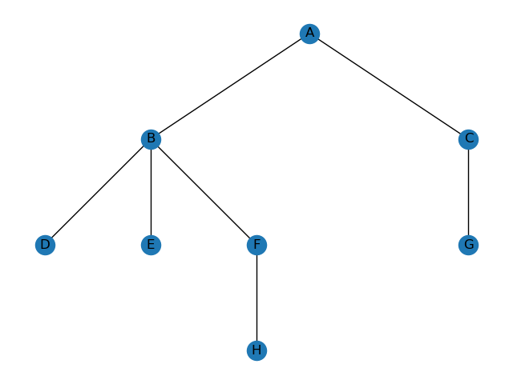
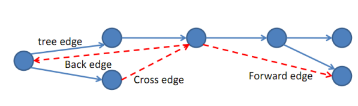
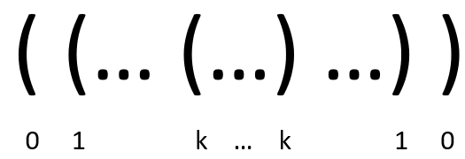

- [Introduction](#introduction)
- [DFS](#dfs)
  - [Recursive](#recursive)
- [SWPIA](#swpia)
  - [Iterative](#iterative)
  - [DFS edge classfication](#dfs-edge-classfication)
- [DFS traversals](#dfs-traversals)
- [Topological sort](#topological-sort)
  - [Compare iterative DFS and BFS](#compare-iterative-dfs-and-bfs)
- [Know your library](#know-your-library)
  - [[graphlib]  source code](#graphlib--source-code)

# Introduction


In the figure above, if we follow numbers 1, 2, through 12 in the graph below, we complete a depth-first search (DFS) traversal. It goes as deep as possible before bouncing back to span the left sub-tree, and then to the next child of the root node and plunge all the way again, and then bounce back to span the right sub-tree. 


# DFS

## Recursive
It is quite instructive to read the [pesudo code from Wikipedia](https://en.wikipedia.org/wiki/Depth-first_search) and traverse manually to really understand this algorithm.  The DFS algorithm can be written using recursion with only 4 lines of code (excluding the return statement).  Procedure DFS(G, v) is

*label v as discovered*
*for all **directed** edges from v to w that are in G.adjacentEdges(v) do*
    *if node w is not labeled as discovered then*
       *** recursively call DFS(G, w)***

# SWPIA
* S = stack
* W = while
* P = pop
* I = if
* A = append


Note that <span class="coding">if node not in visited</span> is important for **undirected graph**.  Without it, the recursion will never stop. 

The <span class="coding">discovered</span> in the psudo code is the list <span class="coding">visited</span> in the code.  We could have used a set for visited, but a set would not show the order of traversal.  

<div class="code-head"><span>code</span>DFS.py</div>

```python
graph ={
    'A': ['B', 'C'],
    'B': ['D', 'E', 'F'],
    'C': ['G'],
    'D': [],
    'E': [],
    'F': ['H'],
    'G': ['I'],
    'H': [],
    'G': []
}
def dfs(G, startNode,visited):
    # initial value
    if startNode not in visited:
        visited.append(startNode)
    # recurse
    for node in G[startNode]:
        if node not in visited:
            dfs(G, node, visited)
    return visited
print(dfs(graph, 'A', []))
# ['A', 'B', 'D', 'E', 'F', 'H', 'C', 'G']
``` 
## Iterative
DFS can also be written using iteratively with short length, using psudo code from Wikipedia. 

procedure DFS_iterative(G, v) is
    let S be a stack
    S.push(v)
    while S is not empty do
        v = S.pop()
        if v is not labeled as discovered then
            label v as discovered
            for all edges from v to w in G.adjacentEdges(v) do 
                S.push(w)

The iterative DFS and the recursive DFS visit the neighbors of each node in the opposite order from each other: the first neighbor of v visited by the recursive variation is the first one in the list of adjacent edges, while in the iterative variation the first visited neighbor is the last one in the list of adjacent edges. 

In other words, while both are depth-first, the recursive goes from left to right whereas the iterative goes from right to left. 

<div class="code-head"><span>code</span>DFS_iterative_r_to_l.py</div>

```python
def dfs_iterative_r_to_l(G, startNode):
    # initialize
    visited = []
    S = list(startNode)
    while S:
        node = S.pop()
        if node not in visited:
            visited.append(node)
        # for all edges from v to w in G.adjacentEdges(v)
        for node in G[node]:
            if node not in visited:
                S.append(node)
    return visited
print(dfs_iterative_r_to_l(graph, 'A'))
# ['A', 'C', 'G', 'B', 'F', 'H', 'E', 'D']
```

<div class="code-head"><span>code</span>DFS_iterative_l_to_r.py</div>

```python
def dfs_iterative_l_to_r(G, startNode):
    # initialize
    visited = []
    S = list(startNode)
    while S:
        node = S.pop()
        if node not in visited:
            visited.append(node)
        # for all edges from v to w in G.adjacentEdges(v)
            S.extend(reversed(G[node]))
    return visited
print(dfs_iterative_l_to_r(graph, 'A'))
# ['A', 'B', 'D', 'E', 'F', 'H', 'C', 'G']
```
## DFS edge classfication

From [MIT CS course recitation](https://courses.csail.mit.edu/6.006/fall11/rec/rec14.pdf), the edges we traverse as we execute a depth-first search can be classified into four edge types.

During a DFS execution, the classification of edge $$(u, v)$$ depends on:
*if we have visited $$v$$ before in the DFS* and if so, the relationship between $$u$$ and $$v$$.

1. If $$v$$ is visited for the first time as we traverse the edge $$(u, v)$$, then the edge is a **tree edge**.
2. Else, $$v$$ has already been visited:
(a) If $$v$$ is an ancestor of $$u$$, then edge $$(u, v)$$ is a **back edge**.
(b) Else, if $$v$$ is a descendant of $$u$$, then edge $$(u, v)$$ is a **forward edge**.
(c) Else, if $$v$$ is neither an ancestor or descendant of $$u$$, then edge $$(u, v)$$ is a **cross edge**.



We can use edge type information to learn some things about G. For example, **tree edges** form trees containing each node DFS visited in $$G$$. 

> $$G$$ has a cycle if and only if DFS finds at least one **back edge**.

DSF can be used for:
- Solving puzzles with only one solution, such as mazes.
- Finding connected components.
- Topological sorting.
- Finding the bridges of a graph.

# DFS traversals

The smart illustration of DFS traversals come from [leetcode](https://leetcode.com/problems/binary-tree-inorder-traversal/discuss/283746/all-dfs-traversals-preorder-inorder-postorder-in-python-in-1-line)


<div class="code-head"><span>code</span>dfs traversals.py</div>

```python
def preorder(root):
  return [root.val] + preorder(root.left) + preorder(root.right) if root else []
def inorder(root):
  return  inorder(root.left) + [root.val] + inorder(root.right) if root else []
def postorder(root):
  return  postorder(root.left) + postorder(root.right) + [root.val] if root else []
```

# Topological sort

A topological sort is a graph traversal in which each node is visited only after all its dependencies are visited.  This sounds very much like how DFS works. 

In DFS, each node at the top is not finished until its dependents are finished. 



For every directed edge $$(u, v)$$ from vertex $$u$$ to vertex $$v$$, $$u$$ comes before $$v$$ in the ordering. 

The only type of graph that can have topological orderings is DAG.  DAGs have no cycles. 

The [graphlib](https://docs.python.org/3/library/graphlib.html) library is a Python standard library.  Its <span class="coding">graphlib.TopologicalSorter</span> does exactly topological sort. 

```python
graph = {"D": {"B", "C"}, "C": {"A"}, "B": {"A"}}
ts = TopologicalSorter(graph)
tuple(ts.static_order())
```
<div class="code-head"><span>code</span>BFS.py</div>

```python
import graphlib
from graphlib import TopologicalSorter

# graph = {"D": {"B", "C"}, "C": {"A"}, "B": {"A"}}
graph ={
    'A': ['B', 'C'],
    'B': ['D', 'E', 'F'],
    'C': ['G'],
    'D': [],
    'E': [],
    'F': ['H'],
    'G': ['I'],
    'H': [],
    'G': []
}
ts = TopologicalSorter(graph)
print(tuple(ts.static_order()))
```


## Compare iterative DFS and BFS

The non-recursive implementation is similar to breadth-first search but differs from it in two ways:

it uses a stack instead of a queue, and
it delays checking whether a node has been discovered until the node is popped from the stack rather than making this check before adding the node.
If G is a tree, replacing the queue of the breadth-first search algorithm with a stack will yield a depth-first search algorithm. For general graphs, replacing the stack of the iterative depth-first search implementation with a queue would also produce a breadth-first search algorithm, although a somewhat nonstandard one.[7]

# Know your library
## [graphlib]  [source code](https://github.com/python/cpython/blob/3.10/Lib/graphlib.py)