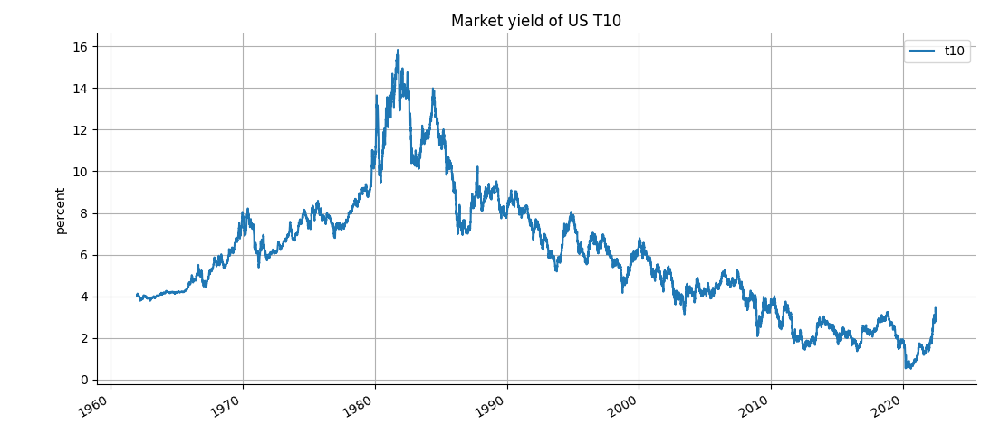

# Why 10 year Treasury yield rise

Ten year Treasury (aka 'T10') is one of the most watched metric for financial institutions.  It has been rising lately after a long period of staying very low. 

Yield rise is because prices are down.  

Prices are down because demand has droppoed, and more are selling than buying. 

Why are people (and 'people') selling bonds(T10)?  

Patrick Pancoast from Intuition Learning explains the reason.

We all know that inflation has been rising.  

People look at inflation, and they anticipate the Fed will be raising rates (and the Fed has been). 

They do not want to hold on bonds. 

> "If I hold the bonds, **when the Fed raises rates, prices of the bonds will drop**."  

> "So I should sell them.  If I want to buy T10, I will buy the newly issued bonds (at a cheaper price) later when rates are higher" 

Therefore, when there is expectation that the Fed is raising rates, bond yield will rise. 

# Why 2 year Treasury yield higher than 10 year?

Normally, consider time value of money, we would expect longer term yield to be higher than shorter term ones.  But often it is not the case.  

Right now 2Y yield is above 3.128%. Whereas the 10Y is below 3%.  Why is that?

There may be two reasons:
1. Investors believe long term rates will back down because they believe the Fed cannot keep rates high either due to recession or inflation will be fixed before too long.
2. There are more buyers of 10Y Treasury than buyers of 2Y.  Or possibly the other way around: there are more sellers of 2Y Treasury than 10Y.  This may likely because of near term rate hike expectations. 