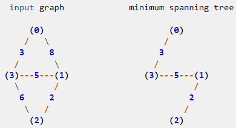
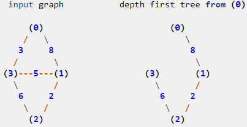
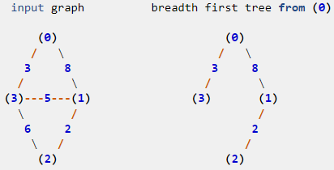

*"To see a World in a Grain of Sand*

*And a Heaven in a Wild Flower*

*Hold Infinity in the palm of your hand"*

*-Willam Blake*


# Introduction

A tree is a connected, acyclic (no cycles) graph.

Minimum spanning tree is a **subset** of the edges of a connected, edge-weighted graph that connects all the nodes together, without any cycles and with the minimum possible total edge weight.  

> Spanning means to connect all nodes. 
> Tree means no cycles. 

Spanning trees are not unique.  There may well be other spanning trees that have the same minimum cost. 

Intuitively, if the edge weights (costs) are all different, then the MST is unique. 


# scipy.sparse.csgraph.minimum_spanning_tree

<span class="coding">scipy.sparse.csgraph.minimum_spanning_tree</span> implements using the Kruskal algorithm, and uses matrix representation. 

In the matrix representation, the number in position $$(i, j)$$ is the weight of the edge connecting the nodes $$(i, j)$$.  If the number is zero, then there is no connection between the nodes. 

The method takes 2 inputs: 
1. a N x N matrix representing an undirected graph over N nodes.
2. whether to overwrite input matrix

Note that the routine loses precision when users input a dense matrix. Small elements < 1E-8 of the dense matrix [are rounded to zero](https://docs.scipy.org/doc/scipy/reference/generated/scipy.sparse.csgraph.minimum_spanning_tree.html). 

<!-- I should test if this is a problem for transition matrix -->

<div class="code-head"><span>code</span>mst_prim.py</div>

```python
from scipy.sparse import csr_matrix
from scipy.sparse.csgraph import minimum_spanning_tree
X = csr_matrix([[0, 8, 0, 3],
                [0, 0, 2, 5],
                [0, 0, 0, 6],
                [0, 0, 0, 0]])
Tcsr = minimum_spanning_tree(X)
Tcsr.toarray().astype(int)
# array([[0, 0, 0, 3],
#        [0, 0, 2, 5],
#        [0, 0, 0, 0],
#        [0, 0, 0, 0]])
```



Here, we might as compare DFS and BFS with MST using the same example.  

MST is using BFS. 

**DFS**


The same input matrix as above, using <span class="coding">scipy.sparse.csgraph.breadth_first_tree(csgraph, i_start, directed=True)</span>. 


**BFS**
The same input matrix as above, using <span class="coding">scipy.sparse.csgraph.breadth_first_tree(csgraph, i_start, directed=True)</span>[<span class="coding">scipy.sparse.csgraph.breadth_first_tree(csgraph, i_start, directed=True)</span>](https://docs.scipy.org/doc/scipy/reference/generated/scipy.sparse.csgraph.depth_first_tree.html)

(https://docs.scipy.org/doc/scipy/reference/generated/scipy.sparse.csgraph.breadth_first_tree.html)



# Greedy algorithm

A greedy algorithm repeatedly makes a locally best choice or decision, but ignores the effects of the future.  

The decision tree algorithm used in random forests and other tree-based models is a greedy algorithm. 

If a problem can be solved by greedy algorithm, then it (usually) has 2 properties:
1. Optimal substructure   
    Optimal substructure is encapsulation of DP: optimal solution to problem incapsulates optimal solutions to subproblem(s). Sounds like William Blake's 
    
> *"To see a World in a Grain of Sand*
> *And a Heaven in a Wild Flower* 
> *Hold Infinity in the palm of your hand* 


    If $$T'$$ is a minimum spanning tree of $$G/e$$, then $$T' ∪ {e}$$ is an MST of $$G$$. 

2. **Greedy Choice Property**
    Locally optimal solutions lead to globally optimal solution (sounds like **Adam Smith's the invisible hand**). 

The MST problem can be solved by a greedy algorithm because the the locally optimal solution is also the globally optimal solution. This fact is described by the GreedyChoice Property for MSTs. 

# Prim's algorithm
Prim's method somehow reminds me of the [Metropolis algorithm](https://en.wikipedia.org/wiki/Metropolis%E2%80%93Hastings_algorithm) even though I have not read anything that says they are related.   

What it reminds me of are 2 things:
1. Start with an arbitrary node
2. At the node where we are, use a metric to pick the next node.  In Prim's, it is the minimum cost edge.  In Metroplis, it is the one with the highest probability. 

We will try to understand Prim's algorithm from the problem below. 

Given a list of nodes, find the minimum cost from the 
Input XY is a set of nodes expressed as list of lists [[x1,y1],..., [x2,y2]]

1. We build adjacency list, a dictionary with nodes as keys, and their distance to other nodes as values in list [cost, node]. 
2. We pick an arbitrary starting point and place it in minH (list of lists, maintained in the priority queue, which is implemented as min heap data structure)
3. We make sure visited are not visited again to make sure no cycles
4. As long as the visits are incomplete, pop the minH for the node with the minimum cost, and add it to the sum.
5. For the one that just got popped, push all its adjacent list [cost, node] into minH if the neighbor has not been visited.
   
Note that nodes in the ***min heap represent all the nodes that are neighbors of those we have already visited***.

Note that there will be duplicate nodes in the min heap.  But ***each of the duplicate nodes have different distances to those that have already been visited***.  And the one with the smallest cost will be popped.  

The one with the smallest cost may not necessarily a neighbor of the node we just visited.  

The visit method is exactly the same as BFS.

<div class="code-head"><span>code</span>mst_prim.py</div>

```python
import heapq
def minCostConnect(XY) -> int:
    """
    input XY is a set of nodes expressed as list of lists [[x1,y1],..., [x2,y2]]
    build adjacency list, a dictionary with nodes as keys, and their distance to other nodes as values in list [cost, node]
    pick an arbitrary starting point and place it in minH (list of lists, maintained in the min heap data structure order)
    keep track of visited
    as long as visited is not completed, pop the minH for the node with the minimum cost, and add it to the sum.
    for the one that just got popped, push all its adjacent list [cost, node] into minH if the neighbor has not been visited. 
    The visit method is exactly the same as BFS.
    """
    N = len(XY)
    adj = {i:[] for i in range(N)} # i: list of [cost, node]
    print("adj ", adj)
    for i in range(N):
         x1, y1 = XY[i]
         for j in range(i + 1, N): 
             x2, y2 = XY[j]
             distance = abs(x1 - x2) + abs(y1- y2)
             adj[i].append([distance, j]) # build adjacency list
             adj[j].append([distance, i])
    print("adj ", adj)
    # Prim's
    sum = 0
    visit = set()
    minH = [[0, 0]] 
    while len(visit) < N:
        cost, node = heapq.heappop(minH) # heappop maintains min heap structure
        print("\nPopped", [cost, node])
        if node in visit:
            continue
        sum += cost
        visit.add(node)
        for neiCost, nei in adj[node]:
            if nei not in visit:
                heapq.heappush(minH, [neiCost, nei]) # heappush maintains min heap structure
        print(minH)
    return sum 

A = [[0,0], [2,2], [3, 10], [5,2], [7,0]]
print(minCostConnect(A))

# adj  {0: [], 1: [], 2: [], 3: [], 4: []}
# adj  {0: [[4, 1], [13, 2], [7, 3], [7, 4]], 1: [[4, 0], [9, 2], [3, 3], [7, 4]], 2: [[13, 0], [9, 1], [10, 3], [14, 4]], 3: [[7, 0], [3, 1], [10, 2], [4, 4]], 4: [[7, 0], [7, 1], [14, 2], [4, 3]]}

# Popped [0, 0]
# [[4, 1], [7, 4], [7, 3], [13, 2]]

# Popped [4, 1]
# [[3, 3], [7, 3], [7, 4], [9, 2], [7, 4], [13, 2]]

# Popped [3, 3]
# [[4, 4], [7, 4], [7, 3], [9, 2], [13, 2], [10, 2], [7, 4]]

# Popped [4, 4]
# [[7, 3], [7, 4], [7, 4], [9, 2], [13, 2], [10, 2], [14, 2]]

# Popped [7, 3]

# Popped [7, 4]

# Popped [7, 4]

# Popped [9, 2]
# [[10, 2], [13, 2], [14, 2]]
```

The reason why we can use heapqpop and heapqpush with lists is because it compares the first element of the lists. In the code above, [cost, node], we have placed cost before node in list.  Therefore, only costs are compared, and the minimum cost is popped from the min heap. 
<!-- https://stackoverflow.com/questions/45892736/python-heapq-how-do-i-sort-the-heap-using-nth-element-of-the-list-of-lists -->

## Keep track of the tree


# Appendix


## Customize less than

<div class="code-head"><span>code</span>lessThan.py</div>

```python
A = [[0,0], [2,2], [3, 10], [5,2], [7,0]]
print(minCostConnect(A))


n = [[1, 5, 93],
    [2, 6, 44],
    [4, 7, 45],
    [6, 3, 12]]
heapq.heapify(n)
print(n)
class MyList(list):
    def __lt__(self, other):
        return self[2] < other[2]

q = [MyList(x) for x in n]
```

import scipy as sp
from scipy.sparse import csr_matrix
from scipy.sparse.csgraph import minimum_spanning_tree

import networkx as nx


friendships = [
    ('A', 'B',{'weight':2}),
    ('A', 'C',{'weight':4}),
    ('A', 'D',{'weight':1}),
    ('A', 'E',{'weight':10}),
    ('B', 'D',{'weight':1}),
    ('C', 'D',{'weight':4}),
    ('C', 'G',{'weight':3}),
    ('D', 'E',{'weight':7}),
    ('D', 'F',{'weight':10}),
    ('D', 'G',{'weight':7}),
    ('E', 'F',{'weight':8}),
    ('E', 'G',{'weight':5}),
]

G = nx.MultiGraph()
G.add_edges_from(friendships)
X = nx.to_numpy_matrix(G)
nx.draw(G, with_labels=True, font_weight='bold')

X = csr_matrix(X)
Tcsr = minimum_spanning_tree(X)
Tcsr.toarray().astype(int)

## Maximum spanning tree


# Use cases

As we can imagine, MST is super useful in any kind of networks: cables, roads, etc.. 

Even k-means clustering can be viewed as finding an MST and deleting the k-1 most expensive edges.

## MST with pygame

Ronald L. Rivest computes mst for set of bouncing balls. [Uses PyGame for graphics(http://people.csail.mit.edu/rivest/mst.py)


# Maybe off topic

It may be odd, but who is there to say it is odd.  Isn't math poetry?  

> He [William Blake] died ... in a most glorious manner. He said He was going to that Country he had all His life wished to see & expressed Himself Happy, hoping for Salvation through Jesus Christ – Just before he died 
> His Countenance became fair. His eyes Brighten'd and he burst out Singing of the things he saw in Heaven. -[ Grigson, Samuel Palmer, p. 38](https://en.wikipedia.org/wiki/William_Blake#cite_note-67)

# Reference

## book 
Introduction to Algorithms by Cormen, Leiserson, Rivest, Stein, (MIT Press;McGraw Hill Chapter 23, for discussion of minimum spanning trees.

[MIT lecture notes](https://ocw.mit.edu/courses/6-046j-design-and-analysis-of-algorithms-spring-2015/4a7fdddff3bc419c70bb470106a1663a_MIT6_046JS15_lec12.pdf)

[William_Blake on Wikipeida](https://en.wikipedia.org/wiki/William_Blake)

## Videos
[Prim's Algorithm: Minimal Spanning Tree](https://www.youtube.com/watch?v=YyLaRffCdk4)

[Graphs: Prim's Minimal Spanning Tree and Dijkstra's Shortest Path](https://www.youtube.com/watch?v=i4W8WgTuGTE&t=288s)

[Prim's Algorithm - Minimum Spanning Tree - Min Cost to Connect all Points - Leetcode 1584 - Python](https://www.youtube.com/watch?v=f7JOBJIC-NA&t=693s)
