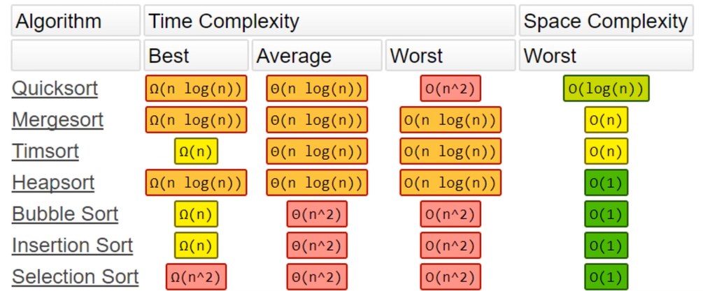
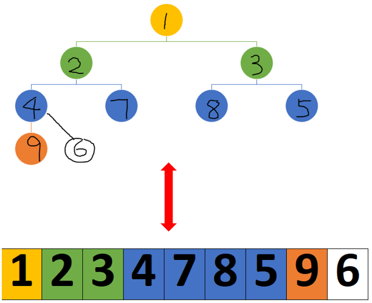
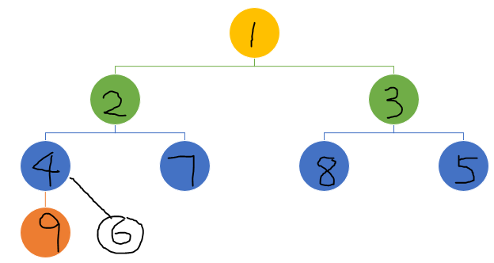

- [Introduction](#introduction)
- [Max heap data structrue](#max-heap-data-structrue)
  - [Cost](#cost)
- [Heapsort 堆排序](#heapsort-堆排序)
  - [Cost](#cost-1)
- [The heapq  module](#the-heapq--module)
  - [Sort by the nth element](#sort-by-the-nth-element)
    - [Customize the dunder method __lt__](#customize-the-dunder-method-lt)
    - [convert the original list of lists into a list of tuples.](#convert-the-original-list-of-lists-into-a-list-of-tuples)
  - [use heapq for max heap](#use-heapq-for-max-heap)
  - [Implement max heap in Python](#implement-max-heap-in-python)
- [Use](#use)
# Introduction

This post is about the heap data structure and heap sort. 



# Max heap data structrue

> The heap data structure is a fusion of array and tree. 



The max (or min) heap data structure is a **complete binary tree** with the max heap property: **At each node, the parent is larger (or smaller) than its chidren.**  (In contrary, binary search trees have more stringent requirement, with the left child smaller than the parent, and the right child bigger than the parent).

**Complete** means that all levels of the tree, except possibly the last one (deepest) are fully filled, and, if the last level of the tree is not complete, the nodes of that level are filled from left to right (left-aligned).

$$\forall \text{complete binary tree, }\exists\text{ an unique array, and vice versa.}$$

$$Left(i)=2*i+1$$

$$Right(i)=2*i+2$$

$$Parent(j)=[(i-2)//2]$$

The **"parent-children" relationship is defined by the array indices from these three functions**.  There is no need of any pointers.  There is no need for attributes such as left or right children either. 

## Cost

$$log(n)$$ push and pop

# Heapsort 堆排序

> [Heapsort can be thought of as an improved Selection sort](https://en.wikipedia.org/wiki/Heapsort).  "Heapsort is nothing but an implementation of selection sort using the right data structure."

> Like Selection sort, heapsort partitions its input into a sorted and an unsorted region, and it iteratively shrinks the unsorted region by selecting the largest (or smallest) element from it and inserting it into the sorted region in order. 

> Unlike selection sort, heapsort does not waste time with a linear-time scan (**no pointers**) of the unsorted region; rather, heap sort maintains the unsorted region in a **max heap data structure** to more quickly find the largest element in each step.

## Cost

* **Time complexity**: In practice on most machines it is **slower than** a well-implemented quicksort ($$O(n^2)$$), it has better worst-case $$O(n*log(n))$$ runtime than quicksort. 

Heapsort is an in-place algorithm, but it is not a stable sort.

* **Space complexity**: $$O(n^2)$$

Here is how heapsort compares with other well-known sorting methods.


# The heapq  module

The <span class="coding">heapq</span> module module is part of Python standard library, with well-documented [Github source code](https://github.com/python/cpython/blob/3.10/Lib/heapq.py).   

Note that it implements min heap, which means that the root node is the smallest.

<span class="coding">heapq.heapify</span> sorts input array (list, or list of lists) into a min heap in place.  The result in example below [1, 2, 3, 4, 7, 8, 5, 9, 6] is a min heap.  Note that the first one is indeed the smallest element. 

The parent-child relationship can be mapped via the indices of the elements. 

<!-- |  index  |   A |
|---:|----:|
|  0 |   1 |
|  1 |   2 |
|  2 |   3 |
|  3 |   4 |
|  4 |   7 |
|  5 |   8 |
|  6 |   5 |
|  7 |   9 |
|  8 |   6 | -->

| index   |   0 |   1 |   2 |   3 |   4 |   5 |   6 |   7 |   8 |
|---:|----:|----:|----:|----:|----:|----:|----:|----:|----:|
|  A |   1 |   2 |   3 |   4 |   7 |   8 |   5 |   9 |   6 |



by default <span class="coding">heapq.heapify</span> sorts by the first elements of elements of input array as shown below. 

```python
A = [[2, 6, 50],
    [4, 7, 60],
    [1, 5, 100],
    [6, 3, 10]]
heapify(A)
print(A)
# [[1, 5, 100], [4, 7, 60], [2, 6, 50], [6, 3, 10]]
```

## Sort by the nth element

When we sort list of lists using .    If we want to sort by anything other than the first elements, there are several ways.

Below examples are adapted from [SOF post on sorting by the nth element of array](https://stackoverflow.com/questions/45892736/python-heapq-how-do-i-sort-the-heap-using-nth-element-of-the-list-of-lists).

### Customize the dunder method __lt__
<div class="code-head"><span>code</span>heapq.py</div>

```python
from heapq import heapify, heappop,heappush

n = [[1, 5, 100],
    [2, 6, 50],
    [4, 7, 60],
    [6, 3, 10]]

class MyList(list):
    def __lt__(self, other):
        return self[2] < other[2]

q = [MyList(x) for x in n]

print(q)
heapify(q)
print(q)
```


<div class="code-head"><span>code</span>heapq.py</div>

```python
from heapq import heapify, heappop,heappush
A = [5, 7 ,3, 9, 2, 8, 1, 4, 6]
heapify(A)
print(A)
# [1, 2, 3, 4, 7, 8, 5, 9, 6]

l = [2, 5, 1]
heappush(q, (l[2], l))
heappop(q)

```

### convert the original list of lists into a list of tuples.   

We want to sort the 3rd element of each list.  We change our input data structure by mapping our list to a **tuple(sort_value, list)**. 

<div class="code-head"><span>code</span>heapq on list of lists1.py</div>

```python
from heapq import heapify, heappop,heappush

A = [[2, 6, 50],
    [4, 7, 60],
    [1, 5, 100],
    [6, 3, 10]]
    
# change data structure to tuple(sort_value, list)
Q = [(x[2], x) for x in A]
# [(50, [2, 6, 50]), (60, [4, 7, 60]), (100, [1, 5, 100]), (10, [6, 3, 10])]
heapify(Q)
print(Q)
# [(10, [6, 3, 10]), (50, [2, 6, 50]), (100, [1, 5, 100]), (60, [4, 7, 60])]
print(heappop(Q))
# (10, [6, 3, 10])

l = [2, 5, 1]
heappush(Q, (l[2], l))
print(heappop(Q))
# (1, [2, 5, 1])
```

Alternatively, we can define a custom list class with a modified <span class="coding">\__lt__</span> dunder (or magic) method.  In our custom class <span class="coding">myList</span>, there is only one function, which is <span class="coding">\__lt__</span>, where we define how to compare 2 myList objects:  
<div class="code-head"><span>code</span>heapq on list of lists2.py</div>

```python
from heapq import heapify, heappop, heappush

A = [[2, 6, 50],
    [4, 7, 60],
    [1, 5, 100],
    [6, 3, 10]]
class myList(list):
    def __lt__(self, other):
        return self[2] < other[2]

Q = [myList(x) for x in A]
print(Q)
# [[2, 6, 50], [4, 7, 60], [1, 5, 100], [6, 3, 10]]
heapify(Q)
print(Q)
# [[6, 3, 10], [2, 6, 50], [1, 5, 100], [4, 7, 60]]
```

## use heapq for max heap
To use the heapq module as max heap may not be efficient. The <span class="coding">_heapify_max</span> function converts an input to a max heap in-place, in $$O(n)$$ time.  So we have to do it $$n$$ times, it will be $$O(n^2)$$. 

<div class="code-head"><span>code</span>heapq.py</div>

```python
from heapq import heapify, heappop, heappush
A = [5, 7 ,3, 9, 2, 8, 1, 4, 6]
_heapify_max(A)
print("max heap", A)
# max heap [9, 7, 8, 6, 2, 3, 1, 4, 5]


print(heappop(A))
print("after poping max")
print(A)

print(heappop(A))
print("after poping the second number, we see that it is no longer max heap")
print(A)

print("need to heapify again")
_heapify_max(A)
print("max heap", A)
```

## Implement max heap in Python

Below implementation of the maxHeap object has 3 public functions: push, peek, and pop.   

When a <span class="coding">maxHeap</span> object is instantiated, the input is transformed into a max heap using the <span class="coding">__heapifyUp</span> function. 

Both <span class="coding">__heapifyUp</span> and <span class="coding">__heapifyDown</span> functions are recursive functions.  The former compares with "parent" whereas the latter compares with "children".

The <span class="coding">__heapifyUp</span> compares the value at the current index with the value at its parent index, if the value at current index is bigger, then it swaps with "its parent" so that the value at the parent index is bigger. 

The <span class="coding">__heapifyDown</span> compares the value at the current index with the values at its children indices.  If the current value is smaller, then it swaps with "one of its children" so that the value at the child index is smaller, or equivalently the value at the current index is bigger. 

<div class="code-head"><span>code</span>heap.py</div>.

```python
class maxHeap:
    """
    3 private functions: 
    __swap
    __heapifyUp
    __heapifyDown
    """
    def __init__(self, items= []):
    # def __init__(self, items= object):
        self.heap = []
        for i in items:
            self.heap.append(i)
            self.__heapifyUp(len(self.heap) - 1)

    def push(self, data):
        self.heap.append(data)
        self.__heapifyUp(len(self.heap) - 1)

    def peek(self):
        if self.heap[0]:
            return self.heap[0]
        else:
            return False

    def pop(self):
        if len(self.heap) > 1:
            self.__swap(0, len(self.heap) - 1) # swap the max and last element
            max = self.heap.pop()
            self.__heapifyDown(0) # heapify down the last element that got swapped to the max position
        elif len(self.heap) ==1:
            max = self.heap.pop()
        else:
            max = False
        return max
    
    def __swap(self, i, j):
        self.heap[i], self.heap[j] =  self.heap[j], self.heap[i]

    def __heapifyUp(self, idx):
        parent = (idx - 1) //2 #  parent index
        if idx <= 0:
            return # do nothing if already at the top
        elif self.heap[idx] > self.heap[parent]: # if larger than parent, then swap with parent
            self.__swap(idx, parent)
            self.__heapifyUp(parent) # recurse

    def __heapifyDown(self, idx):  # heapify down until it is not smaller than its children
        left = idx *2 +1 # left child index
        right = idx * 2 + 2 # right child index
        largest = idx # assume current idx holds the largest
        if len(self.heap) > left and self.heap[largest] < self.heap[left]:
            largest = left
        if len(self.heap) > right and self.heap[largest] < self.heap[right]:
            largest = right
        if largest != idx:
            self.__swap(idx, largest)
            self.__heapifyDown(largest) # recurse

```

Below code instantiates a maxHeap object we defined above, and repeatedly pops the maximum. 

<div class="code-head"><span>code</span>heapSort.py</div>

```python
A = [5, 7,3,9, 2,8, 1, 4,6,]
maxHeap(A).heap
# [9, 7, 8, 6, 2, 3, 1, 4, 5]

M = maxHeap(A)  
print(M.heap) 
# [9, 7, 8, 6, 2, 3, 1, 4, 5]
M.push(10)
print(M.heap)
# [10, 9, 8, 6, 7, 3, 1, 4, 5, 2]

from collections import deque
A = deque()
for i in range(len(M.heap)):
    A.appendleft(M.pop())
print(A) # sorted
# [10, 9, 8, 6, 7, 3, 1, 4, 5, 2]
# deque([1, 2, 3, 4, 5, 6, 7, 8, 9, 10])

```

# Use

The min heap data structure is used in Prim's algorithm of the minimum spanning tree.  See post ["Minimum spanning tree 1"](2022-07-15-1-Minimum-spanning-tree-1.md).  The min heap is also called the "frontier", where "all new unexplored neighbors of old continent" are kept.  The minimum order is based on the distance/cost to visit.  To find the next minimum connection, we pop the smallest from the min heap.  