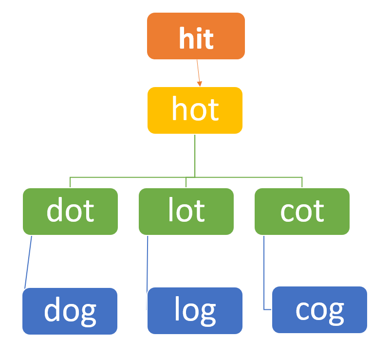

Quote from [Wikipedia](https://en.wikipedia.org/wiki/Word_ladder) "Word ladder (also known as Doublets, word-links, change-the-word puzzles, paragrams, laddergrams, or word golf) is a word game invented by Lewis Carroll..




<!-- The method is like solving a very simple math problem.  
* You first _understand what does the problem exactly ask for_.
* **Put the requirements in math terms!**  
* Then _test it on one or two basic cases to really understand the problem and solution_.  Because it is hard to think only think with abstractions.  
* Work out the **generalization**. 

1. Let the length of the string be $$n$$.  Assume the longest is the entire string, check if it is palindrom. If yes, then done. 
2. If the entire string is not a palindrom, then we decrease check length by 1:  check on continuous chunks of length $$n-1$$, and iterate through them. Say the string is "abcd", then the iterations are: "abc", and "bcd". There are $$4-3+1$$ of them. We generalize the number of substrings with length $$x$$ to $$n - X +1$$.  If any of them is palindrom, then we are done.  Else continue. 
    -->

all(s[i] == s[~i] for i in range(len(s) // 2))
<div class="code-head"><span>code</span>palindrom_brute_force.py</div>

```py
from collections import deque, defaultdict
def seqLength(A,Z, w_lt):
    if Z not in w_lt:
        return 0
    # build adjacency dictionary
    dd = defaultdict(list)
    w_lt.append(A) # because w_lt does not have begin word
    for word in w_lt:
        for i in range(len(word)):
            dd[word[:i] + "*" + word[i+1:]].append(word) # 每个词有 ||词||个 keys, 如果词长度是3， 就有3个keys
    for k, v in dd.items():
        print(k, v)

    # BFS
    visit = set([A])
    print("visit begins with: ", visit)
    que = deque()
    que.append(A)
    print('que begins with', que)
    res = 1
    while que:
        print("\n****************************************\n", que)
        for i in range(len(que)):
            word = que.popleft()
            print('\npopped ', word)
            if word == Z:
                return res # exit 出口
            for j in range(len(word)):
                for value in dd[word[:j] + "*" + word[j+1:]]:
                    if value not in visit:
                        # print("value not in visit:", value)
                        # print("to add ", value)
                        que.append(value)
                        print("Add to que ", value)
                        visit.add(value)
                        # print("visit ", visit)
            print("i:", i)
        res += 1
        print("current res is ", res)

    return 0
beginWord = "hit";  endWord = "cog";  wordList = ["hot","dot","dog","lot","log","cog", "fog", "cot"]
# beginWord = "hit";  endWord = "cog";  wordList = ["hot","dot","dog","lot","log","cog"]
print(seqLength(beginWord, endWord, wordList))

```

```
*ot ['hot', 'dot', 'lot', 'cot']
h*t ['hot', 'hit']
ho* ['hot']
d*t ['dot']
do* ['dot', 'dog']
*og ['dog', 'log', 'cog', 'fog']
d*g ['dog']
l*t ['lot']
lo* ['lot', 'log']
l*g ['log']
c*g ['cog']
co* ['cog', 'cot']
f*g ['fog']
fo* ['fog']
c*t ['cot']
*it ['hit']
hi* ['hit']
visit begins with:  {'hit'}
que begins with deque(['hit'])

****************************************
 deque(['hit'])

popped  hit
Add to que  hot
i: 0
current res is  2

****************************************
 deque(['hot'])

popped  hot
Add to que  dot
Add to que  lot
Add to que  cot
i: 0
current res is  3

****************************************
 deque(['dot', 'lot', 'cot'])

popped  dot
Add to que  dog
i: 0

popped  lot
Add to que  log
i: 1

popped  cot
Add to que  cog
i: 2
current res is  4

****************************************
 deque(['dog', 'log', 'cog'])

popped  dog
Add to que  fog
i: 0

popped  log
i: 1

popped  cog
4
```
