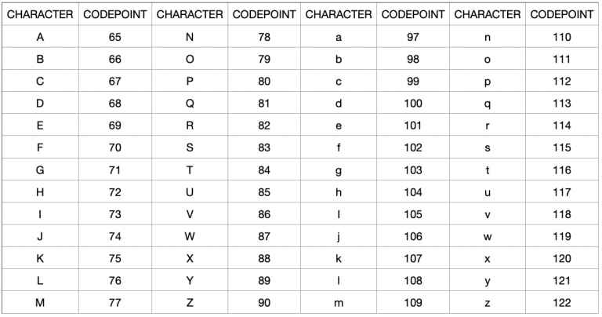

- [Convert string to integer](#convert-string-to-integer)
- [Convert integer to string](#convert-integer-to-string)
- [Appendix](#appendix)
- [Reference](#reference)
- [Future reading list](#future-reading-list)


It seems super easy to convert int to string or from string to int.  Just use the <span class="coding">int</span> and <span class="coding">str</span> functions.   The <span class="coding">int</span> function not only can 
- convert a string to number
- convert using given base
- remove decimals from a floating number 
    
```python
int('10')
# 10
int('10', base = 2)
# 2
int(10.3)
# 10
```
But what if we want to implement those from scratch?  We would need two Python functions that work with Unicode.    According to [Wikipedia](https://en.wikipedia.org/wiki/Unicode), The Unicode Standard is an information technology standard for the consistent encoding, representation, and handling of text expressed in most of the world's writing systems.  In simple terms, Unicode is a universal standard for encoding characters and symbols. It does that by assigning a code point to every character and symbol in every language in the world.

<span class="coding">ord()</span> and <span class="coding">chr()</span> are inverses of each other.  

**ord** converts a str character to its base-10 code point.  A Unicode code point is a unique number assigned to each Unicode character.  Examples:  <span class="coding">ord('0')</span> returns 48. <span class="coding">ord('0')</span> returns 49.  <span class="coding">ord('a')</span> returns 97.  <span class="coding">ord('z')</span> returns 122. 
  
**chr** is the inverse function of ord.  Return a Unicode **string** of an integer.  For example, <span class="coding">chr(48)</span> returns '0'. <span class="coding">chr(49)</span> returns '1'.  Guess what, <span class="coding">chr(97)</span> returns 'a'.  



# Convert string to integer

We can use the <span class="coding">ord</span> function, which returns the Unicode code point for a one-character string. 

So we use <span class="coding">ord(s) - ord('0')</span> to get the integer because integer 1 - 9 can be represented by their distance to ord('0').

<div class="code-head"><span>code</span>Convert string to integer.py</div>

```py
def string_to_int(s):
    return ord(s) - ord('0')

def f(s):
    res = 0
    for i in range(len(s)):
        num = string_to_int(s[i:i+1]) * 10**(len(s) - i -1)
        res = res + num
    return res
f('12')
# 12
```
But that only takes care of positive integers.  We need to account for negative integers by checking if the first character is '-'.
If the beginning letter is the negative sign, then we need to start <span class="coding">i</span> at 1 instead of 0.  Other than that, everything stays the same. 
```python
def f(s):
    res = 0
    if s[0] == '-':
        start_index = 1
    else:
        start_index = 0
    for i in range(start_index, len(s)):
        num = string_to_int(s[i:i+1]) * 10**(len(s) - i - 1)
        res = res + num
    return -1*res if s[0] == '-' else res
print(f('12'))  
# 12  
print(f('-12'))    
# -12
```

# Convert integer to string

We need to take into account integers can be both positive and negative. 

A string is a list of characters.  We will 
- convert the least signficant digit (using <span class="coding">%10</span>) to string.  
- reduce current integer by //10 (to get the quotient 商)
- repeat the last two steps until the current integer is 0
- use .join() to glue the string together. 

Because we want to append to the left, we will use a special list <span class="coding">collections.deque</span>.  For example, for integer 12, the number 2 goes first, then 1.  If we use append, the string would be '21', the reverse of what's expected.  

And to convert a single digit integer to string, we use the <span class="coding">chr</span> function, which returns a Unicode string of one character with ordinal i; 0 <= i <= 0x10ffff.

When we write the function to convert input single string character to integer, we subtract ord('0') from the Unicode of input by <span class="coding">ord(s) - ord('0')</span>.   Conversely, we need to add <span class="coding">ord('0')</span> when we want to go from Unicode to string. 

<div class="code-head"><span>code</span>Convert integer to string.py</div>

```py
from collections import deque
def single_int_to_string(x):
    return chr(ord('0') + x)

def f(num):
    s = deque()
    while num:
        s.appendleft(single_int_to_string(num % 10))
        num //= 10 
    return ''.join(s)

print(f(12))
# '12'
type(f(12))
# str
```

Initially I used <span class="coding">while num</span>.  But I think it is better to use <span class="coding">while num > 0</span> explicitly. 

Even though the code can be much shorter, but I think it is easy to understand and maintain to explicitly account for the case that input integer is zero, negative and positive. 

<div class="code-head"><span>code</span>Convert integer to string.py</div>

```py
from collections import deque
def single_int_to_string(x):
    return chr(ord('0') + x)

def f(num):
    if num == 0:
        return single_int_to_string(0)
    s = deque()
    if num < 0:
        is_negative = '-' 
        num = - num
    else:
        is_negative = ''
    while num > 0:
        s.appendleft(single_int_to_string(num % 10))
        num //= 10 
    s.appendleft(is_negative)
    return ''.join(s)

print(f(12))
# '12'
print(f(-12))
# '-12'
```

# Appendix
Sometimes I like to add how to do things in SAS just so that I don't forget too much.  For reference, in SAS, to conver string to integer, we use

```sas
data new;
   char_var = '123';
   numeric_var = input(char_var, 8.);
run;

data new;
    num_var = 123456;
    char_var = put(num_var,6.);
run;
```

# Reference

[Stackoverflow: What's the difference between a character, a code point, a glyph and a grapheme?](https://stackoverflow.com/questions/27331819/whats-the-difference-between-a-character-a-code-point-a-glyph-and-a-grapheme)

[ReaPython: Python Encoding Guide](https://realpython.com/python-encodings-guide/)

[Learn Coding Fast: 2 ways to convert a string to lowercase in python](https://learncodingfast.com/2-ways-to-convert-a-string-to-lowercase-in-python/)
# Future reading list
[The Absolute Minimum Every Software Developer Absolutely, Positively Must Know About Unicode and Character Sets (No Excuses!)](https://www.joelonsoftware.com/2003/10/08/the-absolute-minimum-every-software-developer-absolutely-positively-must-know-about-unicode-and-character-sets-no-excuses/)  

[What Every Programmer Absolutely, Positively Needs To Know About Encodings And Character Sets To Work With Text](https://kunststube.net/encoding/)