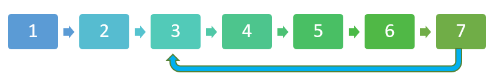

- [Problem statement:](#problem-statement)
- [Space $$O(n)$$ solution](#space-on-solution)
- [Space $$O(1)$$ solution: Floyd's tortoise-hare](#space-o1-solution-floyds-tortoise-hare)
# Problem statement:

Given a linked list, if there is a cycle, return the start of the cycle.  The start of cycle is defined as the place where 2 nodes meet.  
If there is no cycle, return -1. 


# Space $$O(n)$$ solution
The natural solution of finding if there is a cycle is to go down the list using <span class="coding">.next</span> and store each visited in a hashtable or set.  A cycle exists if and only if we reach a node that is already visited. 

# Space $$O(1)$$ solution: Floyd's tortoise-hare 
A famous solution for detecting cycles is attributed to computer scientist [Robert Floyd](https://en.wikipedia.org/wiki/Robert_W._Floyd), who also co-designed the [Floyd-Warshall algorithm](https://en.wikipedia.org/wiki/Floyd%E2%80%93Warshall_algorithm) for finding shortest paths in a directed weighted graph with positive or negative edge weights.  


From [wikipedia](https://en.wikipedia.org/wiki/Cycle_detection#Floyd's_tortoise_and_hare):
The key insight in the algorithm is as follows. use two iterators, a slow and a fast. The slow one moves one step at a time. The fast one moves two step (or more) at a time.  There is a cycle if and only if they meet. 

In code below, <span class="coding">detect_cycle_start</span> is the main function.  The trick is to define two separate movements: the slow one moves 1 step at a time.  The fast one moves 2 steps at a time. 

```python
    slow = slow.next
    fast = fast.next.next
```
If there is no cycle, then we will come out of the <span class="coding">while</span> loop as soon as <span class="coding">fast</span> exhausts all the linked nodes. 

If there is a cycle, then they will meet for sure. This is intuitive: the 2-step is divisible by 1.  We use a helper function <span class="coding">get_cycle_length</span> to get the cycle length, and break out of the <span class="coding">while</span> loop.  

However, when fast meets slow, they can meet somewhere (depends on the linked list) that is not the start of the cycle. 

To get the start of the cycle, we use another clever *trick* that is somewhat similar to the first trick: 
We use two pointers, both start from the origin (head node), with one pointer <span class="coding">p1</span> moves $$||c||$$ (length of cycle) steps from the origin first.  Then <span class="coding">p1</span> and <span class="coding">p2</span> move in tandem.  Because they are exactly $$||c||$$ steps apart, then they meet, it has to be the start of the cycle.   It is easiler to understand illustrating for yourself with pencil and paper than words. 

To get cycle length, we use a helper function <span class="coding">cycle_len</span>.  The function starts at the meeting place where slow meets fast, which is somewhere on the cycle. 

In the end, we return <span class="coding">None</span> if cycle length is not updated and return the meeting node if a cycle is detected. 


<div class="code-head"><span>code</span>linked list cycle detection.py</div>

```py
class Node:
  def __init__(self, x):
    self.val = x
    self.next = None
class Node:
  def __init__(self, x):
    self.val = x
    self.next = None

def has_cycle(head):
  if not head or not head.next:
      return None # edge case
  # helper function to get cycle length    
  def cycle_len(meetingPlace):
    start, steps = meetingPlace, 0
    while True:
      steps += 1
      start = start.next
      if start is meetingPlace:
        return steps

  fast = slow = head
  while fast and fast.next and fast.next.next:
    slow, fast = slow.next, fast.next.next
    if slow is fast:
      p1 = head
      for _ in range(cycle_len(slow)):
        p1 = p1.next # move p1 to ||c|| from the head Node
      p2 = head
      while p1 is not p2:
        p1 = p1.next
        p2 = p2.next 
      return p1
  return None
h = Node(1)
h.next = Node(2)
h.next.next = Node(3)
h.next.next.next = Node(4)
h.next.next.next.next = Node(5)
h.next.next.next.next.next = Node(6)
h.next.next.next.next.next.next = Node(7)
h.next.next.next.next.next.next.next = h.next.next

result = has_cycle(h)
print(result.val)
# 3
g = Node(1)
g.next = Node(2)
g.next.next = Node(3)
g.next.next.next = Node(4)
g.next.next.next.next = Node(5)
g.next.next.next.next.next = Node(6)
g.next.next.next.next.next.next = Node(7)

result = has_cycle(g)
if result:
  print(result.val)
else:
  print("No cycle")
# No cycle
```

Note that we use <span class="coding">is</span> instead of <span class="coding">==</span> for testing if linked node is a cycle: 

<span class="coding">if slow is fast</span> instead of <span class="coding">if slow == fast</span>, and <span class="coding">while p1 is not p2</span> instead of <span class="coding">while p1 != p2</span>. 

This is because linked nodes may have nodes that have the same values, which may not have cycles. 


The time complexity is O(n) because we do not have double loops.  We have 1 loop in the main function. 

The space complexity is O(1) because we use a few pointers only. 