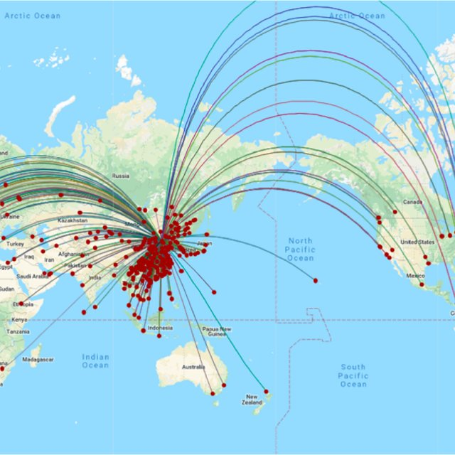

# My problem
What is the cheapest total price from one place to another with at most k stops?  The flights to China now are very expensive, 10 times of pre-Covid prices.  Not only they are very expensive, but also the length of time and number of stops are horendous.  Before Covid the non-stop flight to China was a little over 13 hours.  Now, a $20,000 economy ticket with 5 stops with total travel time of over 50 hours is not uncommon.  This's a practical problem, not just a puzzle. 



Before quoting any named algorithm, how would we solve the problem?  
Given the ticket scacity and high expense situation, *complicated* by zero-Covid strict policies in China that can result in things changing from one day to the next, I will pick any Chinese city close to my destination to get to China first, and then solve the cheapest problem again domestically.  My problem is complex: monetary costs,  date/time of arrivals/departures for connecting the flights, local lockdown severities, my own Covid tests, etcs..  Furthermore, I cannot spend months in China simply waiting at some random cities.  In all, it is a much more complicated and continuously changing problem than a puzzle. 

To make problem as simple as possible (albeit unrealistic), I would focus on monetary cost only and pick one of the cities, say Beijing, as my destination.  And since tickets are usually sold as round trip prices, they can be treated as undirected edges in a graph. 

Then I will get the routes for each airlines that currently flies to Beijing, costs of tickets and associated datetime. Let's say Tokyo, Hong Kong, London, Seul, NYC and a few others. The costs are $1000, $500, $9000, $20000.  Although from NYC the flight is non-stop, the cost is very high.   So I choose the cheapest, which is Hong Kong.  Next, I get the data for all the reachable places from Hong Kong and their respective cost and time.  If Hong Kong to Tokyo is $300.  Then I will update the cost from Beijing to Tokyo to be $800 ($500 + $300) to replace the original price of $1000.  

I will continue this method until I reversely track the path to NYC, where I am currently.  In the process of acquiring data and updating costs of getting to the cities, I would have known the cheapest costs to each and every place from source. 

My solution seems to resemble Dijstra's algorithm: solving problem layer by layer: starting from a single source, pick the best one among all the reachable ones.  In each layer, update all previous ones if needed and pick the best one to move on until reaching the destination.  

But Dijstra was born way befor I was :).  

# How he discovered it
"One of the reasons that it is so nice was that I designed it **without pencil and paper**. I learned later that one of the advantages of designing **without pencil and paper** is that you are almost forced to **avoid all avoidable complexities**. Eventually, that algorithm became to my great amazement, one of the cornerstones of my fame."

— Edsger Dijkstra, in an interview with Philip L. Frana, [Communications of the ACM, 2001](https://cacm.acm.org/magazines/2010/8/96632-an-interview-with-edsger-w-dijkstra/fulltext?mobile=false)
## What I learn from Duhstra's computer programming path

From [Wikipedia, Edsger Wybe Dijkstra](https://en.wikipedia.org/wiki/Edsger_W._Dijkstra) (11 May 1930 – 6 August 2002) was a Dutch computer scientist, programmer, software engineer, systems scientist, and science essayist.

*"The point was that I was supposed to study theoretical physics at the University of Leiden simultaneously, and as I found the two activities harder and harder to combine, I had to make up my mind, either to stop programming and become a real, respectable theoretical physicist, or to carry my study of physics to a formal completion only, with a minimum of effort, and to become....., yes what? A programmer? But was that a respectable profession? For after all, what was programming? Where was the sound body of knowledge that could support it as an intellectually respectable discipline? I remember quite vividly how I envied my hardware colleagues, who, when asked about their professional competence, could at least point out that they knew everything about vacuum tubes, amplifiers and the rest, whereas I felt that, when faced with that question, I would stand empty-handed. Full of misgivings I knocked on Van Wijngaarden's office door, asking him whether I could "speak to him for a moment"; when I left his office a number of hours later, I was another person. For after having listened to my problems patiently, he agreed that up till that moment there was not much of a programming discipline, but then he went on to explain quietly that automatic computers were here to stay, that we were just at the beginning and could not I be one of the persons called to make programming a respectable discipline in the years to come? This was a turning point in my life and I completed my study of physics formally as quickly as I could."*

— Edsger Dijkstra, The Humble Programmer (EWD340), Communications of the ACM

The point I am making with such a long quote instead of just sharing a link is this: do it early, do it when it is not even a profession, or do it when not many people care about it yet.  When it is popular and hot, it is a little too late. 

By this token, the career of a system engineer at one of the big tech firms is not the right path for big success.  


Dijkstra to a promising reseacher's advice was ***"Do only what only you can do"***.  Note that there are two "only" in the quote.  It is not only do what only you can do, but also only do those only you can do. 

By the way, Dijkstra said many witty and sometimes outrageous words (we all do) that people still remember:

"“Object-oriented programming is an exceptionally bad idea which could only have originated in California.”
    - "Go To Statement Considered Harmful" (Communications of the ACM. 11 (3): 147–148)
# Bellman-Ford algorithm
Bellman-Ford is a single source shortest path (SSSP) algorithm for weighted directed graph.  But Bellman-Ford is not the ideal SSSP because of time complexity $$O(E*V)$$.  

Like Dijkstra's algorithm, [Bellman–Ford](https://en.wikipedia.org/wiki/Bellman%E2%80%93Ford_algorithm) uses updating, in which approximations to the correct distance are replaced by better ones until they eventually reach the solution. In both algorithms, the approximate distance to each node is always an overestimate of the true distance, and is replaced by the minimum of its old value and the length of a newly found path. 

However, Dijkstra's algorithm uses a priority queue to greedily select the closest node that has not yet been processed, and performs this update process on all of its **outgoing edges**; by contrast, the Bellman–Ford algorithm **updates all the edges**, and does this $$V-1$$ times, where $$V$$ is the number of nodes in the graph. In each of these repetitions, the number of nodes with correctly calculated distances grows, from which it follows that eventually all nodes will have their correct distances. This method allows the Bellman–Ford algorithm to be applied to a wider class of inputs than Dijkstra. The intermediate answers depend on the order of edges relaxed, but the final answer remains the same.


## Improvements 
We can stop scanning as soon as updates have stopped instead of finishing all of the loops. 

# Problem statement
The problem is [787. Cheapest Flights Within K Stops](https://leetcode.com/problems/cheapest-flights-within-k-stops/).  
 
There are n cities connected by some number of flights. You are given an array flights where flights[i] = [fromi, toi, pricei] indicates that there is a flight from city fromi to city toi with cost pricei.

You are also given three integers origin, target, and k, return the cheapest price from origin to target with at most k stops. If there is no such route, return -1.

Example 1:


Input: n = 4, flights = [[0,1,100],[1,2,100],[2,0,100],[1,3,600],[2,3,200]], origin = 0, target = 3, k = 1
Output: 700
Note that the path through cities [0,1,2,3] is cheaper but is invalid because it uses 2 stops.

Example 2:

Input: n = 3, flights = [[0,1,100],[1,2,100],[0,2,500]], origin = 0, target = 2, k = 1
Output: 200

<!-- The method is like solving a very simple math problem.  
* You first _understand what does the problem exactly ask for_.
* **Put the requirements in math terms!**  
* Then _test it on one or two basic cases to really understand the problem and solution_.  Because it is hard to think only think with abstractions.  
* Work out the **generalization**. 

1. Let the length of the string be $$n$$.  Assume the longest is the entire string, check if it is palindrom. If yes, then done. 
2. If the entire string is not a palindrom, then we decrease check length by 1:  check on continuous chunks of length $$n-1$$, and iterate through them. Say the string is "abcd", then the iterations are: "abc", and "bcd". There are $$4-3+1$$ of them. We generalize the number of substrings with length $$x$$ to $$n - X +1$$.  If any of them is palindrom, then we are done.  Else continue. 
    -->

## Dijstra's method with min heap
I printed out each step to explain what the code does. 
<div class="code-head"><span>code</span>cheapest_upto_k_stops_greedy.py</div>

```py
from collections import heapq, defaultdict
    def findCheapestPrice(self, n, flights, origin, target, k):
        f = collections.defaultdict(dict)
        for a, b, p in flights:
            f[a][b] = p
        heap = [(0, origin, k + 1)]
        while heap:
            p, i, k = heapq.heappop(heap)
            if i == target:
                return p
            if k > 0:
                for j in f[i]:
                    heapq.heappush(heap, (p + f[i][j], j, k - 1))
        return -1
```

## Bellman-ford updating all edges method

For this problem, we cannot apply Bellman-Ford naively because of at most k stops. 

I like to convert the information given into a table, G.  

start | destination| price
---------|----------|---------
 0 | 1 | 100
 1 | 2 | 100
 0 | 2 | 500

We will use the info from the given table to update prices to all nodes, collected in an array X. 

So, given G, where we start (origin) and where we want to go (target), we want to update X for the cheapest price, k times. 

We use a double-loop.  The outer loop is k+1 times; the inner scans through the edges. 

For this problem, it is critical that we make a copy of X in each outer loop: <span class="coding">tmpX = X.copy()</span> because we want to update X only once at the end of each outer loop, and the fact that we need to check the current price (before updating) from the X table:

```python
if X[s] == float("inf"):
    continue
```

And,
```python
if tmpX[d] > X[s] + p:
    tmpX[d] = X[s] + p
```
<div class="code-head"><span>code</span>cheapest_upto_k_stops_non_greedy.py</div>

```py
def findCheapestPrice(n, G, origin, target, k) -> int:
    # n= number of nodes in graph
    # G=graph represented with compact list of list (compact matrix)
    X = [float("inf")] * n # X= list of prices to all nodes
    X[origin] = 0 # starting place
    for i in range(k + 1):
        tmpX = X.copy()
        for s, d, p in G:
            # s=source, d=destination (edges), p=price
            # print("s, d, p:",s, d, p)
            if X[s] == float("inf"):
                continue
            if tmpX[d] > X[s] + p:
                tmpX[d] = X[s] + p
        X = tmpX # update only once per full scan
    return -1 if X[target] == float('inf') else X[target]

# examples
n = 3
G = [[0,1,100],[1,2,100],[0,2,500]]
origin = 0
target = 2
k = 1
print("The cheapest price is ", findCheapestPrice(n, G, origin, target, k))
# s, d, p: 0 1 100
# s, d, p: 1 2 100
# s, d, p: 0 2 500
# s, d, p: 0 1 100
# s, d, p: 1 2 100
# s, d, p: 0 2 500
# The cheapest price is 200

# example 1
n = 4
G = [[0,1,100],[1,2,100],[2,0,100],[1,3,600],[2,3,200]]
origin = 0
target = 3
k = 1
print("The cheapest price is ", findCheapestPrice(n, G, origin, target, k))
# s, d, p: 0 1 100
# s, d, p: 1 2 100
# s, d, p: 2 0 100
# s, d, p: 1 3 600
# s, d, p: 2 3 200
# s, d, p: 0 1 100
# s, d, p: 1 2 100
# s, d, p: 2 0 100
# s, d, p: 1 3 600
# s, d, p: 2 3 200
# The cheapest price is  700
```

# Future reading
[Bellman Ford](https://en.wikipedia.org/wiki/Bellman%E2%80%93Ford_algorithm)

[Interview with Dijkstras](https://cacm.acm.org/magazines/2010/8/96632-an-interview-with-edsger-w-dijkstra/fulltext?mobile=false)