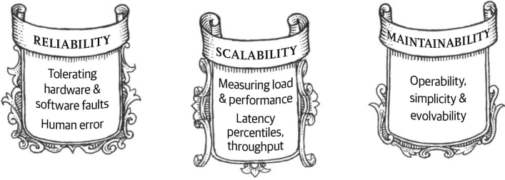

<figure> 
    
   <figcaption></figcaption>
</figure> 

- [What is system design](#what-is-system-design)
  - [Meta data systems](#meta-data-systems)
  - [Google data systems](#google-data-systems)
  - [Large bank data systems](#large-bank-data-systems)
- [Scalability, reliability and maintainability](#scalability-reliability-and-maintainability)
  - [Scalability](#scalability)
  - [Reliability](#reliability)
  - [Availability](#availability)
  - [Reliability vs availability](#reliability-vs-availability)
  - [Maintainability or managebility](#maintainability-or-managebility)
  - [Efficiency](#efficiency)
- [Reference](#reference)

# What is system design

No places that talks about system design bothers to give a definition of what is system design.  But guessing from what I have read, it seems that **system design means how to design big data web-based data systems and applications** such as Facebook, Instagram, Google, Twitter, and so on.  Before diving into data system buzzword, let's see take a look at some companies' data systems and related applications. 

## Meta data systems
Meta recieves petabytes of images and videos everyday, and even larger in read.  What does it use for its data systems?

[From a Quara answer](https://www.quora.com/How-does-Facebook-use-MySQL-to-store-data), Meta uses quite a lot databases:

1. To store user profile, their posts and timeline facebook uses **mysql** databases which runs in mutiple servers . 

2. To avoid the heavy load on the mysql facebook uses a **nosql** database called memcached which is a *cache* system storing the frequently used data and objects in RAM.   

3. To store those images and videos facebook uses a database called **haystack**. 
4. For providing super fast result for searches and retrieving large amount of data faster while maintaining scalability facebook uses a database called **Apache cassandra**.

One response from a Meta employee:
*Data is **sharded into logical databases**, and there are many more logical databases than physical machines. So data is migrated by moving a logical database from one physical machine to another. This is relatively easy, we just dump the database to a file, copy it to another machine and reload it, and update the mapping of logical to physical machine.*

*We don't ever move objects from one shard to another, because the object's ID encodes its shard number. So changing shards would require changing ID numbers and updating anything that referenced the old ID, which is potentially a lot of things. Having the ID encode the shard number is important for scaling - otherwise we would have to do an additional round trip to some directory service for every object access, and that directory service would have a ridiculously large number of entries.*

## Google data systems

According to this [answer on Quora from Robert Rossney, engineer at Google](https://www.quora.com/What-are-the-databases-used-by-Google), 
Most engineers at Google work with are *not “databases” but “storage solutions.”* For instance, a lot of what any normal company would store in a database is, at Google, *a collection of serialized protocol buffers written to a file*. Indeed, you can work at Google quite a while running SQL queries against these “databases” before you run into an implementation detail that tips you off that things are not what they seem (e.g. **you can’t run joins across the other tables in this database because there aren’t any**).

One flavor of these storage solutions these has long been productized as Cloud Datastore[1] , which is a way of storing serialized protocol buffers that supports replication and indexing and very fast direct access to keyed values. It’s what the kids today are calling a NoSQL database.

Internally Google has long used the database that it has **productized as Cloud SQL**[2] for more structured data that doesn’t have to be replicated geographically. It’s a whole lot like MySQL or PostgresSQL, because, well, you’ll see.

Most recently, Google’s been relying on Spanner, or as it’s called by people who don’t work there, Cloud Spanner. Spanner is the next state in the evolution of Google storage systems: it is, once again, really just a bunch of files containing serialized protocol buffers, but most of the time you don’t have to think about that unless what you want to store in a field is a protocol buffer. It also provides blazingly fast point lookups, distributed data, incredibly high reliability, and it supports transactions that simultaneously affect tables that are physically located on opposite sides of the world. Wired wrote a piece about Spanner[3] a while back that was full of gee-whizz astonishment (e.g. “this gives you faster-than-light coordination between two places”) and hype, and that is also not exaggerated. Spanner does give you faster-than-light coordination between two places[4]. It’s also crazy expensive right now, if you’re a hobbyist. (If you’re a Fortune 1000 company that wants to support operations with a fast, reliable global database, it’s dirt-cheap.)

Then there’s Firebase, which has a database at its heart but which is really an infrastructure for developing distributed applications[5]. I really hesitate to call it a database, because it’s so many other things, but because it does include a database, and because I work on Firebase, I think it’s worth mentioning in a discussion of Google databases. It’s really freaking cool.

[1] Google Cloud Datastore Overview  |  Cloud Datastore Documentation  |  Google Cloud Platform
[2] Google Cloud SQL  |  Cloud SQL  |  Google Cloud Platform
[3] Spanner, the Google Database That Mastered Time, Is Now Open to Everyone
[4] Cloud Spanner: TrueTime and External Consistency  |  Cloud Spanner Documentation  |  Google Cloud Platform
[5] Firebase

Google uses databases based on *Cloud SQL* which are of relational kind database when compared with nonrelational NoSQL database like MongoDB.
The primary data storage is **BigTable**, which was built in house, also known as "Distributed File System", and "Object-based storage".

## Large bank data systems

Like large tech companies, banks are striving to improve their customer experience.  However, unlike tech companies financial services institutions are particularly vulnerable because of regulatory and compliance pressures. uses multiple data systems, both large data centers and AWS cloud.  [Report](https://www.datacenterdynamics.com/en/news/jpmorgan-spent-2bn-on-new-data-centers-in-2021-and-plans-to-spend-more/) says that JPMorgan spent $2 billion on new data centers in 2021, despite a continued move to get its IT into the cloud.  The US finance giant spent $12 billion on technology in 2021, and plans to increase that further by eight percent. 

According to [an article published by JM Morgan CTO office](https://aws.amazon.com/blogs/big-data/how-jpmorgan-chase-built-a-data-mesh-architecture-to-drive-significant-value-to-enhance-their-enterprise-data-platform/#:~:text=We%20store%20the%20data%20for,each%20lake%20using%20cloud%20services.) in May 2022, JP Morgan uses Amazon S3 for storage and AWS Glue for integration. 

I read the word "*control*" multiple times in this article.  Understandably, banks are highly regulated.  

JPMC is comprised of multiple lines of business (LOBs) and corporate functions (CFs) that span the organization. To enable data consumers across JPMC’s LOBs and CFs to more easily find and obtain the data they need, while providing the necessary **control** around the use of that data, JPM has data system design as followed:

# Scalability, reliability and maintainability
*"If you are designing a data system or service, a lot of tricky questions arise. How do you ensure that the data remains correct and complete, even when things go wrong internally? How do you provide consistently good performance to clients, even when parts of your system are degraded? How do you scale to handle an increase in load? What does a good API for the service look like?"*

  --designing-data-intensive-applications.

Many factors determine the design: skills and experience of the people involved, legacy system dependencies, the time‐
scale for delivery, your organization’s tolerance of different kinds of risk, regulatory constraints, etc. Those factors depend very much on the situation.

Requirements often depend on industry and company specific goals.  For example, airplanes should have 100% reliability, but not necessarily high availability.  It can have downtime for maintainance. But when it is working, it must be 100% reliable.  On the contrary, a blogpost does not need to be highly reliable. 

## Scalability
The ability of a system to grow and manage as traffic increases.
* **sharding**: *optimization* technique for database horizontal scaling.  It lets you split up databases.  Sharding is a specific type of partitioning.  
  * Scaling up hardware. For example, doubling memory, processor.  But it is very expensive and has diminishing return. 
  * If scale out instead of scale up, make copies of databases.  Instead of one database overloaded with requests, have copies or replicas, eventually.  This introduces a problem: "eventual consistency".  Having eventual consistency can result in stale data.  We all have experienced not receiving text from friends and don't receive it until a day later.  

## Reliability
Probability that a system will fail during a period of time.  I think it means "quality"质量. 

Slightly harder to define than hardware reliability.  The metric often used is mean time between failures (MTBF = Total_time/ Total_down_time)

## Availability
Amount of time a system is operational during a period of time.
Poorly designed software requriing downtime for updates is less available. 

Often measured in 9's.  If the systems is available 23 hours out of a day, then availablity is $23/24=95.83%$
Highly available systems require 5 9's: 99.999%, which is 5.26 minutes out of a year.

## Reliability vs availability
$$Reliable => available$$
Reliable system is always an available system.
Availability can be maintained by redundancy, but system may still be unreliable. 
Reliable software will be more profitable because it provides the same services while requiring less backup resources.  
Good software does not need as many redundancy.

## Maintainability or managebility

Speed and difficulty with maintaining the system. 
Observability, how hard to track bugs.
Whether it is easy to deploy updates.
Whether it can abstract away infrastrue so that product engineers don't have to worry about it. 

## Efficiency
Associated metrics are latency and throughput. 

[Latency numbers](https://youtu.be/MbjObHmDbZo?t=1306) table summarizes different access types and the amounts of time they take. 

Access type | Time | Converted time
---------|----------|---------
 CPU cycle | .3ns | 1s
 CPU L1 cache | 1 nanosecond (ns) | 3s
 CPU L2 cache | 3 ns | 9s
 CPU L3 cache | 1 3ns | 43s
 main memory | 120 ns | 6 minutes
 SSD | 150 micro seconds | 6 days
 HDD | 10 milliseconds (ms) | 1 year
 SF to NYC | 40 ms | 4 years
 SF to Australia | 183 ms | 19 years

1 microsecond = $10^(-6)$ second. 

* **Tips**:  
  * Avoid network calls as much as possible
  * Replicate data across data centers for disaster recovery
  * Use **CDN**s to reduce latency
  * Keep often queried data in memory as much as possible instead of from disk

# Reference

[System Design Dourse for Beginners](https://youtu.be/MbjObHmDbZo?t=1306)

[Bank of America prioritized internal cloud. Now it’s evaluating third-party providers](https://www.ciodive.com/news/bank-of-america-prioritized-internal-cloud-now-its-evaluating-third-party/565228/)

[CS50 Lecture by Mark Zuckerberg - 7 December 2005](https://www.youtube.com/watch?v=xFFs9UgOAlE&t=2745s))

