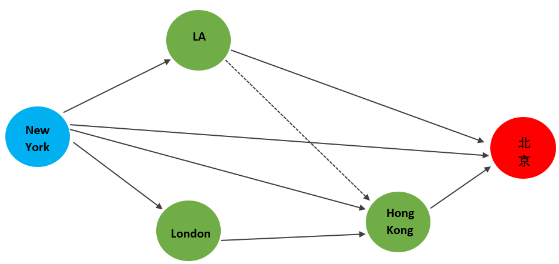
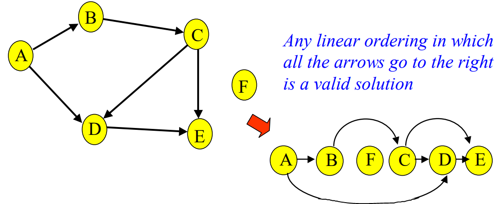
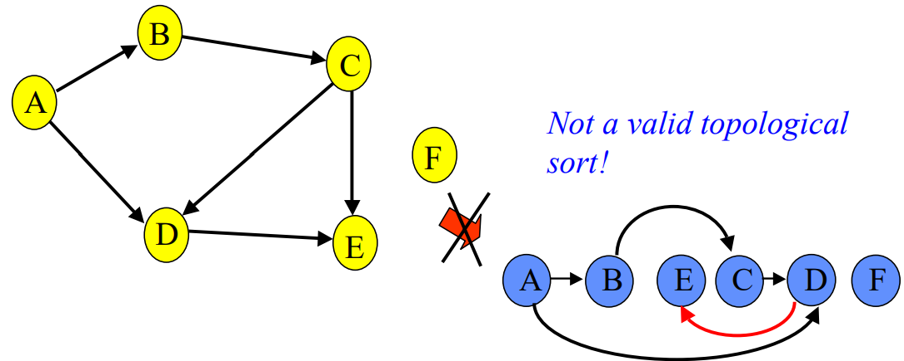
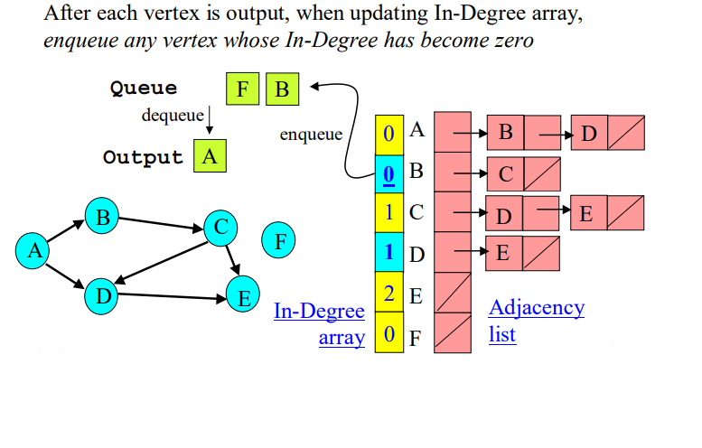

- [Problem](#problem)
- [Topological sort](#topological-sort)
  - [Khan's algorithm](#khans-algorithm)
  - [DFS](#dfs)
- [Cycle detection](#cycle-detection)
  - [Leetcode 207. Course Schedule](#leetcode-207-course-schedule)
  - [Leetcode 210. Course Schedule II](#leetcode-210-course-schedule-ii)
- [Compare with Floyd's algorithm for topological sort](#compare-with-floyds-algorithm-for-topological-sort)
- [Appendix](#appendix)
- [Reference](#reference)
# Problem
Given a directed hierchical structure, how do we flatten it to an array so that the directions are preserved?  

Recall my problem of trying to fly to Beijing, China, while Zero-Covid policy is going on in China, say I have combed through many many flights (edges) and stops (nodes) and have come up with the following possible path.  



How do I write down each of the valid routes in their right order with sentences? 

If we start the routes with "New York -> Beijing", that will not work for sure.  Because we left out other cities.  

Before quoting any named algorithm, how would we solve the problem? 

We can write down my starting place first, since it does not have any dependencies. Then we look at where the directed edges lead to, if any of them do not have any dependencies, then we can write it down next. And so forth until we are done. 

# Topological sort
A topological ordering will be the following:

New York, LA, London, Hong Kong, Beijing. 

My solution seems to resemble Khan's algorithm for topological sort: solving problem layer by layer: start from those that have no dependencies (no incoming edges), remove them and write them down (put them in a queue). Do it to the next batch.

Below images are taken from Washington University Professor Rao's CSE 326 Lecture 20.  The problem is similar, except names of cities have become course numbers.  We want to write down the list of course in their dependency order. 





We use the dfs code below for topological sort. 
<div class="code-head"><span>code</span>dfs.py</div>

```py
def dfs(G, startNode,visited):
    # initial value
    if startNode not in visited:
        visited.append(startNode)
    # recurse
    for node in G[startNode]:
        if node not in visited:
            dfs(G, node, visited)
    return visited
```

```python
g = {'A': ['B', 'D'],
    'B': ['C'],
    'C': ['D', 'E'],
    'D': ['E'],
    'E': [],
    'F': []}
print(dfs(g, 'A', []))
# ['A', 'B', 'C', 'D', 'E']
```



## Khan's algorithm
One of these algorithms, first described by Kahn (1962), works by choosing vertices in the same order as the eventual topological sort. 

First, find a list of "start nodes" which have no incoming edges and insert them into a set S; at least one such node must exist in a non-empty acyclic graph. Then:

L ← Empty list that will contain the sorted elements
S ← Set of all nodes with no incoming edge
while S is non-empty do
    remove a node n from S
    add n to tail of L
    for each node m with an edge e from n to m do
        remove edge e from the graph
        if m has no other incoming edges then
            insert m into S
if graph has edges then
    return error   (graph has at least one cycle)
else 
    return L   (a topologically sorted order)

In Kahn’s algorithm, we construct a topological sort on a DAG by finding nodes that have no incoming edges:

**Step 1: Compute In-degree**: First we create compute a lookup for the in-degrees of every node. In this particular Leetcode problem, each node has a unique integer identifier, so we can simply store all the in-degrees values using a list where indegree[i] tells us the in-degree of node i.

**Step 2: Keep track of all nodes with in-degree of zero**: If a node has an in-degree of zero it means it is a course that we can take right now. There are no other courses that it depends on. We create a queue q of all these nodes that have in-degree of zero. At any step of Khan's algorithm, if a node is in q then it is guaranteed that it's "safe to take this course" because it does not depend on any courses that "we have not taken yet".

**Step 3: Delete node and edges, then repeat**: We take one of these special safe courses x from the queue q and conceptually treat everything as if we have deleted the node x and all its outgoing edges from the graph g. In practice, we don't need to update the graph g, for Khan's algorithm it is sufficient to just update the in-degree value of its neighbours to reflect that this node no longer exists.
This step is basically as if a person took and passed the exam for course x, and now we want to update the other courses dependencies to show that they don't need to worry about x anymore.

**Step 4: Repeat**: When we removing these edges from x, we are decreasing the in-degree of x's neighbours; this can introduce more nodes with an in-degree of zero. During this step, if any more nodes have their in-degree become zero then they are added to q. We repeat step 3 to process these nodes. Each time we remove a node from q we add it to the final topological sort list result.

<div class="code-head"><span>code</span>khans algorithm.py</div>

```py
from collections import deque
from networkx.generators import directed
from networkx.generators import random_graphs

# Make good adjacency list for testing (is DAG)
g = directed.gn_graph(100)
adj_list = g.adjacency_list()

# Make bad adjacency list for testing (is not DAG)
bad_g = random_graphs.fast_gnp_random_graph(100, 0.2, directed=True)
bad_adj_list = bad_g.adjacency_list()

from collections import deque
from networkx.generators import directed
from networkx.generators import random_graphs

# Make good adjacency list for testing (is DAG)
g = directed.gn_graph(100)
adj_list = g.adjacency_list()

# Make bad adjacency list for testing (is not DAG)
bad_g = random_graphs.fast_gnp_random_graph(100, 0.2, directed=True)
bad_adj_list = bad_g.adjacency_list()

def topsort(adj_list):
  def edges(): # Returns list of edges
    return [val for subl in adj_list for val in subl]

  def no_incoming(): # Generates set of all nodes with no incoming edges
    return set(range(0, len(adj_list))) - set(edges())
  
  L = []                       # L <- Empty list that will contain the sorted elements
  S = deque( no_incoming() )   # S <- Set of all nodes with no incoming edges
  
  while len(S) > 0:            # while S is non-empty do
    n = S.pop()                #   remove a node n from S
    L.append(n)                #   insert n into L
    
    for m in adj_list[n]:      #   for each node m with an edge e from n to m do
      adj_list[n].remove(m)    #     remove edge e from the graph
      
      if m in no_incoming():   #     if m has no other incoming edges then
        S.append(m)            #       insert m into S
  
  if len(edges()) > 0:         # if graph has edges then
    raise Exception("Not DAG") #   return error (graph has at least one cycle)
  else:                        # else
    return L                   #   return L (a topologically sorted order)

```
## DFS 
The illustration below shows the one algorithm of doing topological sort with $$O(V+E)$$ time complexity. 



# Cycle detection

Khan's algorithm of topological sort can be used for cycle detection.   
If there is a cycle in the graph then result will not include all the nodes in the graph, result will return only some of the nodes. To check if there is a cycle, you just need to check whether the length of result is equal to the number of nodes in the graph, n.

*Why does this work?*: Suppose there is a cycle in the graph: x1 -> x2 -> ... -> xn -> x1, then none of these nodes will appear in the list because their in-degree will not reach 0 during Khan's algorithm. Each node xi in the cycle can't be put into the queue q because there is always some other predecessor node x_(i-1) with an edge going from x_(i-1) to xi preventing this from happening.
 

## Leetcode 207. Course Schedule

**Problem**:  There are a total of numCourses courses you have to take, labeled from 0 to numCourses - 1. You are given an array prerequisites where $$prerequisites[i] = [a_i, b_i]$$ indicates that you must take course $$b_i$$ first if you want to take course $$a_i$$.  For example, the pair [0, 1], indicates that to take course 0 you have to first take course 1. Return true if you can finish all courses. Otherwise, return false.

* Example 1:

Input: numCourses = 2, prerequisites = [[1,0]]

Output: true

* Example 2:

Input: numCourses = 2, prerequisites = [[1,0],[0,1]]

Output: false.  This is because to take course 1 you should have finished course 0, and to take course 0 you should also have finished course 1.  So it is impossible.

One of the solutions is to use topological sort with DFS.  The

<div class="code-head"><span>code</span>course schedule explain version.py</div>

```py
def canDo(numCourses, prerequisites) -> bool:
  # numCourses: int, prerequisites: List[list[int]]
  adjList = {i: [] for i in range(numCourses)}
  for c, p in prerequisites:
    adjList[c].append(p)
  for k, v in adjList.items():
    print(k, v)

  visiting = set()
  def dfs(c):
    print("**************************\n%s"%c)
    if c in visiting:
      print("%s already visited, cycle detected!"%c)
      return False # cannot do it
    if adjList[c] == []:
      print("%s has no dependency/neighbor"%c)
      return True
    visiting.add(c)
    print("Adding %s to visiting"%c)
    for p in adjList[c]:
      print("checking on neighbor of %s: %s "%(c, p))
      if not dfs(p):
        return False
    print("completed visit of %s and removing it"%c)
    visiting.remove(c)
    adjList[c] = []
    return True
  for c in range(numCourses):
    if not dfs(c):
      return False
  print("Final adjList:", adjList)
  return True
```

```python
print("\n\n")
numCourses = 2
prerequisites = [[1, 0]]
print(canDo(numCourses, prerequisites))
# 0 []
# 1 [0] 
# **************************
# 0
# 0 has no dependency/neighbor
# **************************
# 1
# Adding 1 to visiting
# checking on neighbor of 1: 0
# **************************
# 0
# 0 has no dependency/neighbor
# completed visit of 1 and removing it
# Final adjList: {0: [], 1: []}
# True
```   


```python
print("\n\n")
numCourses = 2
prerequisites = [[1, 0], [0, 1]]
print(canDo(numCourses, prerequisites))

# 0 [1]
# 1 [0]
# **************************
# 0
# Adding 0 to visiting
# checking on neighbor of 0: 1
# **************************
# 1
# Adding 1 to visiting
# checking on neighbor of 1: 0
# **************************
# 0
# 0 already visited, cycle detected!
# False
```


```python
print("\n\n")
numCourses = 5
prerequisites = [[0,1],[0,2], [1, 3], [1,4], [3, 4]]
print(canDo(numCourses, prerequisites))
0 [1, 2]
1 [3, 4]
2 []
3 [4]
4 []
# **************************
# 0
# Adding 0 to visiting
# checking on neighbor of 0: 1
# **************************
# 1
# Adding 1 to visiting
# checking on neighbor of 1: 3
# **************************
# 3
# Adding 3 to visiting
# checking on neighbor of 3: 4
# **************************
# 4
# 4 has no dependency/neighbor
# completed visit of 3 and removing it
# checking on neighbor of 1: 4
# **************************
# 4
# 4 has no dependency/neighbor
# completed visit of 1 and removing it
# checking on neighbor of 0: 2
# **************************
# 2
# 2 has no dependency/neighbor
# completed visit of 0 and removing it
# **************************
# 1
# 1 has no dependency/neighbor
# **************************
# 2
# 2 has no dependency/neighbor
# **************************
# 3
# 3 has no dependency/neighbor
# **************************
# 4
# 4 has no dependency/neighbor
# Final adjList: {0: [], 1: [], 2: [], 3: [], 4: []}
# True
```

## Leetcode 210. Course Schedule II

There are a total of numCourses courses you have to take, labeled from 0 to numCourses - 1. You are given an array prerequisites where prerequisites[i] = [ai, bi] indicates that you must take course bi first if you want to take course ai.

For example, the pair [0, 1], indicates that to take course 0 you have to first take course 1.

Return the ordering of courses you should take to finish all courses. If there are many valid answers, return any of them. If it is impossible to finish all courses, return an empty array.
 
Example 1:

Input: numCourses = 2, prerequisites = [[1,0]]
Output: [0,1]
Explanation: There are a total of 2 courses to take. To take course 1 you should have finished course 0. So the correct course order is [0,1].
Example 2:

Input: numCourses = 4, prerequisites = [[1,0],[2,0],[3,1],[3,2]]
Output: [0,2,1,3]
Explanation: There are a total of 4 courses to take. To take course 3 you should have finished both courses 1 and 2. Both courses 1 and 2 should be taken after you finished course 0.
So one correct course order is [0,1,2,3]. Another correct ordering is [0,2,1,3].
Example 3:

Input: numCourses = 1, prerequisites = []
Output: [0]


Constraints:

1 <= numCourses <= 2000
0 <= prerequisites.length <= numCourses * (numCourses - 1)
prerequisites[i].length == 2
0 <= ai, bi < numCourses
ai != bi
All the pairs [ai, bi] are distinct.

<div class="code-head"><span>code</span>course schedule II.py</div>

```py
from collections import defaultdict

def build_graph(edges, n):
    g = defaultdict(list)
    for i in range(n):
        g[i] = []
    for a, b in edges:
        g[b].append(a)
    return g

def topsort(g, n):
    # -- Step 1 --
    indeg = [0] * n
    for u in g:
        for v in g[u]:
            indeg[v] += 1


    # -- Step 2 --
    q = []
    for i in range(n):
        if indeg[i] == 0:
            q.append(i)

    # -- Step 3 and 4 --
    result = []
    while q:
        x = q.pop()
        result.append(x)
        for y in g[x]:
            indeg[y] -= 1
            if indeg[y] == 0:
                q.append(y)

    return result

def courses(n, edges):
    g = build_graph(edges, n)
    ordering = topsort(g, n)
    # -- Step 5 --
    has_cycle = len(ordering) < n
    return [] if has_cycle else ordering
```

# Compare with Floyd's algorithm for topological sort

# Appendix

Code for plotting the directed group. If we want undirected graph, use <span class="coding">nx.Graph()</span> instead. 
<div class="code-head"><span>code</span>simple directed graph.py</div>

```py
import networkx as nx
import matplotlib.pyplot as plt
G = nx.DiGraph()
G.add_edge(0, 1)
G.add_edge(0, 2)
G.add_edge(1, 3)
G.add_edge(1, 4)
G.add_edge(3, 4)
# explicitly set positions
pos = {0: (-4, 0), 2: (1, -2), 1: (3, 0),  3: (10, 0), 4: (12, -2)}
options = {
    "font_size": 36,
    "node_size": 3000,
    "node_color": "white",
    "edgecolors": "black",
    "linewidths": 5,
    "width": 5,
}
nx.draw_networkx(G, pos, **options)
# Set margins for the axes so that nodes aren't clipped
ax = plt.gca()
ax.margins(0.20)
plt.axis("off")
```

Below is the shorter version of the course schedule code in this post. 
<div class="code-head"><span>code</span>course schedule.py</div>

```py
def canDo(numCourses, prerequisites) -> bool:
  # numCourses: int, prerequisites: List[list[int]]
  adjList = {i: [] for i in range(numCourses)}
  for c, p in prerequisites:
    adjList[c].append(p)
  visiting = set()
  def dfs(c):
    if c in visiting:
      return False # cannot do it
    if adjList[c] == []:
      return True
    visiting.add(c)
    for p in adjList[c]:
      if not dfs(p):
        return False
    visiting.remove(c)
    adjList[c] = []
    return True
  for c in range(numCourses):
    if not dfs(c):
      return False
  return True
```
# Reference

[Washington University CSE 326 Lecture 20: Topo-Sort and Dijkstra’s Greedy Idea](https://courses.cs.washington.edu/courses/cse326/03wi/lectures/RaoLect20.pdf)

[Depth-First Search](https://courses.engr.illinois.edu/cs473/sp2017/notes/06-dfs.pdf)

[Arthur Khan, Topological sorting of large networks, Communications of the ACMVolume 5 Issue 11 Nov. 1962 pp 558–562](https://dl.acm.org/doi/10.1145/368996.369025)

[NetworkX](https://networkx.org/documentation/latest/auto_examples/basic/plot_simple_graph.html#sphx-glr-auto-examples-basic-plot-simple-graph-py)

[Wiki Talk Topological Sorting](https://en.wikipedia.org/wiki/Talk%3ATopological_sorting)
 
