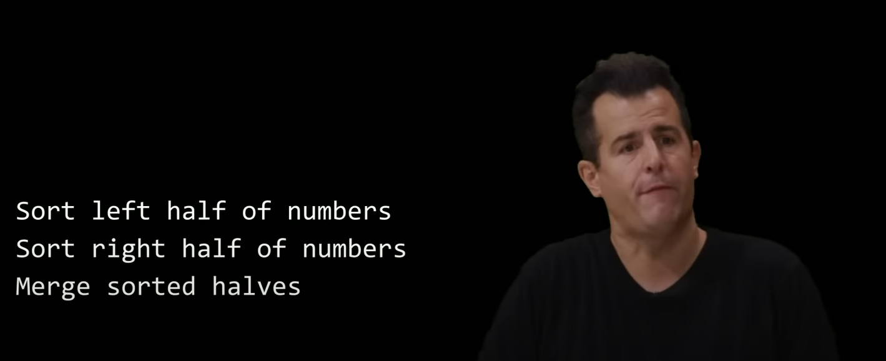
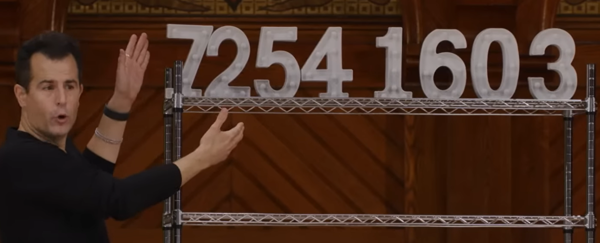
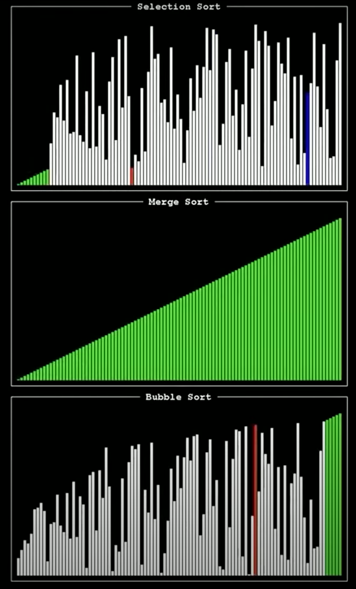

This post is a rewrite of an older post back in July, 2022.  Most of the addition are my edited transcript from the last few minutes of Professor David Malen's CS50 class on algorithm that was live streamed on September 22, 2022.  I know it is kind of strange to edit a transcript and put it in a post.  But the explanation is just that good. Better than anything I have seen. This particular class is just one of the best movies that I have ever watched (yes I call it a "movie" and mean it literally). 

The last few seconds of the movie is quite dramtic. [Watch!](https://youtu.be/4oqjcKenCH8?t=9054)

# My old post
Like quicksort, merge sort is a divide-and-conquer recursive method. 

The quicksort algorithm tries to sort an array in two **"halves"** (or more accurately,two parts), and then **"halves of halves"**, by *comparing* with members of arrays (or more precisely "sub-arrays") that are commonly called "pivot".  The sorting efficiency depends on how close the "pivots" are close to the medians of the arrays.  The pivots are not the medians in reality because we don't know what the medians are. 

Whereas the merge sort method splits input array in exact halves, and then halves, recursively, into one-unit subarrays, compare elements of the subarrays with each other in a binary fashion, and **merge** them back recursively into one sorted array.  

The merge sort method feels like some kind of **depth-first** search even though it is a sorting method. 

Time complexity: $$O(n*log(n))$$, which is optimal for comparison based algorithm. 

In code below, **the recursion calls are placed immediately after halfing the input array into left and right halves**.   

Since the <span class="coding">mergeSort(L)</span> is placed before <span class="coding">mergeSort(R)</span>, it means that the left half will be recursively partitioned and merged before the right half. 


<div class="code-head"><span>code</span>merge sort.py</div>

```python

# merge sort
def mergeSort(A):
    N = len(A)
    if N > 1:
        L = A[:N//2]
        R = A[N//2:]
        # recursion
        mergeSort(L)
        mergeSort(R)
        # merge
        l = r = a = 0 # indices of left, right, and merged array initialized at 0
        while (len(L) > l) and (len(R) > r):
            if L[l] < R[r]:
                A[a] = L[l]
                l += 1
            else:
                A[a] = R[r]
                r += 1
            a += 1
        while (len(L) > l):
            A[a] = L[l]
            a += 1
            l += 1
        while len(R) > r:
            A[a] = R[r]
            a += 1
            r += 1
    return A

A = [9, 4, 100, 1, 598, 0, 8]
print(mergeSort(A))
# [0, 1, 4, 8, 9, 100, 598]

nums = [100, 3, 9, 1, 0, -10, 87, 87]
print(mergeSort(nums))
```

Because halfing is stickly enforced (not up to chance as in quicksort), the time complexity is always $$O(n*log(n))$$. 

#  Harvard CS50 2022 - Lecture 3 - Algorithms
[Merge Sort, Harvard CS50 2022 - Lecture 3 - Algorithms](https://youtu.be/4oqjcKenCH8?t=8121)
Professor David Malen has a great explanation on this recursion.


> "Sort left half of number
> Sort right half of numbers
> Merge sorted values"


This is almost sort of nonsensical because if if you're asked for an algorithm to sort and you respond with well, sort the left half, sort the right half, like that's being sort of difficult because well, I'm asking for a sorting algorithm,
you're just telling me to sort the left half and the right half. 

But implicit in that last line, **merging is a pretty powerful feature of this sort**. Now we do need another base case at the top. So let me add this. If we find ourselves with an array of size one, well, that array is obviously sorted. If there's only one element in it, there's no work to be done. So that's gonna be our base case. But allowing us now in just these six lines of pseudo code to actually sort some elements. 

But let's focus first on just a subset of this.
Let's consider for a moment what it means to merge sorted halves.  Supposed that in the middle of the story we're about to tell, we have two sorted halves.   I've already sorted the left half of these numbers and indeed [2,4,5,7] is sorted from smallest to largest and the right appears to be already sorted [0,1,3,6]. So in my pseudo code we're already done sorting
the left half and the right half somehow. But we'll see how in a moment. Well, how do I go about merging these two halves?

Well, because they're sorted already and you want to merge them in order. I think we can hide all but the first numbers in each of these sub-lists. So here we have a half that starts with two and I don't really care what the other numbers are because they're clearly larger than two. I can focus only on 2 and 0. Also we know that zero is the smallest there.

So let's just ignore the numbers that carter kindly flip down. So how do I merge these two lists into a new sorted larger list?
Well I compare the 2 on my left with 0 on my right obviously which comes first the zero. S Now I have two sorted halves but I've already plucked one off.

So now I compare the 2 against the 1. So I'm gonna take out the one and put it in place here. Now I'm going to compare the two halves again two and three which do I merge first.  Obviously the two comes next and now notice each time I do this my hands are theoretically making forward progress.
I'm not doubling back like I kept doing with selection sort or bubble sort back and forth back and forth.
My fingers are constantly advancing forward and that's going to be a key detail. So I compare 4 and 3...
And then lastly we have just one element left. And even though I'm kind of moving awkwardly as a human, my hands technically were only moving to the right.  **I was never looping back** doing something again and again and that's perhaps the intuition.

So that then is how you would merge. Two sorted halves. We started with left half sorted, right, half sorted.
And merging is just like what you would do as a human and carter just flipped the numbers down **so our focus was only on the smallest elements in each of** halves before we forged ahead.

So now here is an original list, **[7, 2, 5, 4, 1, 6, 0, 3]**, we deliberately put it at the top because there's one detail of merge sort. That's key. Merge sort is technically **going to use a little more space**.
I'm gonna need at least one other array of memory and I'm gonna cheat and I'm going to use even more memory. But technically I could actually go back and forth between one array and a secondary array,
So how do I go about implementing merge sort on this, on this code? Well, let's consider this. Here's a array of size eight.
If only one number, quit, obviously not applicable. So let's focus on the juicy part. Let's sort the left half of the numbers. Alright. How do I sort the left half of the numbers?
Here is now a sub list of size four. How do I sort the left half.



Well, **do I have an algorithm for sorting? Yeah**, what do I do? 

Here's a list of size four. How do I sort it? What's step one: **sort the left half**.  So I now sort of conceptually in my mind, take this sub list of size four and I sort it by first sorting the left half, focusing now on the seven and two. 

[7, 2] All right. Here's a list of size two. How do I sort a list of size two?

Sorry, **I think we just keep following our instructions, sort the left half**. 

All right, here is a list of size one. How do I sort a list of size 1?
I'm done.  So I leave this alone. What was the next step in the story? 
I've **just sorted the left half of the left half of the left half**. What comes next?

I **sort the right half of the left half of the left half**, and I'm done because it's just a list of size one.
What comes after this merge? So this is where it gets a little tricky. **But if I just sorted the left half and I've just sorted the right half. Now I merge them together**. This is a super short list, [2, 7]
I think the first number I take here is the two, and then the second number I take because it's the only option is the seven.
But what's nice now, is that notice the left half of the left half is indeed sorted
because I trivially sorted the left half of it and the right half of it. But **then merging is really where the magic happens**.

Alright again, if you remind, if you rewind now, in your mind if I just sorted the left half of the left half.
What happens next, sort the right half of the left half.  So again you kind of rewind in time.

So how do I do this? I've got a list of size two, I sort the left half the just the five done,
sort the right half.  Now the interesting part I merge the left half and the right half
of the right half of the left half. So what do I do? Four comes down here, five comes down here and now
notice what I have left half [2, 7] is sorted. Right half is sorted.[4, 5]. 

If you rewind in time, where is my next step? Merge the two halves.  Let's focus only on the smallest elements. Just so there's less distraction. I compare the two and the 4, 2 comes first.
Now I compare the new beginning of this list [7] and the old beginning of this list [4,5]
Four obviously comes next and now I compare seven against the 5, 5 obviously comes next.

And now lastly I'm left with one number, so now I'm down to the seven. So even if you kind of lost track of some of the nuances here,
if you just kind of take a step back, **we have the original right half here still untouched, but the left half of the original input is now indeed sorted all by way of doing sorting left half, right half, left half, right half but with those merges in between.**   All right. So if we've just sorted the left half,
we rewind all the way to the beginning, what do I now do?  All right, so sort the right half.

So sort the right half. [1, 6, 0, 3]

How do I sort a list of size four? Well I first sort the left half the one in the six. How do I sort a list of size two? You sort the left half, just the number one.
Obviously there's no work to be done done sorting the left half, six, done sorting the right half.
Now, what do I do? I merge the left half here with the right half here and that one's pretty straightforward.

Now what do I do? I just merged so now I sorted I've just sorted the left half of the right half [1, 6]. So now I sort the right half of the right half, so I consider the zero done. I consider the three done, I now merge these two together. Zero of course comes first, then comes the three. [0, 3]

And now I'm at the point of the story where I've sorted the left half of the right half and the right half of the right half. So step three is merge and I'll do it again like we did with carter. Alright, one and zero, obviously the zero comes first.
Now compare the one and the three, obviously the one comes first. Compared the six and the three obviously the three and then lastly the six. 

So now where are we? We've taken the left half of the whole thing and sorted the left and sorted it.

We then took the right half of the whole thing and sorted it. So now we're at lastly step three for the last time, what do we do?
Merge, so just to be consistent, let me push these down and let's compare left hand or right hand, noticing that they only make forward progress, none of this, back and forth comparisons. 

And even though I grant that of all the algorithms, this is probably the hardest one to stay on top of, realize that what we've just done is **only those three steps recursive**, we started with a list of size eight, we started the left half, we started the right half and then we merge the two together. 

But if you go down each of those rabbit holes, so to speak, **sorting the left half involved sorting the left half of the left and the right half of the left half and so forth**. But this germ of an idea of really **dividing and conquering** the problem, not such that you're having the problem and only dealing with one half. Clearly we're sorting one half and the other half and merging them together. Ultimately, it does still lead us to the same solution.
And if we visualize the remnants of this now, if I depict this as follows, where on the screen here, you see where the numbers originally started in the top row, from left to right, essentially, even though this is in a different order, I divided that list of size eight, ultimately into eight. Lists of size one, and that's where the base case kicked in and just said, okay, we're done sorting that.

And after that I merged two lists of size one into many lists of size two, and those lists of size two into lists of size four, and finally the list of size four into one big list, sorted of size eight. And so I put forth this picture with the little line indicators here because how many times did I divide,divide divide in half, or really double? Double double. So exponent is the opposite of ...?

How many times did I divide? So three concretely, but if there's eight elements total and there's $$n$$ more generally,

it really is a matter of dividing and conquering $$log(n)$$ times.
Or conversely you can start here and exponentially double double double three times, which is law again, but on every row, every shelf literal,
I made a fuss about pointing my hands only from the left to the right, constantly advancing them.
Such that every time I did those merges, I touched every element once and only once, there was none of this back and forth, back and forth on stage.
So if I'm doing something log in times, if I'm doing $$n$$ things $$log(n)$$ times, what would be our big old formula?
Perhaps? $$n$$ things log in times. Yeah, So in law, again,
the order of $$n*log(n)$$ is indeed how we would describe the running time of merge sort and so of all of the sorts thus far,
we've seen that merge sort here actually is $$n log n$$, which is strictly better than $$n^2$$, which is where both merge both selection sort and bubble sort landed but it's also slower than linear search for instance. 

But you would rather expect that if you have to do a lot of work up front sorting some element
versus just searching them, **you're gonna have to put in more effort**. And so the question of whether or not you should just search something blindly with linear search and not bother sorting it really boils down to **can you afford to spend this amount of time**? And if you're the googles of the world odds are you sort it once and then benefit millions, billions of people subsequently using something like binary search or frankly in practice something even fancier and faster than binary search.

But there's always gonna be this **trade off**. You can **achieve binary search only if the elements are sorted**.

I should note that the lower bound on merge sort is also going to be a  $$O(n*log(n))$$.
as such. 
We can describe it in terms of r theta notation, saying that merge sort is indeed in theta of n log n. So generally speaking,
probably better to use something like merge sort or some other algorithm that's in n log n. 

In practice, most programmers are not implementing these sorting algorithms themselves, odds are they're using a library off the shelf that themselves have made the decision as to which of these algorithms to do. But generally speaking, we're seeing now this for the first time if you want to improve time,like use less time, write faster code, you've got to pay a price and that might be your human time just takes you more time to code up something more sophisticated more difficult to implement **or you need to spend something like space**.

And as the shelves suggest that too is one of the key details of merge sort is that you **can't just have the elements swapping in place**.  You need at least in an auxiliary array so that when you do the merging.  Back in the day, decades ago space was really expensive and so you know what,it might have been better to not use merge sort. Use bubble sort or selection sort even or some other algorithm altogether.



Nowadays, space is relatively cheap and so these are more acceptable trade offs, but it totally depends on the application.

# Appendix

To see how the recursion works, I printed out every single parameter as shown in code and output below. 

<div class="code-head"><span>code</span>merge sort.py</div>

```python

# merge sort
def mergeSort(A):
    print("\nEntering function call, A is ", A)
    N = len(A)
    print("N, the length of A is, ", N)
    if N > 1:
        L = A[:N//2]
        R = A[N//2:]
        print("L is ", L)
        print("R is ", R)
    
        # recursion
        mergeSort(L)
        mergeSort(R)

        # merge
        print("\nMERGING STEP")
        i = 0 # left array idx initiated at 0, whenever an element is copied to A i < len(L) means 
        j = 0 # right array idx
        k = 0 # merged array idx
        while i < len(L) and j < len(R): 
            if L[i] < R[j]:
                print("if both L & R have something left, and left is smaller than right")
                print("L[i] is ", L[i])      
                A[k] = L[i]
                i += 1
            else: 
                print("if both L & R have something left, and left is bigger than right")
                A[k] = R[j]
                print("R[j] is ", R[j])
                j += 1
            k += 1

        while i < len(L):
            print("if only L has something left, then copy them to A")
            A[k] = L[i]
            k += 1
            i += 1
            
        while j < len(R):
            print("if only R has something left, then copy them to A")
            A[k] = R[j]
            k += 1
            j += 1
    print("\nExiting function call, A is ", A)
    return A
A = [9, 4, 100, 1, 598, 0, 8]
# A = [9, 4, 100, 1]
print(mergeSort(A))

# Entering function call, A is  [9, 4, 100, 1, 598, 0, 8]
# N, the length of A is,  7
# L is  [9, 4, 100]
# R is  [1, 598, 0, 8]

# Entering function call, A is  [9, 4, 100]
# N, the length of A is,  3
# L is  [9]
# R is  [4, 100]

# Entering function call, A is  [9]
# N, the length of A is,  1

# Exiting function call, A is  [9]

# Entering function call, A is  [4, 100]
# N, the length of A is,  2
# L is  [4]
# R is  [100]

# Entering function call, A is  [4]
# N, the length of A is,  1

# Exiting function call, A is  [4]

# Entering function call, A is  [100]
# N, the length of A is,  1

# Exiting function call, A is  [100]

# MERGING STEP
# if both L & R have something left, and left is smaller than right
# L[i] is  4
# if only R has something left, then copy them to A

# Exiting function call, A is  [4, 100]

# MERGING STEP
# if both L & R have something left, and left is bigger than right
# R[j] is  4
# if both L & R have something left, and left is smaller than right
# L[i] is  9
# if only R has something left, then copy them to A

# Exiting function call, A is  [4, 9, 100]

# Entering function call, A is  [1, 598, 0, 8]
# N, the length of A is,  4
# L is  [1, 598]
# R is  [0, 8]

# Entering function call, A is  [1, 598]
# N, the length of A is,  2
# L is  [1]
# R is  [598]

# Entering function call, A is  [1]
# N, the length of A is,  1

# Exiting function call, A is  [1]

# Entering function call, A is  [598]
# N, the length of A is,  1

# Exiting function call, A is  [598]

# MERGING STEP
# if both L & R have something left, and left is smaller than right
# L[i] is  1
# if only R has something left, then copy them to A

# Exiting function call, A is  [1, 598]

# Entering function call, A is  [0, 8]
# N, the length of A is,  2
# L is  [0]
# R is  [8]

# Entering function call, A is  [0]
# N, the length of A is,  1

# Exiting function call, A is  [0]

# Entering function call, A is  [8]
# N, the length of A is,  1

# Exiting function call, A is  [8]

# MERGING STEP
# if both L & R have something left, and left is smaller than right
# L[i] is  0
# if only R has something left, then copy them to A

# Exiting function call, A is  [0, 8]

# MERGING STEP
# if both L & R have something left, and left is bigger than right
# R[j] is  0
# if both L & R have something left, and left is smaller than right
# L[i] is  1
# if both L & R have something left, and left is bigger than right
# R[j] is  8
# if only L has something left, then copy them to A

# Exiting function call, A is  [0, 1, 8, 598]

# MERGING STEP
# if both L & R have something left, and left is bigger than right
# R[j] is  0
# if both L & R have something left, and left is bigger than right
# R[j] is  1
# if both L & R have something left, and left is smaller than right
# L[i] is  4
# if both L & R have something left, and left is bigger than right
# R[j] is  8
# if both L & R have something left, and left is smaller than right
# L[i] is  9
# if both L & R have something left, and left is smaller than right
# L[i] is  100
# if only R has something left, then copy them to A

# Exiting function call, A is  [0, 1, 4, 8, 9, 100, 598]
# [0, 1, 4, 8, 9, 100, 598]
```
