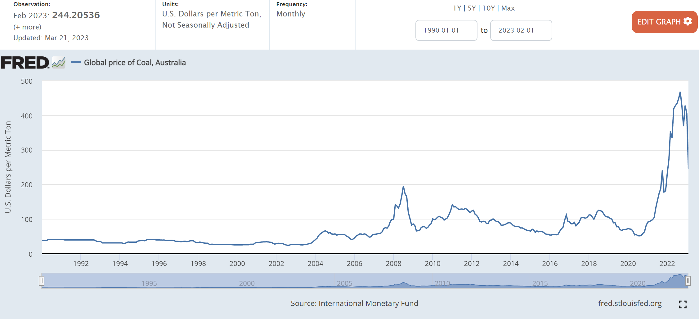

- [Two types of climate risk](#two-types-of-climate-risk)
  - [Carbon emission price](#carbon-emission-price)
  - [Carbon tax](#carbon-tax)
- [Stranded asset- Coal](#stranded-asset--coal)
- [Stranded physical assets](#stranded-physical-assets)
- [goal of net-zero emissions by 2050.](#goal-of-net-zero-emissions-by-2050)
- [Physical risk](#physical-risk)
- [Reclassifying](#reclassifying)
- [Unanswered questions](#unanswered-questions)
- [Reference](#reference)

The more that people say the world is going to end, [...], the more times the word "climate catastrophy" is mentioned around the world, the higher and higher risk assets go.  What's going on?   

Climate-related financial risks, referred to throughout this site as simply climate risk, are the financial risks linked to climate change. Note that climate models may be totally wrong, and there is large variance between the predictions.  

Images of this post are from [New York Fed Quarterly Trends for Consolidated U.S. Banking Organizations](https://www.newyorkfed.org/research/banking_research/quarterly_trends.html), based on onsolidated financial statistics for the U.S. commercial banking industry, including both bank holding companies (BHCs) and banks. Statistics are based on quarterly regulatory filings. Statistics are inclusive of BHCs' nonbank subsidiaries. 

# Two types of climate risk

Below is a summary of the three accounting classifications of bank assets:

**Physical risk**: Securities (debt and equity) that are bought and held for the purpose of selling in the near term. They are reported at fair value.  *** Physical risks can have strong direct effects, but also indirect ones through supply chains, legal liability, or systemic and second-order effects.***. 

It splits physical risk in two subtypes: acute and chronic.

**Transition risk**: 
 It splits transition risk into four subtypes: policy and legal, technology, market, and reputational.

• What's both exciting and frightening is the economic transformation required to reach climate change targets, which is a source of transition risk, is huge and unprecedented in speed and scale.  

• Transition risks manifest not only through **policies** but also from **technological change**, **reputational risk**, and **market risk**.
The equivalent drivers of transition risk include factors such as tighter government policies to reduce emis-sions (e.g., through carbon taxes), technological changes (e.g., cheaper renewables making fossil fuel–based power generation less economical by comparison), and consumer pressures for sustainable products. 

• Climate risk transmits into the economy through corporate and financial balance sheets and consumer spend-ing patterns; however, the effects vary significantly by sector.

## Carbon emission price

'CFI2H3' currently trading at about $90/ Tonne. 

## Carbon tax
[cabon tax 2022](../images/posts/carbon_tax_2022.PNG)
[carbon tax 2022 dashboard](https://carbonpricingdashboard.worldbank.org/map_data) 

[What a carbon tax can do and why it cannot do it all](https://blogs.worldbank.org/energy/what-carbon-tax-can-do-and-why-it-cannot-do-it-all#:~:text=There%20are%20good%20reasons%20why,relatively%20more%20than%20richer%20ones.)
high prices for carbon-emitting goods reduce demand for them. The carbon tax is generally levied on fossil
Roumeen Islam wrote, “The carbon tax on fuel aims to restructure economies by raising the cost of a critical resource- the juice that makes them run. But restructuring takes time as people, capital and other resources do not flow seamlessly into new sectors.”

Some of the resources used in other sectors will flow into the renewable energy and supporting sectors where both investment and jobs will increase. Yet, this too, will not automatically and immediately make up for disinvestment in fossil fuels, as is already evident. Supply- demand mismatches will happen in the short run. Add to this substantial uncertainty regarding several economic variables, such as the size of fuel reserves, the size of stranded assets, the harshness of winter, the future direction of climate policy, the pace of innovation in the renewables sector, or demand risk, and it is clear how economic disruption may be magnified.  

# Stranded asset- Coal
Good intentions can have disastrous consequences. 

From the standard climate risk text from media, we read that a coal-fired power plant or a steel plant, would be exposed to tighter climate policy, such as a higher carbon price.  This has not yet happened.  

Climate risk can affect financial balance sheets and lead to losses through standard channels such as diminished asset valuations or increased loan defaults. Sounds scary.   But the worst of the "standed assets", coal, prices have been goingup for the last year.  

The coal prices bottomed in 2015-2016, like most commodities.  Then it went bottom again in August 2020, and then it rose to all time high...

According to [IMF](https://www.iea.org/news/global-coal-demand-is-set-to-return-to-its-all-time-high-in-2022), 
for many countries where coal remains a key fuel for electricity generation and a range of industrial processes. At the same time, the world’s continued burning of large amounts of coal is heightening climate concerns, as coal is the largest single source of energy-related CO2 emissions. 

Global coal demand is being propped up this year by rising natural gas prices, which have intensified ***gas-to-coal*** switching in many countries, as well as economic growth in India. 

Several EU countries are extending the life of coal plants scheduled for closure, reopening closed plants or raising caps on their operating hours to reduce gas consumption. However, Europe only accounts for about 5% of global coal consumption.

So it seems that reality is quite different from what was predicted about "stranded asset".

# Stranded physical assets
Physical risks can equally create stranded assets.   Unlike stranded assets due to transition risk, which are likely to be more concentrated in the energy and industrial sectors (we shall see), stranding due to physical risk can occur **across nearly all sectors**, but it is more likely to be concentrated geographically: for example, sea level rise and increased coastal 
 
# goal of net-zero emissions by 2050.
The Inter-governmental Panel on Climate Change (IPCC), and the goals of the Paris Agreement of 2015 to keep the average global temperature rise “well below 2°C above pre-industrial levels” and to “pursue efforts to limit the rise to 1.
5°C” (UNFCCC, 2015).

To reach net-zero emissions—a goal, many countries have set for themselves to reach by 2050. However, some countries have set slightly earlier goals (for example, Finland has set a goal for 2035), and some countries have set slightly later goals (for example, China has a goal for 2060), and there are other jurisdictions that have not yet made any net-zero commitments.

[TCFD](https://www.fsb-tcfd.org/about/) recommends that firms should disclose on four key parameters, ranging from the concrete to the abstract, so that stake-holders are aware of the progress the firms have made in their preparedness to tackle climate change. These are metrics and targets, that is, the metrics used by the firm in question to assess climate-related risks and opportunities; risk management, that is, what processes the firm has in place to manage climate risks; the firm’s strategy surrounding climate change; and the

# Physical risk

acute and chronic hazards. 

The former includes weather-related or weather-exacerbated events, whose incidence are increasing with climate change, such as floods, hurricanes, and wildfires. 

The latter includes gradual, long-term trends such as rising average temperatures and sea levels. 

But for both kinds of risk to become manifest, hazards (or driving factors) are not enough alone. 

In the face of these hazards and factors, different kinds of assets and companies will have differing levels of exposure and vulnerability. Exposure, here, is used in the classic financial sense of assets or firms that are in a vulnerable place or setting. A factory or warehouse in a low-lying coastal area would be exposed to sea level rise, and consequently so would the firm that owns the factory. 

Vulnerability—a concept linked to notions of resilience, flex-ibility, and adaptation—is less of a focus in traditional finan-cial risk, but it is integral to considerations of climate risk, especially physical climate risk. It refers to the propensity or predisposition of the asset (or firm) to suffer adversely from its exposure to hazards. At the facility level, vulnerability to physical climate risk typically depends on physical infrastruc-ture: for example, of two neighboring factories in a flood zone, only one may have flood pumps installed. Vulnerability can also be discussed at the facility level for transition risk, referring to the ease of reducing or eliminating emissions—for instance, through conversion to

hydrogen-based production—as opposed to having to pre-maturely close a facility, thus stranding it (see Section 3.2.1). At the corporate level, vulnerability can refer to the lack of preparation for such issues as climate change mitigation and adaptation planning, or it can apply to a lack of financial resilience, such as through insurance-based mechanisms. Overall, the interaction between hazards or drivers, expo-sures, and vulnerability then produces the overall effect of climate risk (see Figure 3.1).

3.2.1 Stranded Assets The notion of stranded assets is particularly important in

the context of climate risk, and it has grown to be an impor-tant focus of research and analytical efforts in recent years to better understand climate, environmental, and broader sustainability risks. Stranded assets are assets that have “suffered from unanticipated or premature write-downs, devaluations or conversion to liabilities” (Caldecott, 2013).

The concept of assets being left behind by external forces, leading to reduced valuations or complete write-downs, is not new, and it links to the idea of creative destruction. While the metaphor is obviously a physical one, the concept was first significantly applied to climate risk in the early 2010s in relation to the notion of “unburnable carbon” (for example, known oil or coal reserves that cannot be fully exploited if the agreed goals of limiting warming to 2°C or 1.5°C are to be met, thus making coal mines or oilfields into “stranded assets”). From there, the concept extended quite naturally to high-emitting industrial assets such as coal-fired power plants (see Section 3.4.1) or steel plants. The concept of stranded assets still refers most commonly to these assets with high transition risk, though the definition has been steadily expanding.

1. Banks may face an **imbalance between desposits and lendings**.   For example, there may not be enough good profitable lending opportunities.   In such cases, funding-rich banks may choose to invest in securities that reflect lending by other banks or by nonbank lenders (e.g., mortgage-backed securities issued by another lender), or direct debt issuance by nonfinancial firms (e.g., corporate bonds).

2. For risk management and to meet regulatory requirements: securities can be sold more easily and with lower price impact than loans, for which the secondary market is less active. Regulation such as the **liquidity coverage ratio** developed as part of the Basel III Capital Accord requires banks to hold enough high-quality liquid assets to meet their liquidity needs under a thirty-day liquidity stress scenario.

3. From a risk management point of view, holding securities may help the bank diversify or mitigate its risk exposures. Conversely, adjusting securities holdings can provide a straightforward way for banks to ramp up their level of risk in an effort to increase expected returns. For example, recent research argues that banks respond to expansionary monetary policy by lengthening the maturity of their securities portfolios, in an effort to boost yields.

4. Keeping an inventory of securitiesfor market-making, broker-dealers services.

5. Regulatory arbitrage:  holding securities instead of loans may reduce capital requirements.

# Reclassifying

Since AFS is a catch-all category, that means that banks can move assets in or out of the AFS to the other ones when the intent has changed.  For example, HTM to AFS and vice versa. Why?  Mostly to stablize capital adequacy ratio and to stablize earnings. 

Notice in the chart the HTM (red) has more than doubled in size as a percentage of all bank assets over the past several years. 

A key difference between HTM and AFS is the accounting treatment of gains and losses as described at the begnning of the post.   The gains and losses in the value of HTM  that result from market movements (e.g., interest rates) aren’t recognized unless the asset is sold.   

For AFS securities, however, such shifts in value, while not affecting accounting income, do affect the measurement of regulatory capital adequacy for **large** banks under the Basel III framework (for so-called “advanced approaches” firms).  

On Oct 11, 2013, the [Federal Register](https://www.govinfo.gov/content/pkg/FR-2013-10-11/pdf/2013-21653.pdf), published by the Department of Treasury and the OCC, wrote "[...] consistent with Basel III, the agencies and the FDIC proposed to
require banks to include
the majory of AOCI components in common equity tier 1 capital."   

Then it went on to say that they received a significant number of comments on the proposal to require banks to recognize AOCI in common equity tier 1 capital.  Interestingly, the comments expressed concerns that became reality:

"[…] the change would introduce significant volatility in banks’ capital ratios due in large part to fluctuations in benchmark interest rates, and would **result in many banks moving AFS securities into HTM or holding additional regulatory capital** solely to mitigate the volatility resultingfrom temporary unrealized gains and losses in the AFS securities portfolio."

The commenters also asserted that the change would likely impair lending and negatively affect banks’ ability to manage liquidity and interest rate risk and to maintain compliance with legal lending limits."

In 2014, [Bloomberg reported](https://www.bloomberg.com/news/articles/2014-02-26/banks-averting-bond-losses-with-accounting-twist-credit-markets) that JMPC and Wells Fargo are leading a shift in how banks account for their bond investments after a $44 billion plunge in value exposed a potential drain on capital under new rules.  It also reported that The largest U.S. lenders are moving assets into HTM instead of designating them as AFS.

# Unanswered questions

1. **AFS as a whole decreased** the most (slope the steepest) after 2003 until the GFC.   Was it **due to rising rates** of that period?  If it was due to rising rates, then we expect to see reduced AFS in 2022 as the Fed has been increasing rates.  Indeed, even with 1 quarter of the data in 2022, we see that AFS has dropped.  We will find out more when the new quarterly reports comes out.  

2. Transfering assets from AFS to HTM can educe the volatility of regulatory capital ratios.  However, the move will limit banks’ ability to sell those securities in the future.  What does that mean for risk management and profitability of the banks?  Would it affect negatively banks’ ability to manage liquidity and interest rate risk since banks won't be able to sell from HTM? 
   
3. I am curious as to if there are follow-up studies especially quantitatively on some of things raised in [Federal Register / Vol. 78, No. 198 / Friday, October 11, 2013 / Rules and Regulations](https://www.govinfo.gov/content/pkg/FR-2013-10-11/pdf/2013-21653.pdf).  Specifically, banks's comments of concerns of aggregate impact of Basel III rule changes regarding the
potential aggregate impact of the banks and the overall U.S. economy. Many commenters argued that the new rules would have significant negative consequences for the financial services industry.  According to the commenters, by requiring banks to hold more capital and increase risk weighting on some of their assets, as well as to meet higher risk-based and leverage capital measures for certain PCA categories, the new rules would negatively affect the banking sector: restricted job growth; reduced lending or higher-cost lending, including to small businesses and low-income or minority communities; limited availability of certain types of financial products; reduced investor demand for banks’ equity; higher compliance costs; increased mergers and consolidation activity, specifically in rural markets, because banks would need to spread compliance costs among a larger customer base; and diminished access to the capital markets resulting from 
reduced profit and from dividend restrictions associated with the capital buffers. The commenters also asserted that the recovery of the U.S. economy would be impaired by the new rules as a result of reduced lending by banks that the commenters believed would be attributable to the higher costs of regulatory compliance. In particular, the commenters expressed concern that a contraction in small business lending would adversely affect job growth and employment. 

4. From the same [Federal Register](https://www.govinfo.gov/content/pkg/FR-2013-10-11/pdf/2013-21653.pdf), are the competitive concerns warranted?  "[...] would create an unlevel playing field between banking organizations and other financial services providers."  Credit unions,  foreign banks with significant U.S. operations, members of the Federal Farm Credit System, and entities in the shadow banking industry, and unregulated NBFIs, would have a competitive advantage over banking organizations as they are not subject to the new rules.  The data seems to support these claims.   
   
5. The new rules certainly increased complexity and implementation costs for large banks: software upgrades for new
internal reporting systems, increased employee training, and the hiring of additional employees for compliance.  Is it true that "a simple increase in the minimum regulatory capital requirements would have provided increased protection and increase safety and soundness without adding complexity to the regulatory capital framework"?

# Reference

[Taskforce on Climate-related Financial Disclosures (TCFD)](https://www.fsb-tcfd.org/about/) , formed in 2015 under the aegis of the G20 Finan-cial Stability Board. This international body is chaired by Michael Bloomberg,

[Federal Register / Vol. 78, No. 198 / Friday, October 11, 2013 / Rules and Regulations](https://www.govinfo.gov/content/pkg/FR-2013-10-11/pdf/2013-21653.pdf)

[Available for Sale? Understanding Bank Securities Portfolios](https://libertystreeteconomics.newyorkfed.org/2015/02/available-for-sale-understanding-bank-securities-portfolios/)

[Quarterly Trends for Consolidated U.S. Banking Organizations
First Quarter 2022 Federal Reserve Bank of New York](https://www.newyorkfed.org/medialibrary/media/research/banking_research/quarterlytrends2022q1.pdf?la=en)

[Bloomberg: Banks Averting Bond Losses With Accounting Twist: Credit Markets](https://www.bloomberg.com/news/articles/2014-02-26/banks-averting-bond-losses-with-accounting-twist-credit-markets)