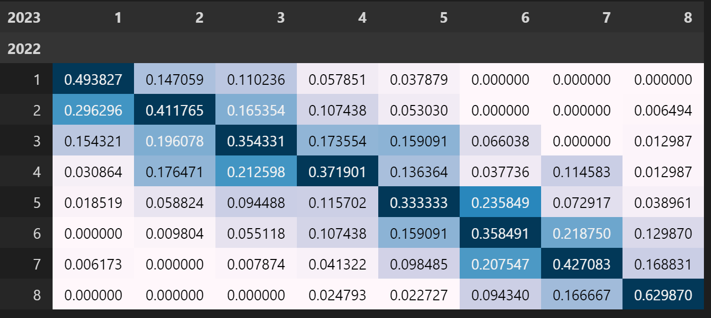

Wholesale credit analysis is a very labor intensive process.  Although there are many quantitative models, so far real intelligence analyzing the financials is still the most effective method.  This is because there are so many different things that can affect a company differently from another one in a different industry, or even in the same industry. 

Please note that the example given is hypothetical and so that it is simple enough to provide a basic understanding. 

- Ratings usually are expressed either as English letters or integers.  <span class="coding">np.random.randint(1, 9, size=1000)</span> creates a list of ratings from 1 to 8 (inclusive). 
- In year 2, the ratings most likely will be different.  We use a normal distribution with mean and standard deviation of 2 to estimate the change.  <span class="coding">np.trunc(np.random.normal(0, 2, size=1000))</span> 
  - <span class="coding">np.trunc()</span> is used to drop the decimal part of the rating change.  In credit rating application, "1" means 1 full notch, and we may increment by half notch changes instead of 1. 
  - <span class="coding">.clip(min, max)</span> return an array whose values are limited to ``[min, max]``. 
- 


<div class="code-head"><span>code</span>rating migration</div> 

```python

rating_2022 = np.random.randint(1, 9, size=1000)
rating_2023 = (rating_2022 + np.trunc(np.random.normal(0, 2, size=1000))).clip(1,8)

df = pd.DataFrame({2021: rating_2022, 2022: rating_2022}).astype('int')

pd.crosstab(df[2022], df[2023], normalize='columns').style.background_gradient()
pd.cross
```




# EEIO Model

Yes, the EEIO (Environmentally Extended Input-Output) model can utilize a transition matrix as part of its analysis. Transition matrices are often employed in dynamic input-output models to represent changes over time in the structure of an economy. 

In the context of EEIO modeling, a transition matrix could be used to depict changes in technology, consumption patterns, or environmental policies that affect the environmental intensity of economic activities. By incorporating a transition matrix into the EEIO model, analysts can simulate how these changes propagate through the economy and influence environmental impacts over time.

For example, researchers might use a transition matrix to model the gradual adoption of cleaner technologies or the implementation of carbon pricing policies. This would allow them to assess how these changes affect emissions, resource use, and other environmental indicators across different sectors of the economy.

Overall, while not every EEIO model may incorporate a transition matrix, it can be a valuable tool for analyzing dynamic changes in environmental impacts and policy scenarios over time.


