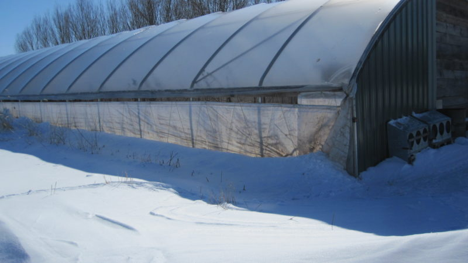

Lately I am looking into high tunnels （高隧道).   High tunnel is similar to greenhouse, but it is not greenhouses or low tunnel systems. 可避免如強風、豪雨、冰雹、雪霜與乾旱等極端氣候現象造成的作物災損。此外，其優勢在於可拉長作物的產季、提高精品作物的生產量、延長貨架壽命(shelf life)等，以滿足廣大的高端消費市場。

### Tips on Using High Tunnel from an NRCS Field Officer

Below tips are from our wonderful field officer, who had practiced farming growing up working with his mom in his grandmother's farm. 

1. **Till & level**.  Learn how to level. 
2. Remove weed/brush roots, especially those rhyzones that look like thick and white veins. 
3. Build high tunnel structure.  Mow around it or use landscape fabric for weed control. 
4. **Wood chip walkway**: Dig rows of ditches and fill them with wood chips for walking paths (2 to 3 feet wide).   
5. Grow food in rows (1 foot wide) between the wood chip path.  
6. For plants that go vertical, tie "bailing" strings on the structure and hang them down.  The strings don't need to be tied to the ground.  Climbing plants know how to find them. 
7. Put beneficial insects such as lady bugs in the high tunnel for insect control
8. Can mix rows of lavender, rows of daikon, and mix with rows of flowers such as roses. 

### NRCS Practice: 325 - High Tunnel System

Scenario Description: Use in areas with low expected snow and wind loads. Quonset-style (round) manufactured frame of tubular steel (30 x 72 ft.) covered with 4-year 6
mil plastic. Costs are based on purchase of manufactured kit and landowner installation of structure. Structure must be installed to manufacturer's specifications. Associated
practices might include CPS Roof Runoff Structure (588), Underground Outlet (620), Critical Area Planting (342), Mulching (484).
Before Situation: Cropland where extension of the growing season is needed. Primary resource concern addressed will be plant health and vigor.
After Situation: High Tunnel structure has been installed and the growing season has been extended for 1-4 months on average. Plant health and vigor is improved.
Feature Measure: Area of Tunnel Installed
Unit: Square Foot
Typical Size: 2160
Total Cost: $8,950.96
Unit cost: $4.14

### Size for beginners
size 30x72 or 30x90 are the most common sizes for beginner farmers, they are large enough for expanding your operation but not so large that they become unmanageable quickly.
Example pricings are $4467 plus shipping [30x72](https://zimmermanshightunnels.com/index.php/pricing/)

## NRCS Guidance

NRCS reviews and periodically updates conservation practice standards. To obtain the current
version of this standard, contact your Natural Resources Conservation Service State office or
visit the "Field Office Technical Guide"  [NRCS](https://www.nrcs.usda.gov/) and type "FOTG" in the search field.
### DEFINITION
An enclosed polyethylene, polycarbonate, plastic, or fabric covered structure that is used to cover and protect crops from sun, wind, excessive rainfall, or cold, to extend the growing season in an environmentally safe manner.
### PURPOSE
This practice is used to accomplish the following purpose:
Improve plant health and vigor

### CONDITIONS WHERE PRACTICE APPLIES
This practice applies to land capable of producing crops. This practice applies where sun or wind intensity may damage crops, or where an extension of the growing season is needed due to climatic conditions.
The practice does not apply to crops not grown in the natural soil profile (i.e. tables/benches, portable pots, hydroponically, etc.).
### CRITERIA
General Criteria Applicable to All Purposes
Plan supportive conservation practices to address all environmental concerns associated with the installation and use of the high tunnel systems such as erosion, irrigation, and runoff.

Crops must be grown in the natural soil profile. Raised beds may be installed to improve soil condition, fertility, and access. Raised beds are a maximum of 12 inches in depth.

The practice cannot be used to provide shelter or housing for any livestock, or to store supplies or equipment.

- Locate structures to avoid buried public utilities.
- Locate the structure near a viable water source for irrigation.
- All components of the high tunnel structure must be planned, designed, and constructed from a manufactured kit in accordance with manufacturers’ recommendations. The high tunnel frame must be constructed of metal, wood, or durable plastic; and be at least 6 feet in height at the peak of the structure. If required for enclosure, end wall covering may be greenhouse-grade plastic, polycarbonate, wood, or other. Use structures with the entry/exit point sized to facilitate movement of equipment and supplies needed for the production of planned crops.

Select the high tunnel covering material of a significant thickness to withstand the temperature change for the period required and will have a *5-year-minimum lifespan*. For polyethylene covers, use a **minimum 6- mil greenhouse grade**, UV-resistant material. Other specifications such as, but not limited to rafter spacing, pipe gauge, and pipe diameter will be based on the expected environmental conditions (wind speeds, snow loads, etc.) for the location the high tunnel will be installed. It is the responsibility of the producer to discuss these factors with the manufacturer when choosing a high tunnel to install.

- For organic producers, it will be the responsibility of the producer to make sure that all permissible activities, design, material used, and material specifications are consistent with the USDA Agricultural Marketing Service National Organic Program, National Standards on Organic Agricultural Production and Handling.
Construct high tunnel structures on **level grade or the naturally occurring slope if the slope does not exceed five percent**.

Where snow or ice loads may damage the structure, the tunnel cover shall be *removed or rolled up* at the end of the growing season unless the structure is designed by the manufacturer to withstand expected snow loads. If using the structure over the winter, the operator must manage the snow or ice load to ensure the integrity of the high tunnel for the lifespan of the practice.
  
Where wind loads may damage the structure, select the tunnel cover and structure designed by the manufacturer to withstand expected wind loads or manage the tunnel system in a manner that limits wind damage.

Where the intensity or duration of sunlight can shorten the growing season, the appropriate thickness of shade cloth may be used in place of, or in addition to impervious plastic covers. When shade cloth is used alone, end walls are not required.
High tunnels shed a large amount of water and can create drainage and ponding issues where none previously existed. Direct runoff away from the high tunnel structure to avoid ponding. Provide a detention basin, storage reservoir, or stable outlet when runoff from tunnel covers empties onto the ground surface with potential to cause erosion.

If the areas outside the high tunnel structure will not be restored to cropland or other stabilized cover, vegetate all exposed surfaces disturbed during construction in accordance with CPS Code 342, Critical Area Planting. If climatic conditions preclude the use of seed or sod, use CPS Code 484, Mulching.

### CONSIDERATIONS
In addition to management of the structure, high tunnels require intensive internal management of pests and diseases, irrigation, fertilization, internal temperature, and ventilation. Consider attending education sessions about high tunnel management to develop a thorough understanding of high tunnel growing requirements.
When evaluating alternative location for high tunnels, consider potential limitations such as seasonal high water tables, flooding, runoff from upstream areas, and state or location regulations including property line setbacks and zoning. The landowner or operation is responsible for insuring compliance with applicable regulations.

Runoff may be captured and used for irrigation purposes, if allowed by State law, though runoff should not be relied on as the only source of irrigation water. Use the criteria for CPS Code 558, Roof Runoff Structure, to design any structure needed to meet the runoff criteria above, in accordance with the criteria requiring manufacturer approval for modifications. Runoff may empty into surface or underground outlets, or onto the ground surface when properly protected. Size surface and underground outlets according to 
the criteria for Conservation Practice Code 620, Underground Outlet, to ensure adequate capacity. Provide for cleanout as appropriate. 

Surface or ground outlets such as rock pads, rock-filled trenches with subsurface drains, concrete and other erosion-resistant pads, or preformed channels may be used.

Consider managing the high tunnel system to maintain or improve soil health by following a soil management system that creates a favorable habitat for soil microbes by:
minimizing soil disturbance, physical, chemical and biological
- using plant diversity in the rotation to increase diversity below ground
- keeping a living root growing year round as much as possible
- keeping the soil covered with residue and growing plants year round
- Locate the high tunnel conveniently for ingress/egress of plant materials, equipment, and other operation and maintenance activities.

Remove or manipulate side covers to control internal temperatures and humidity. Installation of vents, fans, or heaters should be considered and should be included in the manufacturer’s design and recommendations. If providing protection from the sun extends the growing season, consider a high tunnel structure that includes shade cloth.

If available, consider installing a supplemental manufacturer’s kit to provide additional structural support.

If the high tunnel is planned for a permanent location, consider setting end posts in concrete, the use of heavier 12 to14 gauge steel, and a double layer of plastic to increase integrity of the structure. When considering anchoring consult local and state regulations as well as tax ramifications. Using concrete may result in the high tunnel being considered a permanent structure.

High tunnels may be designed to be movable within a field location. If movable, must use provisions to adequately anchor the high tunnel against wind, snow, and ice load.

Consider a minimum clearance of 10 to 20 feet between side by side high tunnel installations for snow removal and cover installation.

Consider potential shading of high tunnel structures by other structures or trees and locate at a distance of two times the height of the tree or structure.

Control weeds with soil fabrics, covers, or mulches.

Consider additional conservation practices where appropriate to include:
- crop rotation
- irrigation water management
- salinity management
- nutrient management
- integrated pest management
- critical area planting
- mulching
- roof runoff structure
- diversion
- underground outlets
- heavy use area protection
- cover crop

### PLANS AND SPECIFICATIONS
Prepare plans and specifications in accordance with the criteria of this standard.
As a minimum, the plans and specifications include the following:
- Identify purpose.
- Document the planned growing season.
- Layout and location of the high tunnel.
- Site preparations and the required supporting practices for erosion control, runoff, and vegetative cover according to the requirements of the corresponding conservation practice standard.
- The planned width and length of the seasonal high tunnel. Statement that the seasonal high tunnel will be built per the manufacturer’s directions.
- Procedure and timing to remove or roll up the high tunnel cover prior to inclement weather conditions.
- Procedure and timing to add or replace shade cloth for protection from the sun for the high tunnel cover.

### OPERATION AND MAINTENANCE
Managing a tunnel requires intensive and vigilant attention by the producer.
Prepare an operation and maintenance (O&M) plan and review with the landowner and/or operator responsible for the practice. Provide specific instruction for proper operation and maintenance of each component of this practice and detail the level of repairs needed to maintain the effectiveness and useful life of the practice.
Periodically inspect the high tunnel and repair, reinstall, or replace, as needed to accomplish the intended purpose.
Manage the structure in a manner that limits wind and/or snow damage. Close sides and ends before storm events. In areas that receive snow and ice, the structure should be closed prior to winter weather.
Remove snow and ice from the structure cover and sides promptly to prevent structure failure.
When the structure is at serious risk of collapse due to weather conditions, consider slashing the plastic cover to relieve pressure and save the framework.
Perform soil tests regularly to monitor nutrients and to monitor salt build-up. The soils under the immobile high tunnels may require periodic “flushing” to remove salt build-up. This is accomplished by removing the cover for a season to allow natural precipitation to infiltrate, or by artificially flooding the ground under cover.
If needed, seed all disturbed earth surfaces outside of the high tunnel and maintain the vegetation throughout the structure’s life.
Removal of cover materials shall be consistent with the intended purpose and site conditions.
Plan for proper disposal of the cover at the end of its useful life.
Operation of equipment near and on the site shall not compromise the intended purpose of the high tunnel structure or its cover.

### REFERENCES
- Community Garden Guide Season Extension - High Tunnel, NRCS. Rose Lake Plant Materials Center, East Lansing, Michigan.

- “High Tunnel Production Manual”. Penn State University College of Agriculture, Department of Horticulture. White, L. and Orzolek, M. 2003

- “High Tunnels: Using Low-Cost Technology to Increase Yields, Improve Quality and Extend the Season”. Ted Blomgren, Cornell Cooperative Extension, and Tracy Frisch, Regional Farm and Food Project. Published by the University of Vermont Center for Sustainable Agriculture. 2007.

- “Minnesota high tunnel production manual for commercial growers”. Edited by: Terrance T. Nennich, Sr., University of Minnesota Extension and Suzanne Wold-Burkness, University of Minnesota. 2013.

- “Growing Under Cover: A Guide to Polytunnel Options for Kansas Growers”; Kansas Rural Center; Kim Scherman, 2014.

