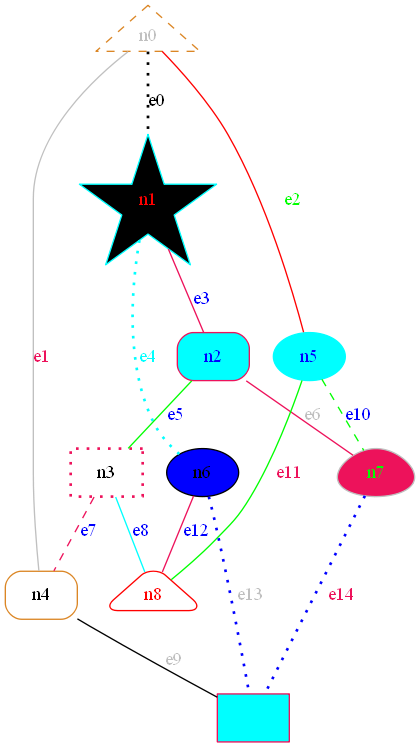
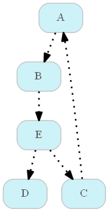

We often want to visualize relationships: between models, people, or anything. 

I learned a lot from a user's fun example:
[How to customize a networkx graph?](https://github.com/pydot/pydot/issues/169)

<div class="code-head"><span>code</span>graph representation 1.py</div>

```python
import random
import networkx as nx
G = nx.petersen_graph()
pdot = nx.drawing.nx_pydot.to_pydot(G)

shapes = ['box', 'polygon', 'ellipse', 'oval', 'circle', 'egg', 'triangle', 'exagon', 'star', ]
colors = ['blue', 'black', 'red', '#db8625', 'green', 'gray', 'cyan', '#ed125b']
styles = ['filled', 'rounded', 'rounded, filled', 'dashed', 'dotted, bold']

for i, node in enumerate(pdot.get_nodes()):
    node.set_label("n%d" % i)
    node.set_shape(shapes[random.randrange(len(shapes))])
    node.set_fontcolor(colors[random.randrange(len(colors))])
    node.set_fillcolor(colors[random.randrange(len(colors))])
    node.set_style(styles[random.randrange(len(styles))])
    node.set_color(colors[random.randrange(len(colors))])

for i, edge in enumerate(pdot.get_edges()):
    edge.set_label("e%d" % i)
    edge.set_fontcolor(colors[random.randrange(len(colors))])
    edge.set_style(styles[random.randrange(len(styles))])
    edge.set_color(colors[random.randrange(len(colors))])

png_path = "test.png"
pdot.write_png(png_path)
```




Here is a super simple example on how I visualize relationships.  I borrowed ideas from [python pandas recursive lookup between manager and employee ID's](https://stackoverflow.com/questions/58791543/python-pandas-recursive-lookup-between-manager-and-employee-ids):

<div class="code-head"><span>code</span>graph representation 1.py</div>

```python
import pandas as pd
import random
import networkx as nx
file_path = 
df = pd.read_excel(file_path, sheet_name = "connections")
df1 = pd.D


import pandas as pd
import networkx as nx

data = {'parent_id': ["A", "B", "C", "E", "E"], 'child_id': ['B',"E", "A", "D", "C" ]}
df = pd.DataFrame(data)


# df2 = pd.DataFrame(data, columns = ['parent_id', 'child_id'])
df3 = pd.DataFrame(([list(nx.ancestors(g, x)), x] for x in df.child_id), 
                   index=df.index, columns=['parent_id', 'child_id'])

df_final = df3.explode('parent_id')

G = nx.from_pandas_edgelist(df, source='parent_id', target='child_id', create_using=nx.DiGraph)
pdot = nx.drawing.nx_pydot.to_pydot(G)

shapes = ['box', 'polygon', 'ellipse', 'oval', 'circle', 'egg', 'triangle', 'exagon', 'star', ]
colors = ['blue', 'black', 'red', '#db8625', 'green', 'gray', 'cyan', '#ed125b']
styles = ['filled', 'rounded', 'rounded, filled', 'dashed', 'dotted, bold']

for  node in pdot.get_nodes():
    node.set_shape('box')
    node.set_fontcolor('#595959') # dark gray
    node.set_fillcolor('#CDF2F7') # light blue I like
    node.set_style('rounded, filled')
    node.set_color('gray') # outer frame color

for edge in pdot.get_edges():
    edge.set_style('dotted, bold')
    edge.set_color('black')

png_path = r"test_connect.png"
pdot.write_png(png_path)
```

