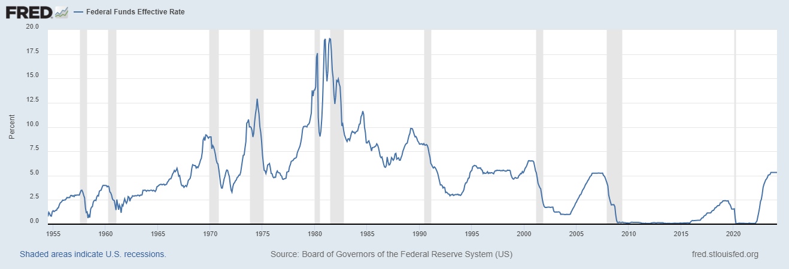

# Double leverage
The Fed has two ways of influencing the economy. It can impact interest rates by moving an interest rate it directly controls. The Fed also has the power to change the supply of money in the economy.  

The Federal Reserve typically raises interest rates through its monetary policy tools. Here's a simplified breakdown of the process:

1. **Federal Funds Rate**: The primary tool used by the Federal Reserve to influence interest rates is the federal funds rate. This is the interest rate at which banks lend to each other overnight to meet reserve requirements. When the Fed wants to raise interest rates, it sets a higher target for the federal funds rate.

2. **Open Market Operations**: The Fed conducts open market operations to achieve its target federal funds rate. If it wants to raise rates, it sells government securities (like Treasury bonds) to banks and other financial institutions. By selling these securities, it decreases the amount of money available in the banking system, which in turn pushes up short-term interest rates, including the federal funds rate.

3. **Discount Rate**: The discount rate is the interest rate at which banks can borrow directly from the Federal Reserve. When the Fed raises the discount rate, it becomes more expensive for banks to borrow from the Fed, which can influence other interest rates in the economy.

4. **Interest on Excess Reserves (IOER)**: The Fed also pays interest on excess reserves that banks hold with it. By adjusting the interest rate paid on excess reserves, the Fed can influence the incentives for banks to lend or hold onto their reserves.

5. **Forward Guidance**: The Fed also communicates its intentions regarding future monetary policy actions through forward guidance. If the Fed signals that it plans to raise interest rates in the future, it can affect current interest rates by shaping market expectations.

By using these tools in combination, the Federal Reserve can implement its monetary policy objectives, including raising interest rates when it deems necessary to control inflation or maintain financial stability.

# Reference

[Federal Reserve Supervisory Policy and Guidance Topics on Accounting](https://www.federalreserve.gov/supervisionreg/topics/accounting.htm)

[Federal Register / Vol. 78, No. 198 / Friday, October 11, 2013 / Rules and Regulations](https://www.govinfo.gov/content/pkg/FR-2013-10-11/pdf/2013-21653.pdf)

[Available for Sale? Understanding Bank Securities Portfolios](https://libertystreeteconomics.newyorkfed.org/2015/02/available-for-sale-understanding-bank-securities-portfolios/)

[Quarterly Trends for Consolidated U.S. Banking Organizations First Quarter 2022 Federal Reserve Bank of New York](https://www.newyorkfed.org/medialibrary/media/research/banking_research/quarterlytrends2022q1.pdf?la=en)

[Bloomberg: Banks Averting Bond Losses With Accounting Twist: Credit Markets](https://www.bloomberg.com/news/articles/2014-02-26/banks-averting-bond-losses-with-accounting-twist-credit-markets)

[Citigroup 2007 report](https://fcic-static.law.stanford.edu/cdn_media/fcic-docs/2008-02-22%20Citigroup%202007%2010-K.pdf)