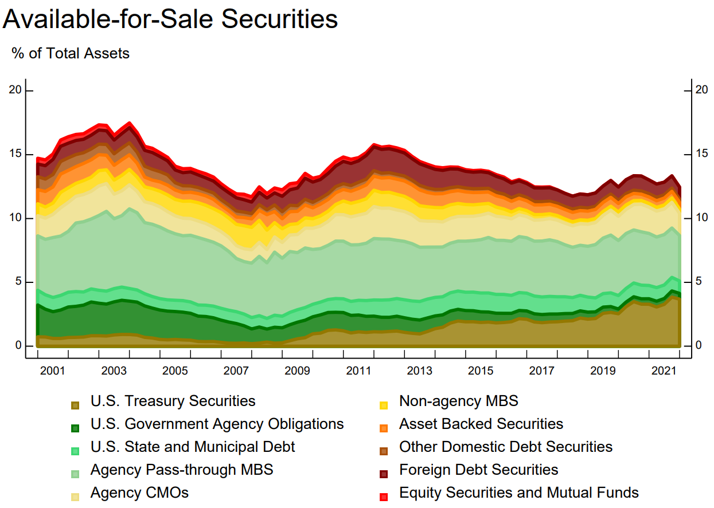
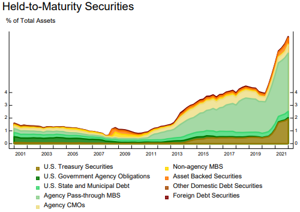

# Double leverage
Refco,very succesffully, 3 months collaped.  4 billion dollar hole on the BS.  At the time they had 17X double leverage.  There was no real capital in it. 

Cannot measure CME.  Parent company does not need to meet capital adequacy requirements.  If it were subject to Basel, it will not be allowed to do it. 

It is a problem for both holdco and sub creditors. 

Borrow at the parent, then shuffle down the subs as equity.

Double leverage ratio = investment in subs/ equity of parent

Holdco debt serves as contingent capital for subs.

According to Fitch, DL < 1.25 is okay. 

In HK, it is illegal to borrow from subs.  

Important to think of debt both to parent and subs.

Structured approach to credit assessment

1. Rational
   1. Obligor
   2. Purpose
   3. Payback / exit

# Accounting, asset quality and early warning

Everyone was growing their BS too quickly.  Peer analysis is important but also important to look at the context.  We don't want to see all of them off the cliff.

IFRS, overly complicated,dominated by academics rather than business.

Assessing impairment is a subjective area.  very easy to manipulate, eventually reality has to break through. sober assessment.

Important: the impaired loan ratio / total loans,  is a *lagging* ratio rather than leading ratio.  Can easily be understated. 

## Leading causes for banks Growth and concentration risk

We are in a business inherently very risky.  Like AirBnB rental, upside is very little, and downside very large.  [???? how to minimize AirBnB risk]

In the US, Citi retail looks a lot riskier than EU banks as cards are unsecured. 

In Europe, a lot of mortgages on the retail book.  


# Unfunded
Unfunded commitments are important to consider because they represent potential future outflows of funds for the bank. While these commitments may not immediately impact the bank's balance sheet, they still represent obligations that the bank must fulfill when borrowers draw down on their credit lines or utilize their approved loans.

When times are difficult, those in trouble will quickly draw down.  Unfunded can quickly be drawn down. 


#### Example: Santander

off balance sheet risks:
1. Loans commitment granted (undrawn): in bad days this can quicky become problem
2. Financial guarantees
   

# Loan write off
Accounting Treatment: The bank *records the loan as a loss* on its income statement, which reduces its net income for the period. Simultaneously, it *removes the loan from its balance sheet as an asset* and adjusts its loan loss reserve account to reflect the loss.

## How does loan write off affect impairment ratio?
impair loans / total loans

a/b
(a -i)(b-i) is smaller than a/b. 
overly agressively write off to manipulate 

## How does loan write off impact provisions in P&L?
If you already provided the provision fully of the distressed loan, then there is no impact on the provision. 
It is BS movement.  Impact on the income statement it is when provision is made. 

## Why write off rates are higher in US
American banks are more willing to foreclose, more unsecured consumer lending, easier to forecloase.  Legal system allows fast collateral collection.  Depending on states, but in general, the US courts are more friendly to credit than EU courts.

Impairment takes place when ***Net present value of cashflows(including what you expect to receive such as collateral)*** < book value of loan

Say 5 year amortized loan, missed payment for last 12 months.  If collateral more than covered the the last 12 payment, then it is not considered "impaired".  

Accounting of impairment: 
Before, US GAAP and IFRS are the same.  Critism: *pro-cyclical*.  Incurred loss basis. In good time, no loss, and in bad times, a lot.  In good times, you lend too much.  In bad times, need lending. But it is not lending. 

The US is more straightforward: recognize TTC loss *at inception*.  

IFRS:
1. Stage 1: performing
2. Stage 2: under-performing: 
3. Stage 3: non-performing

In IFRS, there is no criteria for S2 and S3.  
Likely indicators of SICR ("Significant Increase in Credit Risk"):

**Should look at charge off rate, and impairment ratio together.**

Loan impairment metrics are used by banks to assess the quality of their loan portfolios and to estimate potential losses due to credit risk. These metrics help banks gauge the health of their lending activities and make informed decisions about provisioning for loan losses. Some common loan impairment metrics used by banks include:

1. **Non-Performing Loans (NPLs)**: NPLs are loans where the borrower has failed to make scheduled payments of principal and/or interest for a certain period, typically 90 days or more. A high level of NPLs relative to total loans indicates potential credit quality issues.

2. **Net Charge-Off Rate**: This metric represents the annualized rate at which loans are written off as uncollectible, expressed as a percentage of average outstanding loans. It provides insight into the actual losses experienced by the bank due to loan defaults.

3. **Loan Loss Provision Ratio**: This ratio compares the amount of money set aside by the bank for potential loan losses (loan loss provisions) to the total amount of loans outstanding. A higher provision ratio indicates that the bank is setting aside more funds to cover potential losses, which can be a sign of increased credit risk.

4. **Allowance for Loan and Lease Losses (ALLL) to Total Loans Ratio**: The ALLL represents the estimated amount of potential losses within the loan portfolio. This ratio compares the ALLL to the total amount of loans outstanding and provides an indication of the adequacy of the bank's provisions for loan losses relative to its loan portfolio size.

5. **Loan-to-Value (LTV) Ratios**: LTV ratios measure the proportion of a loan amount to the appraised value of the collateral securing the loan. Higher LTV ratios indicate greater risk for the bank in the event of default, as there may be insufficient collateral to cover the outstanding loan amount.

6. **Coverage Ratio**: This ratio compares the total provisions held by the bank for potential loan losses to its total non-performing loans. A *higher coverage ratio indicates that the bank has set aside more reserves to cover potential losses from non-performing loans*.

7. **Days Past Due (DPD)**: DPD measures the number of days that payments on loans are overdue. Banks track DPD to monitor the aging of delinquent loans and assess the likelihood of future defaults.

These metrics help banks identify trends in credit quality, assess the adequacy of their provisions for loan losses, and manage their overall risk exposure in lending activities. Banks often report these metrics to regulators, investors, and stakeholders to demonstrate the soundness of their loan portfolios and risk management practices.

Impairment = stage 3 loans / total loans, but in reality, we should also look at stage 2. 

# Reserve adequacy

How long does it take to foreclose?
Much faster in the US than in Europe

The incurred loss model because they thought banks are profit moving.

The Loan loss reserves / impaired loans Citi is very high in 2022 and 2023: 420%, 568%.  This is crazy. FDIC charge is in the extraordinary one-tme charge.  Maybe Rapid stress testing is not right for the bank.  Should take a look at JPM. 

Expected loss cac: as soon as you incept a loan, use TTC EL.  
In IFRS, PiT for performing loan, Switch to lifetime for stage 2 &3.  So IFRS is fairly pro-cyclical.  SO they are not fully complied with the G20.  

Possibly the US one is more conservative and more straightfoward. 

Reserve adequacy for a bank refers to the sufficiency of its reserves to cover potential losses and risks associated with its operations, particularly in terms of credit risk. These reserves are typically held to cover potential losses on loans and other financial assets due to factors such as borrower defaults, economic downturns, or unforeseen events.

Here are some key aspects and considerations regarding reserve adequacy for a bank:

1. **Loan Loss Reserves**: Banks set aside reserves, often referred to as the allowance for loan and lease losses (ALLL), to cover potential losses on their loan portfolios. The adequacy of these reserves is assessed based on the bank's historical loss experience, the quality and composition of its loan portfolio, economic conditions, and other relevant factors. Regulatory authorities often provide guidance on the minimum level of reserves that banks must maintain.

2. **Stress Testing**: Banks conduct stress tests to evaluate the resilience of their balance sheets under adverse scenarios, such as severe economic downturns or financial market disruptions. These stress tests help banks assess the adequacy of their reserves and capital levels to withstand potential shocks.

3. **Provisions for Contingent Liabilities**: In addition to loan loss reserves, banks may also set aside reserves for contingent liabilities, such as legal claims, litigation, or other potential obligations. Adequate provisions for contingent liabilities help banks mitigate the risk of unexpected losses and liabilities.

4. **Capital Adequacy**: Reserve adequacy is closely related to capital adequacy, as reserves contribute to the bank's overall capital buffer. Regulatory capital requirements, such as Basel III standards, mandate that banks maintain minimum levels of capital to support their risk-weighted assets. Banks with higher levels of reserves relative to their risk exposure are better positioned to absorb losses and maintain financial stability.

5. **Risk Management Practices**: Effective risk management practices, including robust credit risk assessment, monitoring, and mitigation measures, are essential for maintaining reserve adequacy. Banks employ sophisticated risk models, credit scoring systems, and portfolio analytics to identify and manage credit risk effectively.

6. **Regulatory Requirements**: Regulatory authorities, such as central banks and banking regulators, monitor banks' reserve adequacy as part of their supervisory oversight. They may require banks to maintain reserves above certain thresholds and conduct regular assessments of reserve adequacy through regulatory examinations and stress testing exercises.

Overall, reserve adequacy is a critical aspect of prudent banking practices, ensuring that banks have sufficient financial resources to cover potential losses and maintain financial stability in various economic and market conditions. Banks continuously assess and adjust their reserves based on changes in risk profiles, market conditions, and regulatory requirements to uphold reserve adequacy and safeguard against unexpected losses.

# Stress testing

Stress testings have been fashionable.
Original rational is when the bank business opaque. 

Images of this post are from [New York Fed Quarterly Trends for Consolidated U.S. Banking Organizations](https://www.newyorkfed.org/research/banking_research/quarterly_trends.html), based on onsolidated financial statistics for the U.S. commercial banking industry, including both bank holding companies (BHCs) and banks. Statistics are based on quarterly regulatory filings. Statistics are inclusive of BHCs' nonbank subsidiaries. 

# Accounting classifications of bank assets

Below is a summary of the three accounting classifications of bank assets:

**Trading**: Securities (debt and equity) that are bought and held for the purpose of selling in the near term. They are reported at fair value.  ***Unrealized gains and losses are included in the earnings***. 

**Held to maturity (HTM)**: Debt securities that the firm has the positive intent and ability to hold until maturity. (Equities can’t be included in this category since they don’t mature.)   The debt securities are reported at ***amortized cost***.  

**Available for sale (AFS)**: A catch-all for debt and equity securities not captured by either of the above definitions. These are securities that the bank may retain for long periods but that may also be sold.  Often, they are held in the Treasury department of large banks.  The types of securities may include: US Treasury, sovereign debt, MBS, municipal bonds, corporate bonds, and so on.  They are reported at **fair value**.  However, ***non-credit related unrealized gains and losses are excluded from earnings***.    The noncredit-related component of the fair value decline is recognize in other comprehensive income (*OCI*). See [source](https://www.federalreserve.gov/supervisionreg/topics/faq-new-accounting-standards-on-financial-instruments-credit-losses-accessible.htm).  However, **OCI does impact regulatory capital** per Basel III. 

Because of the different accounting treatments, in particular on HTM and AFS, banks have been reclassifying their assets for various purposes. 


# Compare loans and derivatives
Loans are riskier, derivatives are more complex. 

On CIti BS, exposure is $75 B after netting and and cash collateral.  

If comparing US bank with EU bank, need to compare on the same footing.   

Derivatives: liquidity risk, biggest is counterparty risk (CVA) and wwr (correlation btw PD and EAD)
Derivatives are complex, sum of fair value today and future potential exposure (can only be estimated).  Potential: the closer to maturity the bigger the risk, impacted by netting, and cash collateral. 

Santander: Table 49, $224 Bm 
Add-on: potential future exposure (PFE)


Why banks do derivative? Most (99%) is for market making for customers. 1% for self. 

The most important is counterparty risk. Even if when it is exchange traded.  Because I am responsible for client's performance at the clearence house.   The risk is at the clearence house.  Also risk with the exchange.  The exchange is not rock solid. 


## Contingent exposure

Riskiest is the committed but undrawn, especially to commerical corporates. 

Cover bond stays on the BS, securitization is sold.


# Earnings and sensitivity to market risk

When looking at earnings, composition, operating leverage (asset side (left hand) side more volatile.  Are they more stable than industry), impairment,


# Peer comparions
When "Other" is the main business earning, you see trouble.  W

https://macrotrends.net/definitions/terms/return-on-equity-roe/

[Book Value per Share for Banks: Is It a Good Measure?](https://www.investopedia.com/articles/investing/051316/book-value-share-banks-it-good-measure-jpm-bac.asp)


Book Value per Share for Banks: Is It a Good Measure?
By JAY WEI Updated September 16, 2023

Bank stocks are notorious for trading at prices below book value per share, even when a bank's revenue and earnings are on the rise. As banks grow larger and expand into nontraditional financial activities, especially trading, their risk profiles become multidimensional and more difficult to construct. This increases business and investment uncertainties.

This is presumably the main reason why bank stocks tend to be conservatively valued by investors who must be concerned about a bank's hidden risk exposures. Trading for their own accounts as dealers in various financial derivatives markets exposes banks to potentially large-scale losses, something investors have decided to take into full consideration when valuing bank stocks.

KEY TAKEAWAYS
The book value per share is a company's book value for every common share outstanding. The book value is the difference between total assets and liabilities.
Bank stocks tend to trade at prices below their book value per share as the prices consider the increased risks from a bank's trading activities.

The price-to-book (P/B) ratio can be used to compare a company's market cap to its book value. This provides a comparison of market price to shareholders' equity rather than earnings, which can fluctuate more often, particularly through trading activities.
An above-one P/B ratio means the stock is being valued at a premium in the market to equity book value, whereas a below-one P/B ratio means the stock is being valued at a discount to equity book value.
Companies with large trading activities usually have P/B ratios below one because the ratio considers the inherent risks of trading.
It Is More Accurate Than Price-To-Earnings
Book value per share—or total shareholders' equity divided by total outstanding shares—is a way to value bank stocks. The price-to-book (P/B) ratio is applied with a bank's stock price compared to equity book value per share, meaning that the ratio looks at a company's market cap compared to its book value.

The alternative of comparing a stock's price to earnings, or price-to-earnings (P/E) ratio, may produce unreliable valuation results, as bank earnings can easily swing back and forth in large variations from one quarter to the next due to unpredictable, complex banking operations.

Using book value per share, the valuation is referenced to equity with less ongoing volatility than quarterly earnings in terms of percentage changes because equity has a much larger base, providing a more stable valuation measurement.

Price-To-Book Shows Discount or Premium
The P/B ratio can be above or below one, depending on whether a stock trades at a price more than or less than equity book value per share. An above-one P/B ratio means the stock is being valued at a premium in the market to equity book value, whereas a below-one P/B ratio means the stock is being valued at a discount to equity book value.

For instance, Capital One Financial (COF) and Citigroup (C) had P/B ratios of 0.73 and 0.436, respectively, on Sep. 15, 2023.
1
1. Proprietary trading in banks can lead to substantial profits, but trading, particularly derivatives, comes with significant amounts of risk, often through leverage, that must be considered when evaluating a bank.
Many banks rely on trading operations to boost core financial performance, with their annual dealer trading account profits all in the billions. However, trading activities present inherent risk exposures and could quickly turn to the downside.

Wells Fargo & Co. (WFC) in 2021 saw its stock trading at a premium due to its equity book value per share, with a P/B ratio of 1.24 at the end of 2021.
3. One reason for this was that Wells Fargo was relatively less focused on trading activities than its peers, potentially reducing its risk exposures.
4. Price-To-Book Valuation Risks
While trading mostly derivatives can generate some of the biggest profits for banks, it also exposes them to potentially catastrophic risks. A bank's investments in trading account assets can reach hundreds of billions of dollars, taking a large chunk out of its total assets.

For Q4 2021, Bank of America (BAC) recorded its equity trading revenue at $1.4 billion, while its fixed-income trading revenue was $1.6 billion over the same period.
5. Moreover, trading investments are only part of a bank's total risk exposures when banks can leverage their derivatives trading to almost unimaginable amounts and keep them off the balance sheets.

For example, at the end of 2021, Bank of America had total derivatives risk exposure of more than $18 trillion, and Citigroup had more than $47 trillion.
6. These stratospheric numbers in potential trading losses dwarfed their total market caps at the time of $377.8 billion and $122.8 billion for the two banks, respectively.
7
8

Faced with such a magnitude of risk uncertainty, investors are best served to discount any earnings coming out of a bank's derivatives trading. Despite being partly responsible for the extent of the 2008 market crash, banking regulation has been minimized over the past few years, leading banks to take on increasing risks, expand their trading books, and leverage their derivatives positions.

What Is a Good Price to Book Value for Banks?
It depends on your risk tolerance, but generally, a ratio close to 1.0 is ideal. If it gets too far below or above one, it might indicate that you should investigate further before investing.

What Is the Best Ratio To Value Banks?
There are several ratios used, but one of the most popular is the price to book. Some examples are the gross non-performing asset, net non-performing asset ratios, and the net interest margin ratio in your evaluation. Whichever you choose, make sure you compare it to industry averages for similar banks.

What Is the Largest Bank by Value?
If you prefer market cap to look at total value, JP Morgan & Chase is usually at the top of the list of largest banks.

The Bottom Line
Banks and other financial companies may have attractive price-to-book ratios, putting them on the radar for some value investors. However, upon closer inspection, one should pay attention to the enormous amount of derivatives exposure that these banks carry. Of course, many of these derivatives positions offset each other, but a careful analysis should be undertaken nonetheless.


Related Terms
# What Is Market Value, and Why Does It Matter to Investors?
Market value is the price an asset gets in a marketplace. Market value also refers to the market capitalization of a publicly traded company. more
Book Value: Definition, Meaning, Formula, and Examples
A company's book value is its total assets minus its total liabilities. It can be determined by looking at the Shareholders's Equity section of the Balance Sheet. more
Price to Tangible Book Value (PTBV): Definition and Calculation
Price to tangible book value (PTBV) measures a company's market value relative to the hard or tangible assets reported on its balance sheet. more
Price-to-Book (PB) Ratio: Meaning, Formula, and Example
The price-to-book (P/B) ratio evaluates a firm's market value relative to its book value. more
Mutual Funds: Different Types and How They Are Priced
A mutual fund consists of a portfolio of stocks, bonds, or other securities and is overseen by a professional fund manager. more
Energy Derivatives: What They Are, How They Work, Example
Energy derivatives are financial instruments whose underlying assets are energy products, including oil, natural gas, and electricity. more

# Why do banks own securities besides loans

To understand how and why banks classify assets, we should first know why banks hold security assets in addition to loans.

1. Banks may face an **imbalance between desposits and lendings**.   For example, there may not be enough good profitable lending opportunities.   In such cases, funding-rich banks may choose to invest in securities that reflect lending by other banks or by nonbank lenders (e.g., mortgage-backed securities issued by another lender), or direct debt issuance by nonfinancial firms (e.g., corporate bonds).

2. For risk management and to meet regulatory requirements: securities can be sold more easily and with lower price impact than loans, for which the secondary market is less active. Regulation such as the **liquidity coverage ratio** developed as part of the Basel III Capital Accord requires banks to hold enough high-quality liquid assets to meet their liquidity needs under a thirty-day liquidity stress scenario.

3. From a risk management point of view, holding securities may help the bank diversify or mitigate its risk exposures. Conversely, adjusting securities holdings can provide a straightforward way for banks to ramp up their level of risk in an effort to increase expected returns. For example, recent research argues that banks respond to expansionary monetary policy by lengthening the maturity of their securities portfolios, in an effort to boost yields.

4. Keeping an inventory of securitiesfor market-making, broker-dealers services.

5. Regulatory arbitrage:  holding securities instead of loans may reduce capital requirements.

# Reclassifying

Since AFS is a catch-all category, that means that banks can move assets in or out of the AFS to the other ones when the intent has changed.  For example, HTM to AFS and vice versa. Why?  Mostly to stablize capital adequacy ratio and to stablize earnings. 

Notice in the chart the HTM (red) has more than doubled in size as a percentage of all bank assets over the past several years. 



A key difference between HTM and AFS is the accounting treatment of gains and losses as described at the begnning of the post.   The gains and losses in the value of HTM  that result from market movements (e.g., interest rates) aren’t recognized unless the asset is sold.   



For AFS securities, however, such shifts in value, while not affecting accounting income, do affect the measurement of regulatory capital adequacy for **large** banks under the Basel III framework (for so-called “advanced approaches” firms).  

On Oct 11, 2013, the [Federal Register](https://www.govinfo.gov/content/pkg/FR-2013-10-11/pdf/2013-21653.pdf), published by the Department of Treasury and the OCC, wrote "[...] consistent with Basel III, the agencies and the FDIC proposed to
require banks to include
the majory of AOCI components in common equity tier 1 capital."   

Then it went on to say that they received a significant number of comments on the proposal to require banks to recognize AOCI in common equity tier 1 capital.  Interestingly, the comments expressed concerns that became reality:

"[…] the change would introduce significant volatility in banks’ capital ratios due in large part to fluctuations in benchmark interest rates, and would **result in many banks moving AFS securities into HTM or holding additional regulatory capital** solely to mitigate the volatility resultingfrom temporary unrealized gains and losses in the AFS securities portfolio."

The commenters also asserted that the change would likely impair lending and negatively affect banks’ ability to manage liquidity and interest rate risk and to maintain compliance with legal lending limits."

In 2014, [Bloomberg reported](https://www.bloomberg.com/news/articles/2014-02-26/banks-averting-bond-losses-with-accounting-twist-credit-markets) that JMPC and Wells Fargo are leading a shift in how banks account for their bond investments after a $44 billion plunge in value exposed a potential drain on capital under new rules.  It also reported that The largest U.S. lenders are moving assets into HTM instead of designating them as AFS.


Euro zone crisis 2011, Turkey

if swap is done at market, then at time zero, its fair value is always zero at inception.  

Book CVA at inception when it is A rated.  But when credit rating drops, 

# Resilience: Liquidity and Capital

Does the firm has diverse and stabel funding and enough liquidity to meet potential stress cash outflows?
- What are the main sources of funding?  Are they diverse and stable? 
- How reliant are the short term, interbank financing such as loans from banks and repos
- How signficant is the use of secured funding- consider level of encumbrance
- How does the bank perform relative to peers and regulatory requirements on key liquidity metrics?
- The group (holding company) runs liqudity on a decentralized basis.  What are the pros and cons of "multiple point of entry" vs "single point of entry" where debt is ussued out of a single holding company?  How might it impact your credit exposure?

- Peer analysis: liquidity
- Peer analysis: capital
- Extracts from annual report
  - Liquidity and funding management
  - Capital management
- Extracts from investor presentation
  - Liquidity and funding
  - TLAC
  - Ratings

## Capital Adequacy: 
Reserve adequacy is closely related to capital adequacy, as reserves contribute to the bank's overall capital buffer. Regulatory capital requirements, such as Basel III standards, mandate that banks maintain minimum levels of capital to support their risk-weighted assets. Banks with higher levels of reserves relative to their risk exposure are better positioned to absorb losses and maintain financial stability.
Does the bank have enough capital given the strategy and risk profile of the business model?
- quality and quantity: compare with peer and the risks in its own business model and operating enviroment
- capital requirements: how and why did capital and RWA change during the year and what is the future outlook for both?
- capital vulnerability:  how vulnerable is capital to potential further losses arising from Covid 19 and/or increases in RWA due to Basel III.  Consider the buffer over the minimum requirements. 
- The group has been required to meet a total loss absorbing capacity (TLAC) requirement of 16% RWA since 2019 and goes to 21.52% by 2022.  How successful has the bank been raising new eligible liabilities (senior non preferred and senior preferred debt) which will count towards these requirements?

### Bank analysis metrics
**The net loan to total assets ratio** is a financial metric used to assess the proportion of a bank's total assets that are financed through loans, after deducting any loan loss reserves. It is calculated by dividing net loans by total assets and is expressed as a percentage.

The formula for the net loan to total assets ratio is:

\[ \text{Net Loan to Total Assets Ratio} = \frac{\text{Net Loans}}{\text{Total Assets}} \times 100\% \]

Where:
- Net Loans (a similar concept as insurance "net premium") =  total loans outstanding - loan loss reserves or allowances for loan losses.  
- Total Assets represent all of the assets owned by the bank, including loans, securities, cash, and other assets.

This ratio provides insights into the bank's lending activities and the extent to which its assets are tied up in loans. A higher net loan to total assets ratio indicates that a larger portion of the bank's assets is invested in loans, which can potentially lead to higher interest income but also higher credit risk. Conversely, a lower ratio suggests a more conservative lending approach or a more diversified asset base.

Banks often use this ratio as part of their risk management and performance evaluation processes. However, it's important to interpret this ratio in conjunction with other financial metrics and consider the bank's risk tolerance, business strategy, and economic conditions.

**Return on average asset** 

[Return on Average Assets for all U.S. Banks](https://fred.stlouisfed.org/series/USROA)


The average based on the data is 0.98%. 

<div class="code-head"><span>code</span>US historical RoA banks.py</div>

```python
import requests
import pandas_datareader.data as web    # pandas 0.19.x and later
from datetime import datetime
import pandas as pd
from pandas import DataFrame
from tabulate import tabulate
import numpy as np

grey = "#57606c"
blue = "#1f77b4"
green ="#2ca02c"
from datetime import datetime


start = datetime(1960, 1, 1) 
end = datetime(2022, 2, 1) 

def get_series(MEV, NAME,start, end):
    df =web.DataReader(MEV, "fred", start, end)
    df.columns=[NAME]
    df[NAME] = np.where(df[NAME]==0., np.nan, df[NAME])
    df.dropna(axis=0, inplace=True)
    df.sort_index(ascending = False, inplace=True)
    # df.index = df.index.date # to remove the time part
    print(df.head())
    return df
 

def get_max_min(df):
    mm = pd.concat([df.loc[df.idxmax()],df.loc[df.idxmin()]])
    mm['Max_min']=['Max','min']
    print(tabulate(mm.round(1), tablefmt="pipe", headers='keys'))
    mm.index.name='Date'
    mm.reset_index(drop=False,inplace=True)
    return mm

get_series("USROA", "usroa",start, end)

        usroa
count 147.000
mean    0.980
std     0.364
min    -0.370
25%     0.730
50%     1.040
75%     1.270
max     1.410

get_max_min(df)
| DATE       |   usroa | Max_min   |
|:-----------|--------:|:----------|
| 2004-01-01 |     1.4 | Max       |
| 1987-04-01 |    -0.4 | min       |
```

What happened in 1987?   On October 19, 1987, the “Black Monday,” the Dow Jones Industrial Average dropped 22.6 percent.


**Return on average equity** (ROAE) is a financial metric that measures a bank's profitability relative to its shareholders' equity. It indicates how effectively a bank is utilizing its shareholders' equity to generate profits. ROAE is calculated by dividing the bank's net income by its average shareholders' equity and is typically expressed as a percentage.

The formula for return on average equity (ROAE) is:

\[ \text{ROAE} = \frac{\text{Net Income}}{\text{Average Shareholders' Equity}} \times 100\% \]

Where:
- Net Income refers to the bank's net profit after deducting all expenses, including interest expenses, operating expenses, and taxes.
- Average Shareholders' Equity is the average value of shareholders' equity over a specific period.  (beginning shareholders' equity + ending shareholders' equity) / 2

See [average the US bank return on equity from 2000 to 2020](https://fred.stlouisfed.org/series/DDEI06USA156NWDB). 

The best time was Q1 2002, and worst in Q1 2008. 

| DATE      |   roe | Max_min   |
|:----------|------:|:----------|
| 2003-01-01|  14.9 | Max       |
| 2008-01-01|   1.5 | min       |


Return on average equity measures how *efficiently* a bank is using its shareholders' equity to generate profits. A higher ROAE indicates that the bank is generating more profits relative to its equity base, suggesting better performance and higher profitability. Conversely, a lower ROAE may indicate less efficient utilization of equity or lower profitability.

ROAE is a key performance indicator used by investors, analysts, and bank management to assess a bank's financial health, profitability, and operational efficiency. It provides insights into the bank's ability to generate returns for its shareholders and is often compared with industry peers and historical performance to evaluate performance trends and relative competitiveness.


**Net interest margin (NIM)** is a key financial metric used in the banking industry to measure the difference between the interest income generated from a bank's interest-earning assets and the interest expenses paid on its interest-bearing liabilities, relative to its interest-earning assets. It essentially represents the spread or margin that a bank earns on its interest-earning assets after accounting for the cost of funds.

The formula to calculate net interest margin is:

\[ \text{Net Interest Margin (NIM)} = \frac{\text{Net Interest Income}}{\text{Average Interest-Earning Assets}} \]

Where:
- Net Interest Income is the difference between interest income earned on interest-earning assets (such as loans, securities, and other investments) and interest expenses paid on interest-bearing liabilities (such as deposits and borrowings).
- Average Interest-Earning Assets represent the average value of interest-earning assets held by the bank over a specific period.

Net interest margin is typically expressed as a percentage. A higher NIM indicates that the bank is earning more income from its interest-earning assets relative to the cost of funding those assets, suggesting better profitability. Conversely, a lower NIM may indicate lower profitability or tighter interest rate spreads.

Net interest margin is an essential metric for banks as it reflects their ability to effectively manage interest rate risk, optimize asset and liability management, and generate net interest income, which is a significant component of their overall revenue. It is also used by investors, analysts, and regulators to assess a bank's financial performance, profitability, and efficiency in managing its balance sheet.

The **loans-to-deposits ratio** is a financial metric used by banks to assess their lending activities relative to their deposit base. It measures the proportion of a bank's deposits that are being used to fund its loans and is calculated by dividing total loans outstanding by total deposits.

The formula for the loans-to-deposits ratio is:

\[ \text{Loans-to-Deposits Ratio} = \frac{\text{Total Loans}}{\text{Total Deposits}} \]

Where:
- Total Loans refers to the total amount of loans and advances that the bank has extended to borrowers.
- Total Deposits represent the total amount of funds held by the bank from its customers in the form of deposits, including checking accounts, savings accounts, and time deposits.

The loans-to-deposits ratio provides insights into the bank's lending activities and its reliance on deposits as a source of funding for those loans. A higher ratio indicates that the bank is lending out a larger portion of its deposit base, potentially leading to higher interest income but also higher credit risk if not managed prudently. Conversely, a lower ratio suggests that the bank is more conservative in its lending activities and may have excess liquidity.

Banks typically aim to maintain a loans-to-deposits ratio that strikes a balance between maximizing lending opportunities while ensuring sufficient liquidity and managing risk effectively. The optimal ratio can vary depending on factors such as the bank's business model, risk appetite, regulatory requirements, and prevailing market conditions.

# Compare banks with corporates

Comparing financial metrics between banks and non-financial corporations (corporates) requires an understanding of their different business models, operational characteristics, and risk profiles. Here's a comparison of some key financial metrics commonly used to assess the performance and health of banks and corporates:

Corporate Metrics | Corporates | Banks
---------|----------|---------
 COGS | Direct cost of goods produced or services sold | Interest expenses & Provisions for Credit Losses
 SG&A | Selling, General, and Administrative Expenses (operating expenses incurred in the day-to-day operations of the company, excluding costs directly associated with producing goods or services) | Although not called SG&A, banks have very similar types of expenses: overheads, IT, consulting, etc
 EBITDA |  assess a company's operating profitability before considering non-operating expenses and non-cash items | **operating margin**, which measures a bank's operating income (net interest income plus non-interest income) relative to its total revenue


**1. Return on Equity (ROE):**
   - **Banks**: ROE measures the profitability of a bank relative to its shareholders' equity. Due to the leverage inherent in banking operations, banks typically have higher ROE compared to non-financial corporates. However, banks also face regulatory capital requirements that limit their leverage and impact their ROE.
   - **Corporates**: ROE for corporates measures their profitability relative to shareholders' equity. Corporates may have lower ROE compared to banks due to lower leverage and profit margins in non-financial sectors.

**2. Return on Assets (ROA):**
   - **Banks**: ROA measures the profitability of a bank relative to its total assets. Banks aim to generate higher returns on their assets through lending, investing, and fee-based services. ROA can vary widely among banks depending on their business mix, risk management practices, and efficiency.
   - **Corporates**: ROA for corporates measures their profitability relative to total assets. Corporates may have lower ROA compared to banks, especially in capital-intensive industries, as they generate profits through the sale of goods or services rather than financial intermediation.

**3. Net Interest Margin (NIM):**
   - **Banks**: NIM measures the difference between a bank's interest income and interest expenses relative to its interest-earning assets. NIM is a key indicator of a bank's interest rate spread and its ability to generate net interest income from lending and investing activities.
   - **Corporates**: NIM is not typically calculated for corporates since they do not engage in financial intermediation activities like banks. However, corporates may monitor their gross profit margin, which measures the difference between revenue and the cost of goods sold or services provided.

**4. Debt-to-Equity Ratio:**
   - **Banks**: Debt-to-equity ratio measures a bank's leverage and capital structure by comparing its total debt (including deposits) to shareholders' equity. Banks typically have higher leverage ratios compared to corporates due to their business model of borrowing short-term funds and lending long-term.
   - **Corporates**: Debt-to-equity ratio measures the proportion of debt financing relative to shareholders' equity. Corporates may have varying levels of leverage depending on their industry, growth prospects, and risk tolerance.

**5. Efficiency Ratio:**
   - **Banks**: Efficiency ratio measures a bank's operating expenses relative to its revenue. Banks aim to maintain low efficiency ratios to improve profitability and operational efficiency. Lower ratios indicate higher efficiency.
   - **Corporates**: Efficiency ratios for corporates may vary depending on their industry and business model. Similar to banks, corporates aim to minimize operating expenses relative to revenue, but benchmarks may differ across industries.

While these are some common financial metrics used to compare banks and corporates, it's essential to consider industry-specific factors, regulatory environments, and market conditions when conducting comparisons. Additionally, qualitative factors such as business strategy, competitive positioning, and risk management practices play a crucial role in assessing the overall performance and financial health of banks and corporates.

KPI
Loan/deposit
maturity gap
customer funding % total funed balancesheet (excluding derivatives)
Inter-bank assets % inter-bank liabilities


Liquidity coverage ratio
Pool of liquid assets 
# Stability of fundings
Less liquid assets should be funded by stable funding. 
Stable funding have higher weight. 
The Net Stable Funding Ratio (NSFR) is a liquidity ratio introduced as part of the Basel III framework, aimed at ensuring that banks maintain a stable funding profile over the longer term relative to the liquidity of their assets and off-balance sheet exposures. The NSFR complements the Liquidity Coverage Ratio (LCR), which focuses on short-term liquidity risk.

The NSFR requires banks to maintain stable funding sources over a one-year horizon to support their activities. It compares the amount of available stable funding (ASF) to the amount of required stable funding (RSF) based on the liquidity characteristics of banks' assets and activities.

The formula for calculating the NSFR is as follows:

NSFR = Available Stable Funding (ASF) / Required Stable Funding (RSF)

- **Available Stable Funding (ASF)** represents the portion of a bank's liabilities and capital that is expected to be reliable over a one-year time horizon. This includes sources of stable funding such as retail deposits, long-term wholesale funding, and equity capital.

- **Required Stable Funding (RSF)** represents the liquidity risk associated with a bank's assets and off-balance sheet exposures. It is calculated by applying predefined RSF factors to each asset category and off-balance sheet exposure. RSF factors reflect the potential liquidity risk of different types of assets and exposures.

The NSFR requires banks to maintain an NSFR of at least 100%, indicating that they have sufficient stable funding to support their long-term assets and activities. Banks with an NSFR below 100% may be considered to have a funding shortfall and may be subject to regulatory action or additional capital requirements.

Key features of the NSFR include:

1. **Longer-Term Horizon**: Unlike the Liquidity Coverage Ratio (LCR), which focuses on short-term liquidity risk, the NSFR considers a longer-term horizon of one year, reflecting the stability of funding sources over a longer period.

2. **Risk Sensitivity**: The NSFR applies predefined RSF factors to different types of assets and off-balance sheet exposures, reflecting the liquidity risk associated with each category. This risk sensitivity ensures that banks maintain stable funding relative to the liquidity risk of their activities.

3. **Complementary to LCR**: The NSFR complements the Liquidity Coverage Ratio (LCR) by focusing on longer-term funding stability, while the LCR addresses short-term liquidity risk. Together, the NSFR and LCR provide a comprehensive framework for assessing and managing banks' liquidity risk.

Overall, the Net Stable Funding Ratio (NSFR) is an important regulatory requirement aimed at promoting the resilience and stability of banks' funding profiles over the longer term. By ensuring that banks maintain sufficient stable funding to support their assets and activities, the NSFR contributes to the overall safety and soundness of the banking system.


# Reference

[Federal Reserve Supervisory Policy and Guidance Topics on Accounting](https://www.federalreserve.gov/supervisionreg/topics/accounting.htm)


[Federal Register / Vol. 78, No. 198 / Friday, October 11, 2013 / Rules and Regulations](https://www.govinfo.gov/content/pkg/FR-2013-10-11/pdf/2013-21653.pdf)

[Available for Sale? Understanding Bank Securities Portfolios](https://libertystreeteconomics.newyorkfed.org/2015/02/available-for-sale-understanding-bank-securities-portfolios/)

[Quarterly Trends for Consolidated U.S. Banking Organizations First Quarter 2022 Federal Reserve Bank of New York](https://www.newyorkfed.org/medialibrary/media/research/banking_research/quarterlytrends2022q1.pdf?la=en)

[Bloomberg: Banks Averting Bond Losses With Accounting Twist: Credit Markets](https://www.bloomberg.com/news/articles/2014-02-26/banks-averting-bond-losses-with-accounting-twist-credit-markets)


[Citigroup 2007 report](https://fcic-static.law.stanford.edu/cdn_media/fcic-docs/2008-02-22%20Citigroup%202007%2010-K.pdf)