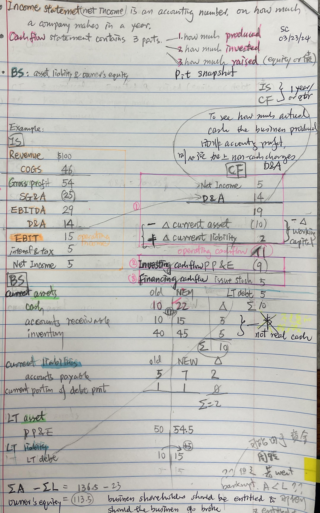

This post covers the very basics of the three main financial statements and their connections.  

Why do I write this post? I am writing the post because I need to use the financials in climate transition risk modeling.   Climate transition risk does not work like CCAR models where you model the relationship of macroeconomic variables such as GDP, housing price index, unemployment rate with default rate, LGD, EAD using same time or up to a few quarters' lag data.   As climate risk and opportunities are more strategic, the scenarios are quite different from CCAR ones.  We need to project how well the companies' bottom lines and financials will be when their costs go up due to carbon tax, due to demand change, due to availability of cheaper renewables, etc.   We then project the default probabilities based on the financials.  

This scope of the post is on non-financial institution corporates.  The financial statements of financial institutions are very different due to the differences in business models and will be covered in a separate post.  I will also cover a very different topic on carbon accounting in a separate post. 

In addition, when we compare financial statements, we need to keep in mind the context where the company operates: different jurisdiction have different accounting traditions/rules (IFRS in Europe and other places vs. US GAAP), and different industry have different norms, and different companies have different business models.

# Income Statement to Cashflow Statement

To reconcile net income from the income statement to the cash flow statement, you typically add back non-cash expenses and subtract non-cash revenues. Here are some common adjustments:

1. **Depreciation and Amortization**: These are non-cash expenses that reduce net income but do not affect cash flow. Therefore, you add them back to net income on the cash flow statement.

2. **Non-cash Stock-Based Compensation**: Expenses related to stock-based compensation, such as stock options or restricted stock units, are non-cash charges. They reduce net income but do not affect cash flow, so they are added back on the cash flow statement.

3. **Impairment Charges**: If there are impairment charges recorded on the income statement, these are non-cash expenses that need to be added back on the cash flow statement.

4. **Provisions**: Certain provisions, such as provisions for bad debts or restructuring, may reduce net income but are not cash transactions. Therefore, they should be added back on the cash flow statement.

5. **Losses on Disposal of Assets**: If the company recorded losses on the sale or disposal of assets, these are non-cash charges that need to be added back.

6. **Gains on Disposal of Assets**: Conversely, gains on the sale or disposal of assets are non-operating revenues. Since they are not cash transactions, they are subtracted from net income.

These adjustments help to reconcile net income, which is based on accrual accounting principles, with the cash flow from operating activities, which represents the cash generated or used by the company's core operations. By adding back non-cash expenses and subtracting non-cash revenues, you arrive at the cash flow from operating activities, which provides a clearer picture of the cash-generating ability of the business.

## Not add back SG&A to Cashflow Statement

SG&A (Selling, General, and Administrative) expenses are typically considered operating expenses on the income statement. These expenses include salaries, rent, utilities, marketing expenses, and other costs not directly related to production but necessary for running the business.

Since SG&A expenses represent cash outflows related to the ongoing operations of the business, they are already reflected in the net income. Therefore, you do not add back SG&A expenses separately on the cash flow statement. Instead, SG&A expenses are implicitly included in the net income figure from the income statement, which is then adjusted for non-cash items to arrive at the cash flow from operating activities on the cash flow statement.

However, it's essential to note that while SG&A expenses are not added back separately, the overall adjustment process on the cash flow statement may involve adding back non-cash items like depreciation and amortization, as well as making adjustments for changes in working capital, which can affect cash flow from operating activities.

## working capital and operating cash flow
Working capital and operating cash flow are not the same, although they are related concepts.

1. **Working Capital**: Working capital refers to the difference between a company's current assets and its current liabilities. It represents the funds available to a company for its day-to-day operations. Working capital management involves ensuring that a company has enough liquidity to meet its short-term obligations while also efficiently utilizing its current assets.

    Working capital = Current Assets - Current Liabilities

2. **Operating Cash Flow**: Operating cash flow, also known as cash flow from operating activities, is a section of the cash flow statement that shows the cash generated or used by a company's core business operations during a specific period. It reflects the cash flow resulting from the company's primary revenue-generating activities, excluding financing and investing activities.

    Operating Cash Flow = Net Income + Non-cash Expenses (such as depreciation) - Changes in Working Capital

While operating cash flow does consider changes in working capital as part of its calculation, it's important to note that operating cash flow encompasses more than just changes in working capital. It includes all cash transactions related to the company's primary business operations, such as cash receipts from customers and cash payments to suppliers and employees.

In summary, working capital focuses specifically on the difference between current assets and current liabilities, while operating cash flow represents the cash generated or used by a company's core operations, taking into account changes in working capital as well as other operating activities.

## How does SG&A relate to Working Capital

Selling, General, and Administrative (SG&A) expenses typically do not directly relate to working capital in the same way that items like accounts receivable, accounts payable, and inventory do. However, there can be indirect connections between SG&A expenses and working capital management:

1. **Impact on Cash Flow and Working Capital**: While SG&A expenses are not part of working capital itself, they affect the cash flow of a business. For example, paying salaries, rent, utilities, and other operating expenses included in SG&A consumes cash, which can impact working capital levels.

2. **Efficiency and Control of SG&A**: Effective management of SG&A expenses can indirectly influence working capital efficiency. For instance, efficient cost control measures in SG&A can free up cash that can be used to fund working capital needs or other growth initiatives.

3. **Revenue Growth and Working Capital**: Increasing SG&A expenses may be necessary to support revenue growth, which can in turn impact working capital requirements. For example, expanding sales and marketing efforts (a component of SG&A) may lead to higher accounts receivable levels as sales increase, affecting working capital.

4. **Operating Cycle Considerations**: Although SG&A expenses themselves are not part of the operating cycle, the efficiency with which these expenses are managed can affect the overall operating cycle of a business. A shorter operating cycle generally leads to better working capital management.

While SG&A expenses are not directly tied to working capital, they play a crucial role in the overall financial health and operational efficiency of a business. Effective management of both SG&A expenses and working capital is essential for sustaining business operations, managing cash flow, and driving long-term growth.

## Is investing cashflow PP&E

Yes, investing cash flow typically includes transactions related to Property, Plant, and Equipment (PP&E). PP&E refers to long-term tangible assets that are used in the production of goods or services, such as buildings, machinery, equipment, vehicles, and land.

In the cash flow statement, investing activities involve cash transactions related to the acquisition and disposal of long-term assets, including PP&E. These transactions include:

Purchases of PP&E: Cash outflows from the acquisition of new property, plant, and equipment.

Proceeds from Sale of PP&E: Cash inflows from the sale or disposal of existing PP&E.

Capital Expenditures: Cash outflows for investments in the maintenance or expansion of existing PP&E, such as expenditures for repairs, upgrades, or additions to machinery and equipment.

Investments in Intangible Assets: Cash outflows related to the acquisition of intangible assets, such as patents, copyrights, and trademarks, which are also considered investing activities.

Proceeds from Sale of Investments: Cash inflows from the sale or redemption of investments, including marketable securities or other financial instruments classified as non-current assets.

Loans to Others: Cash outflows from providing loans to other entities, which are classified as investing activities if they are not part of the company's core operations.

These cash flows are reported in the investing activities section of the cash flow statement, providing stakeholders with insights into how a company is investing its resources in long-term assets and potential future growth opportunities.

# Reference

[Youtube video: Connecting the Income Statement, Balance Sheet, and Cash Flow Statement](https://youtu.be/OGJBapKV1oE?si=3ghe1bPzzfS1qynT)

