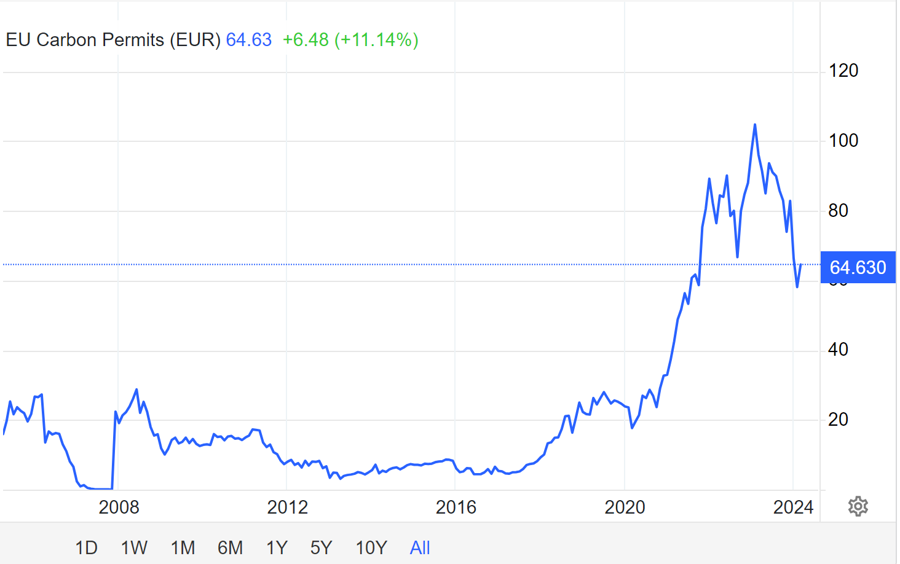
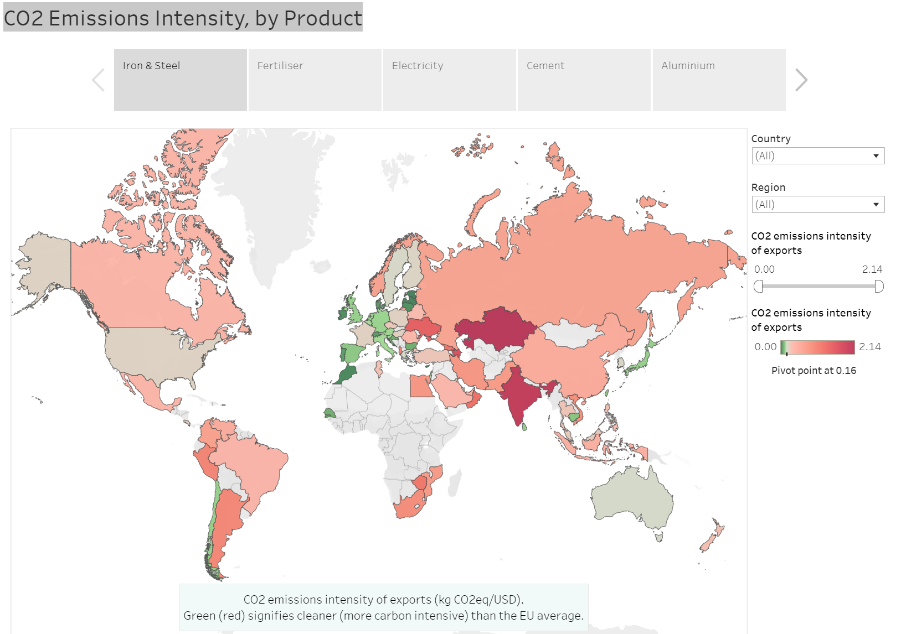
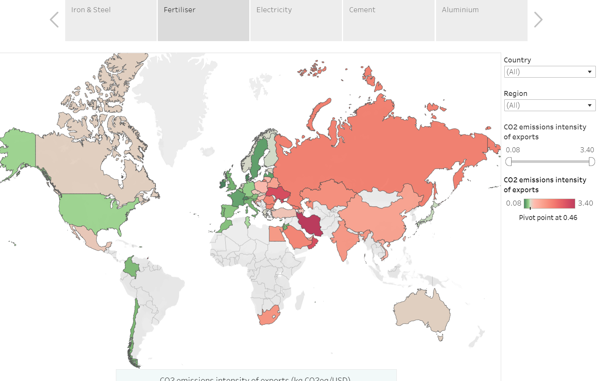
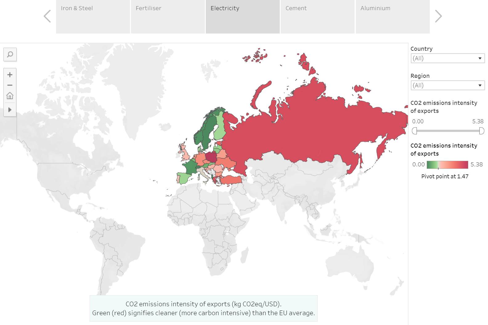

# Context: EU Emission Regulation

The EU is in the forefront on climate regulation. Its [home page](https://climate.ec.europa.eu/index_en) has a ticking countdown clock to 2050 Net Zero. It has the European Climate Law, which writes into law the goal set out in the European Green Deal for Europe’s economy and society to become climate-neutral by 2050. The law also sets the intermediate target of reducing net greenhouse gas emissions by at least 55% by 2030, compared to 1990 levels.

The EU ETS is a cornerstone of the EU's policy to combat climate change and its key tool for reducing greenhouse gas emissions cost-effectively. It is the world's first major carbon market and remains the biggest one.  

## ETS

The EU Emissions Trading System (ETS):
The EU [Emissions Trading System in a nutshell](https://climate.ec.europa.eu/eu-action/eu-emissions-trading-system-eu-ets/what-eu-ets_en):
- makes polluters pay for their greenhouse gas emissions, helps bring emissions down and use (at least some of) the money to finance the EU’s green transition:
- operates in all EU countries plus Iceland, Liechtenstein and Norway (EEA-EFTA states),
- covers emissions from 
  - Energy & manufacturing industry: around 10,000 installations
  - aircraft operators flying within the EU and departing to Switzerland and the UK – or around 40% of the EU’s emissions
  - maritime transport from 2024

# Cross Border Adjustment Mechanism

The EU's Cross Border Adjustment Mechanism is to prevent CO2 emissions from leaking out of the EU by adjusting prices at borders taking into account CO2 emissions.  

The CBAM is designed to b compatible with WTO rules.

On Aug 17, 2023, the European Commision adopted the rules governing the implementation of CBAM during its transitional phase, which started on Oct 1, 2023 and runs until end of 2025.

Jan 1, 2026: importers will need to declare each year the ***quantity of goods*** imported into the EU in the preceding year and ***their embedded GHB***.   They will then surrender the corresponding number of *CBAM certificates*.  The price of the certificate will be <u>calculated depending on the weekly average auction price of EU ETS allowances expressed in €/tonne of CO2 emitted.</u>

> If importers can prove that a carbon price has already been paid during the production of the imported goods, the corresponding amount can be deducted.

# CBAM transitional phase (2023 – 2026)
Oct 1, 2023: the CBAM entered into application in its transitional phase, with the first reporting period for importers ending Jan 31, 2024. The gradual phasing in of CBAM allows for a careful, predictable and proportionate transition for EU and non-EU businesses, as well as for public authorities.

The CBAM will initially apply to imports of certain goods and selected precursors whose production is carbon intensive and at most significant risk of carbon leakage: 
- cement 水泥
- iron  铁
- steel 钢
- aluminium 铝
- fertilisers 化肥
- electricity 电
- hydrogen 氢

CBAM will eventually – when fully phased in – capture more than 50% of the emissions in ETS covered sectors. The objective of the transitional period is to serve as a pilot and learning period for all stakeholders (importers, producers and authorities) and to collect useful information on embedded emissions to refine the methodology for the definitive period.

During this period, importers of goods in the scope of the new rules will **only have to report** GHG embedded in their imports (*direct and indirect emissions*), without the need to buy and surrender certificates. 

For cement and fertilisers, indirect emissions will be covered in the scope after the transitional period. 

The Implementing Regulation on reporting requirements and methodology provides for some flexibility when it comes to the values used to calculate embedded emissions on imports during the transitional phase. Until the end of 2024, companies will have the choice of reporting in three ways: 

**EU method**: full reporting according to the new methodology

**equivalent method**: reporting based on an equivalent method (three options)

**Default reference values**: reporting based on default reference values (only until July 2024).

As of Jan 1, 2025, only the EU method will be accepted and estimates (including default values) can only be used for complex goods if these estimations represent less than 20% of the total embedded emissions. The Commission published default values on 22 December 2023. This report from the EU’s Joint Research Centre (JRC) fed into the preparation of those default values.

The Commission has also developed dedicated IT tools to help importers perform and report these calculations, as well as in-depth guidance, training materials and tutorials to support businesses in this transitional phase.

A review of the CBAM's functioning during its transitional phase will be concluded before the entry into force of the definitive system. At the same time, the product scope will be reviewed to assess the feasibility of including other goods produced in sectors covered by the EU ETS in the scope of the CBAM mechanism, such as certain downstream products and those identified as suitable candidates during negotiations. The report will include a timetable setting out their inclusion by 2030.

# Who are most at risk

The World Bank publishes a good visualization on [CBAM exposure](https://www.worldbank.org/en/data/interactive/2023/06/15/relative-cbam-exposure-index#1) and provide underlying data.  It uses a metric called "Relative CBAM Exposure Index".    "The Relative CBAM Exposure Index is designed to identify countries with a high exposure to the EU CBAM, using carbon emissions intensity and exports of CBAM products to the EU. Assuming the carbon price ($100 per metric ton), the index measures the additional cost of CBAM certificates for exporters compared to the average EU producer, adjusted by the proportion of exports to the EU market."   

It recognizes cost changes in the EU market, where EU producers also bear emissions costs, enabling relatively clean exporters to gain competitiveness despite the requirement to purchase certificates. 

# Who can help with CBAM reporting

There are already companies working on providing help with reporting such as Carbon Chain.  I am working on one myself as well with advanced scholars in environmental scientists from MIT and Carnegie Mellon. 

# References

[World Bank CBAM exposure index: CO2 Emissions Intensity, by Product](https://www.worldbank.org/en/data/interactive/2023/06/15/relative-cbam-exposure-index)

[Carbon Border Adjustment Mechanism, Taxation and Customs Union, European Commission](https://taxation-customs.ec.europa.eu/carbon-border-adjustment-mechanism_en)

[EU Emissions Trading System (EU ETS)](https://climate.ec.europa.eu/eu-action/eu-emissions-trading-system-eu-ets_en)

[Carbon Chain CBAM Reporting](https://www.carbonchain.com/cbam/cbam-declaration-report)
## Videos

[KPMG Ireland: Carbon Border Adjustment Mechanism](https://www.youtube.com/watch?v=o-9Q61yMATY)

[PWC EU Carbon Border Adjustment Mechanism (CBAM) Webcast Series - Event 1 Introduction to CBAM](https://www.youtube.com/watch?v=H5B2tG_mBfU)

[5分鐘了解 你不可不知的 歐盟碳邊境調整機制 (CBAM) 【2021草案版】](https://www.youtube.com/watch?v=sh26BeSWPhA)

[歐盟碳關稅將上路！憂衝擊台灣螺絲王國地位 經濟部編列8億助1600業者減碳｜非凡財經新聞｜20230208](https://www.youtube.com/watch?v=K6s_7u3DQXo)

[不可不知的CBAM 重擊:碳邊界調整機制的基本概念和影響](https://www.youtube.com/watch?v=fHiDjqCEsfs)

[台灣碳權交易所成立，碳抵換仍有爭議｜零碳焦慮](https://www.youtube.com/watch?v=OQtD8l36uKc&t=529s)

[歐碳關稅15年長跑達協議 2023年10月試營開徵](https://www.youtube.com/watch?v=LEntBU1VHYY)