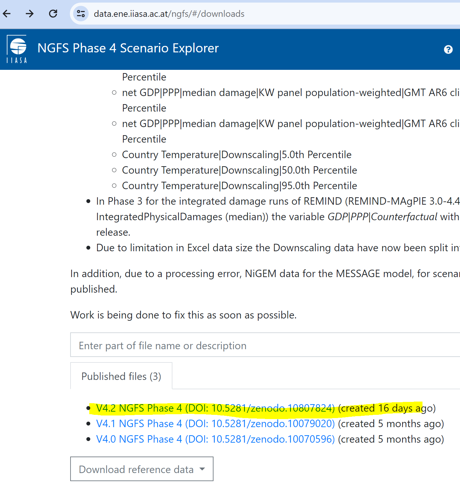

# References

[S&P TruCost FAQ](https://www.spglobal.com/spdji/en/documents/additional-material/faq-trucost.pdf)

[Carbon Border Adjustment Mechanism, Taxation and Customs Union, European Commission](https://taxation-customs.ec.europa.eu/carbon-border-adjustment-mechanism_en)

[EU Emissions Trading System (EU ETS)](https://climate.ec.europa.eu/eu-action/eu-emissions-trading-system-eu-ets_en)

[Carbon Chain CBAM Reporting](https://www.carbonchain.com/cbam/cbam-declaration-report)
## Videos

[KPMG Ireland: Carbon Border Adjustment Mechanism](https://www.youtube.com/watch?v=o-9Q61yMATY)

[PWC EU Carbon Border Adjustment Mechanism (CBAM) Webcast Series - Event 1 Introduction to CBAM](https://www.youtube.com/watch?v=H5B2tG_mBfU)

[5分鐘了解 你不可不知的 歐盟碳邊境調整機制 (CBAM) 【2021草案版】](https://www.youtube.com/watch?v=sh26BeSWPhA)

[歐盟碳關稅將上路！憂衝擊台灣螺絲王國地位 經濟部編列8億助1600業者減碳｜非凡財經新聞｜20230208](https://www.youtube.com/watch?v=K6s_7u3DQXo)

[不可不知的CBAM 重擊:碳邊界調整機制的基本概念和影響](https://www.youtube.com/watch?v=fHiDjqCEsfs)

[台灣碳權交易所成立，碳抵換仍有爭議｜零碳焦慮](https://www.youtube.com/watch?v=OQtD8l36uKc&t=529s)

[歐碳關稅15年長跑達協議 2023年10月試營開徵](https://www.youtube.com/watch?v=LEntBU1VHYY)