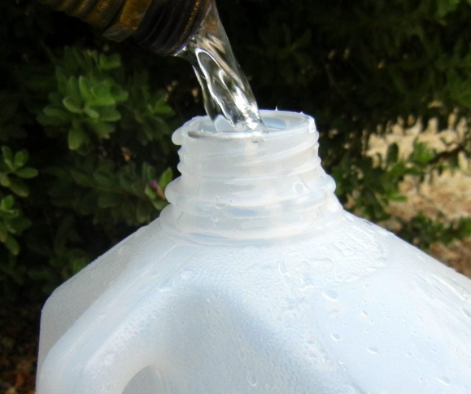
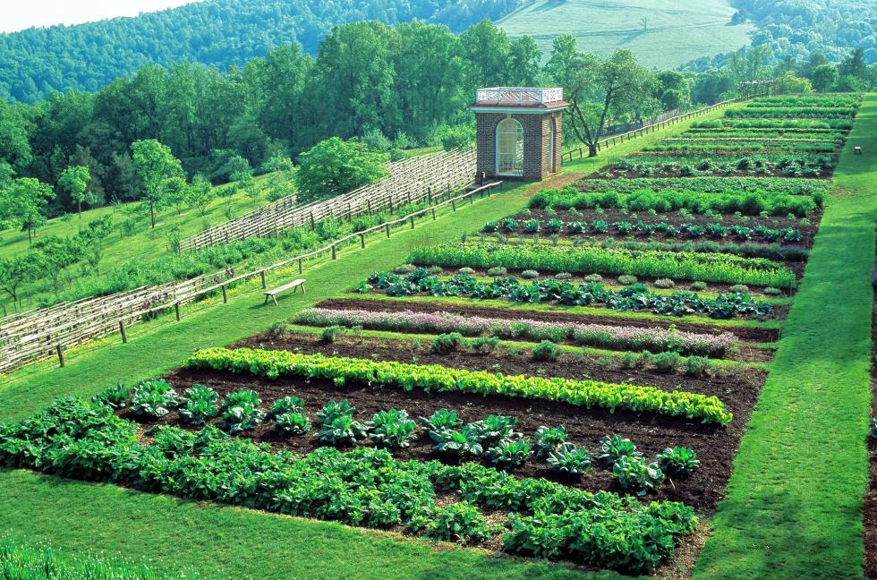

Very much like lavenders, it has been three years since I first started growing vegetables.  I put in tremendous effort, albet a very inconsistent one, but have almost always failed.  As Professor Goldfeld said about me "whatever she does, she does it well", I am determined to move on from the failures, and make growing vegitables successful, given the time constraint.  

Those that lived in my JC home seem to have all survived well. But my JC home has only a small vegetable garden with purchased soil, thoroughly tilled, weeds removed, and fertilized.

In my PA farm, vegetables have done extremely poorly, except the wild ones like wild onion, dandelions, mogwatts etc.  It could be due to the lack of care as I have been busy working in NYC and could only go to PA whenever time allowed, and the fact that it was ***not tilled, weed roots staying, and not fertilized***. 

Given the time constraint, how do I maximize the survival? First I am reveiwing what has happened and then plan actions. 

# Why bother with it

I started growing vegetables during Covid.  It was so difficult to get fresh vegetables then.  Some said, oh, that was a one-in-a-hundred-year event, and it will never happen again.  But as an actuary and risk manager, I know disaster can happen again, and can be even worse.  If I start growing vegetables only when disaster hits, then my family may have a difficult time surviving.   

So, here are my reasons for doing it:
1. Survival
2. Replace part of lawn with food and fresher food
4. Connect with Mother Nature with my own hands

# Review my failures and improve
I did a quick review on some of my past activities, which seemed like a series of experiments that had not followed laws of nature.   The key steps where failure took place are:

Failure | Details | Action Plan
---------|----------|---------
 ***soil not adequately prepared*** | weeds are still there in the soil with matted roots | *Draw a boundary, thoroughly prepare the soil, remove the weed roots within the boundary, and weed/mow regularly around it*
 not fertilized | those that survive are skinny and small | need to fertilize before planting, and a few weeks after planting
 ***not watered consistently*** | they dried out and died | water by hand, irrigation tubes, use gallon container to drip water
 clean water | water treated with softener | find facet that has water not treated with softener 

* **Watering**
I do not 

This is the perfect way to slow-water your plants and recycles your old milk jugs.  It is also an easy way to apply liquid fertilizer to your plants too!

Making your own drip-watering container is super easy and the only things you need are a clean plastic milk jug and a sharp nail.  That’s it!

What you need to do is to make tiny holes on the bottom of your milk container. Here is how you do it…

– Take a sharp nail and heat it up using a lighter or the burner on your stove (be careful not to burn your fingers when you do this part ;-).

– Make four holes equally spaced on the bottom of your milk jug.  You may need to reheat the nail after each hole, which helps the nail to pierce the plastic easily.

For a more permanent solution, you can make holes on the sides of a milk jug and bury it entirely next to your plant, just leaving the mouth of the jug exposed.  Leave the cap on and unscrew it and fill with water when needed.

* **Past failures with direct sowing** 
 
Almost no vegetable survivied except a few brave *cilantros and garlics*.  The last time I checked, there are six healthy cilantro smiling happily alongside bright tulip flowers on side of the front garden.  Maybe it is because of good soil, and few weeds around there.   Out of a hundred or so garlic bulbs I planted in cold wind, there are 4 garlic plants braving in the lawn.  The rest were taken over by weeds or lawn.  

Vegetable | Number planted | Survived | Annual vs Perennial
---------|----------|---------|---------
 cilantro | 100 + | 6 | somewhat annual
 garlic | ~ 100 | 4 |perennial
 spinach | ? | 0 | annual
 tonghao | 1000 + | 0 | annual
 cucumber | 30 + | 6 | annual
 tomato | 30 + | 8 | annual
 daikon and radishes as winter cover crop | 1000000 + | ~ 0 | annual
 many other kinds of veggies | boxes of seed packages | ~ 0 | annual

* **How I failed with Jiffy pellets** 

Yes, I admit I even failed with Jiffy pellets.  and they work somewhat like this: .  

Going over the instructions, it is clear where I failed. The seeds I sowed all sprouted.  But in step 7, I left them indoor, they did not get enough sunlight and all had super skinny stems that could not support the leaves.  What really killed them was Step 8.  I was gone for a week.  They all dried out in the indoor heat. 

1. Put the pellets in the planting tray.
2. Soak the pellets with lukewarm water, pour off any excess water.
3. Sow seeds or stick cuttings and position the tray in a bright place.
4. When the seeds are sprouting, turn the cover slightly for air circulation.
5. When the seeds have sprouted, take the cover off.  
6. Avoid frost.
7. **Gradually** expose to the sun.
8. **Never overwater or let them dry out**.
9. Water thoroughly.
10. Refill water when required.
11. To protect the sensitive roots, cover the Jiffy 7® completely in the flower bed or flower pot when planting.
12. Cover with soil.

<iframe width="989" height="413" src="https://www.youtube.com/embed/2PljH1yycB0" title="Jiffy all inclusive!" frameborder="0" allow="accelerometer; autoplay; clipboard-write; encrypted-media; gyroscope; picture-in-picture; web-share" referrerpolicy="strict-origin-when-cross-origin" allowfullscreen></iframe>

# Utilize existing resources

Oh, there are so many existing resources either native and wild, or planted by the former owners.  I feel very grateful for Nature and what the former owners did. 

Former owner has a few **asparagus** plants that always come back. So I get to eat a few stalks each spring.  But to have more than a few stalks, I need to make room for the asparagus, which are currently growing in the midst of the lawn.  

**Action for Asparagus**

1. Draw a boundary
2. remove the weeds/grass & their roots within the boundary.  Be careful not to injure the roots of asparagus.  They have *shallow roots*.
3. fertilize the asparagus, Asparagus is a heavy feeder and benefits from regular fertilization. In the spring, apply a balanced fertilizer or a fertilizer specifically formulated for asparagus according to package instructions. *Avoid fertilizers high in **nitrogen**, as they can encourage weed growth*.
4. Mulch the exposed soil with cut grass and wood chips
5. Keep mowing schedule to keep the grass from encroaching on the asparagus plants. Mow around the edges of the bed regularly to maintain a clear boundary between the lawn and the asparagus bed.

# Inspirations
From the pictures, I see that some garden beds are higher (raised) but none used a boxed in one.  Some walkways are mulch walkways.  

# Reference

[THOMAS JEFFERSON Monticello Garden](https://www.monticello.org/house-gardens/farms-gardens/gardens-image-gallery/)
[monticello.org](https://www.monticello.org/)
