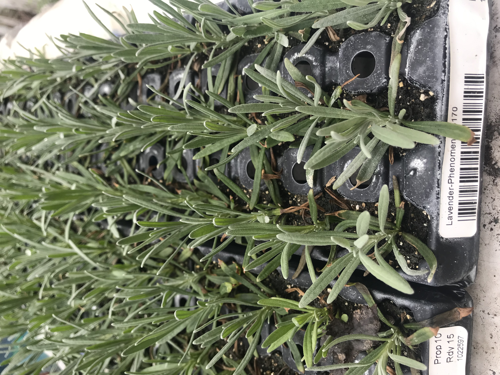

In my PA farm, fruits have done quite well, even though I did not do much as I have been busy working in NYC and could only go to PA whenever time allowed. But the succesful ones were the fruits of former owners' hardwork. Since I moved there, I have planted the following:

Given the time constraint, how do I maximize success?

# Born from seeds

I tried growing from seeds.  Some germinated.  But unfortunately these new borns died as no one was at the farm to look after them.  

Below is the instruction from seed packages I bought: 

DAYS TO GERMINATION: 14-28 days sowing: Start the seeds inside 6-10 weeks before the last frost. Plant each seed 1/8" deep and do not cover them with soil, since they require light to germinate. Place them under grow lights or in a window that faces south. Transplant them to their own pot when they have grown large enough to work with.i LIGHT PREFERENCE: If under fluorescent lights, have the light on for 16 hours a day and off for 8. SOIL REQUIREMENTS: pH 6.5-8.0 HARVEST: Harvest the flower spikes in the morning on a dry warm sunny day by cutting the base of the flower stem above the leaves. PLANT SPACING: Plant them outside 18" apart after the last frost. If you live in a humid area, space them more widely to allow air flow. Don't plant lavender too deeply. Make sure that the soil is just above the roots. Water thoroughly and then mulch the plants. Use stone as mulch if you live in a climate where it rains a lot. 

# Seedlings bought from wholesaler
I bought 

1. **Choose the Right Variety**: Select lavender varieties that are better suited to colder climates, such as English lavender (Lavandula angustifolia). These varieties are more tolerant of cooler temperatures and winter conditions.

2. **Start Indoors**: Lavender seeds can be started indoors about 6-8 weeks before the last frost date in your area. Use a seed starting mix and sow the seeds lightly on the surface. Keep the soil moist but not waterlogged.

3. **Provide Adequate Light**: Lavender seedlings need plenty of sunlight to grow strong and healthy. Place them in a sunny windowsill or under grow lights for at least 12-14 hours a day.

4. **Maintain Warmth**: Lavender seeds germinate best in warm temperatures, around 70-75°F (21-24°C). Consider using a heat mat to maintain consistent warmth during the germination period.

5. **Transplant Carefully**: Once the seedlings have developed a few sets of true leaves, they can be transplanted into larger containers. Use a well-draining potting mix with good aeration. Be gentle when handling the delicate roots to avoid damage.

6. **Harden Off**: Before transplanting lavender seedlings outdoors, they need to be gradually acclimated to outdoor conditions. Start by placing them outdoors in a sheltered location for a few hours each day, gradually increasing the time and exposure to sunlight over the course of a week or two.

7. **Choose a Sunny Location**: Lavender thrives in full sun and well-drained soil. Choose a planting site that receives at least 6-8 hours of sunlight per day and amend the soil with sand or gravel to improve drainage if necessary.

8. **Spacing**: Plant lavender seedlings at least 12-18 inches apart to allow for proper air circulation and prevent overcrowding as they mature.

9. **Water Wisely**: While lavender is drought-tolerant once established, young seedlings need regular watering to encourage root development. Water deeply but infrequently, allowing the soil to dry out slightly between waterings to prevent root rot.

10. **Mulch**: Apply a thin layer of mulch around the base of the plants to help retain moisture and suppress weed growth. Avoid mulching too close to the stems to prevent rotting.

11. **Prune Regularly**: Pruning encourages bushier growth and helps prevent legginess. Trim back spent flowers and leggy growth throughout the growing season, but avoid cutting into old wood as lavender does not typically regrow from woody stems.

12. **Winter Protection**: In the fall, consider providing winter protection for your lavender plants, especially during the first few years while they are establishing. Mulch around the base of the plants with straw or pine needles to insulate the roots from freezing temperatures.

By following these tips, you can increase the likelihood of success in growing lavender seedlings in the northeast region of America.

# Reference
