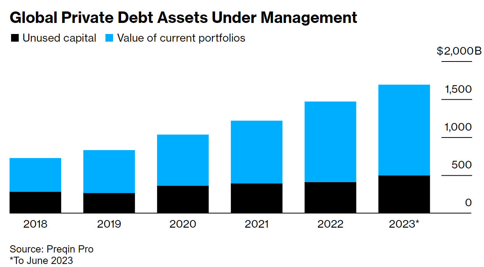

Private credit in the oil and gas industry refers to financing provided by private credit funds, private equity firms, or other non-bank lenders to companies operating within the oil and gas sector. This type of financing can take various forms, including debt financing, mezzanine financing, or structured finance solutions. Private credit has become increasingly popular in the oil and gas industry, particularly in times when traditional bank lending may be limited or when companies seek alternative sources of capital.

Here are some key aspects of private credit in the oil and gas industry:

1. **Flexibility**: Private credit providers often offer more flexibility in terms of loan structures and terms compared to traditional bank loans. This can be especially beneficial for oil and gas companies facing unique operational and market challenges.

2. **Tailored Solutions**: Private credit solutions can be tailored to the specific needs of oil and gas companies, whether they are looking to finance exploration and production activities, acquisition of assets, or capital expenditure projects.

3. **Risk Appetite**: Private credit providers may have a higher risk appetite compared to traditional banks, allowing them to finance projects that might be deemed too risky by conventional lenders. However, this may come with higher interest rates or other risk-mitigating measures.

4. **Asset-Based Lending**: In some cases, private credit in the oil and gas industry may involve asset-based lending, where the value of the company's oil and gas reserves or infrastructure assets serves as collateral for the loan.

5. **Opportunistic Investing**: Private credit funds may opportunistically invest in distressed assets or companies within the oil and gas sector, providing capital for restructuring, turnaround, or growth initiatives.

6. **Market Dynamics**: The availability and terms of private credit in the oil and gas industry can be influenced by various factors, including commodity prices, regulatory environment, and investor sentiment towards the sector.

7. **Complexity**: Deals involving private credit in the oil and gas industry can be complex, requiring thorough due diligence and legal structuring to address the specific risks associated with the sector, such as regulatory compliance, environmental liabilities, and commodity price volatility.

Overall, private credit plays an important role in providing alternative financing options to oil and gas companies, helping them navigate through challenging market conditions and capitalize on growth opportunities. However, it's essential for both lenders and borrowers to carefully evaluate the terms and risks associated with private credit transactions in the context of the oil and gas industry's unique dynamics.

# Why borrow from private credit
Oil and gas companies may choose to borrow from private credit sources instead of traditional banks for several reasons:

1. **Flexibility in Loan Terms**: Private credit providers often offer more flexibility in structuring loans compared to traditional banks. This flexibility can include customized repayment schedules, less restrictive covenants, and tailored financing solutions that better align with the cyclical nature and long-term investment horizon of the oil and gas industry.

2. **Speed of Execution**: Private credit transactions typically involve fewer bureaucratic hurdles and can be executed more quickly than bank loans, allowing oil and gas companies to access capital faster when needed for time-sensitive projects, acquisitions, or investment opportunities.

3. **Access to Capital Markets**: Private credit providers may have access to capital markets and alternative funding sources that traditional banks do not have, enabling them to offer larger loan sizes and more competitive terms to borrowers in the oil and gas sector.

4. **Industry Expertise**: Some private credit funds specialize in lending to specific industries, including oil and gas. These lenders often have deep industry expertise and understanding of the unique risks and challenges faced by oil and gas companies, allowing them to structure financing solutions that better meet the needs of borrowers.

5. **Risk Appetite**: Private credit providers may have a higher risk tolerance than traditional banks and be willing to lend to oil and gas companies with higher leverage ratios, lower credit ratings, or in more challenging operating environments. This can be particularly beneficial for smaller or more specialized oil and gas firms that may not meet the stringent lending criteria of banks.

6. **Confidentiality**: Private credit transactions can offer greater confidentiality and discretion compared to public bank financing, which may be subject to disclosure requirements and regulatory scrutiny. This can be advantageous for oil and gas companies seeking to maintain strategic confidentiality or competitive advantage.

7. **Diversification of Funding Sources**: Borrowing from private credit sources allows oil and gas companies to diversify their funding sources and reduce reliance on traditional bank financing, thereby enhancing financial resilience and flexibility, especially during periods of market volatility or economic uncertainty.

Overall, borrowing from private credit sources provides oil and gas companies with access to alternative financing options that complement traditional bank loans and better address their specific financing needs, risk profiles, and strategic objectives. However, it's essential for companies to carefully evaluate the terms, costs, and risks associated with private credit transactions and consider how they fit within their overall capital structure and financial strategy.
<!--  -->
The growth in alternative credit, also known as non-bank lending or shadow banking, has been a significant trend in the financial industry in recent years. Alternative credit refers to credit provided by entities other than traditional banks, such as non-bank financial institutions, private credit funds, peer-to-peer lending platforms, and fintech companies. Several factors have contributed to the expansion of alternative credit:

1. **Market Demand**: Alternative credit providers often offer more streamlined application processes, faster approval times, and greater flexibility in loan terms compared to traditional banks. As a result, borrowers, including individuals, small businesses, and even large corporations, increasingly turn to alternative credit sources to meet their financing needs.

2. **Technological Innovation**: Advances in financial technology have democratized access to credit, enabling fintech companies to leverage data analytics, artificial intelligence, and machine learning algorithms to assess credit risk more accurately and efficiently. This has led to the emergence of innovative lending models, such as peer-to-peer lending and online marketplace lending, which have gained popularity among borrowers seeking alternative financing options.

3. **Regulatory Environment**: Regulatory changes and increased scrutiny of traditional banks following the global financial crisis have prompted some financial institutions to diversify their funding sources and shift towards alternative credit activities. Moreover, regulatory reforms aimed at promoting competition and financial inclusion have created opportunities for non-bank lenders to enter the market and expand their lending operations.

4. **Investor Appetite**: Institutional investors, including pension funds, insurance companies, hedge funds, and private equity firms, have shown growing interest in alternative credit assets as they seek higher yields in a low-interest-rate environment. Alternative credit investments, such as direct lending, distressed debt, and structured finance, offer attractive risk-adjusted returns compared to traditional fixed-income securities.

5. **Diversification Benefits**: Alternative credit investments can provide portfolio diversification benefits for investors seeking to reduce exposure to traditional asset classes, such as stocks and bonds. By allocating capital to alternative credit strategies, investors can enhance risk-adjusted returns and mitigate correlation risks associated with public market investments.

6. **Globalization**: The globalization of financial markets has facilitated the cross-border flow of capital and enabled alternative credit providers to operate on a global scale. This has created opportunities for borrowers and investors to access a broader range of credit products and investment opportunities across different geographies and asset classes.

Overall, the growth in alternative credit reflects the evolving landscape of the financial industry, characterized by innovation, competition, and changing consumer preferences. While alternative credit presents opportunities for borrowers and investors alike, it also poses challenges related to regulatory oversight, credit risk management, and systemic stability, which require ongoing monitoring and supervision by policymakers and regulators.

https://www.bloomberg.com/help/question/cancel-digital-access-subscription
contactus@bloombergsupport.com
